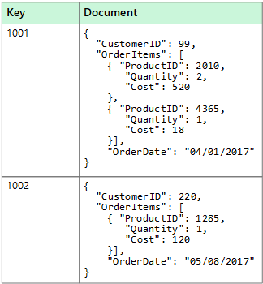
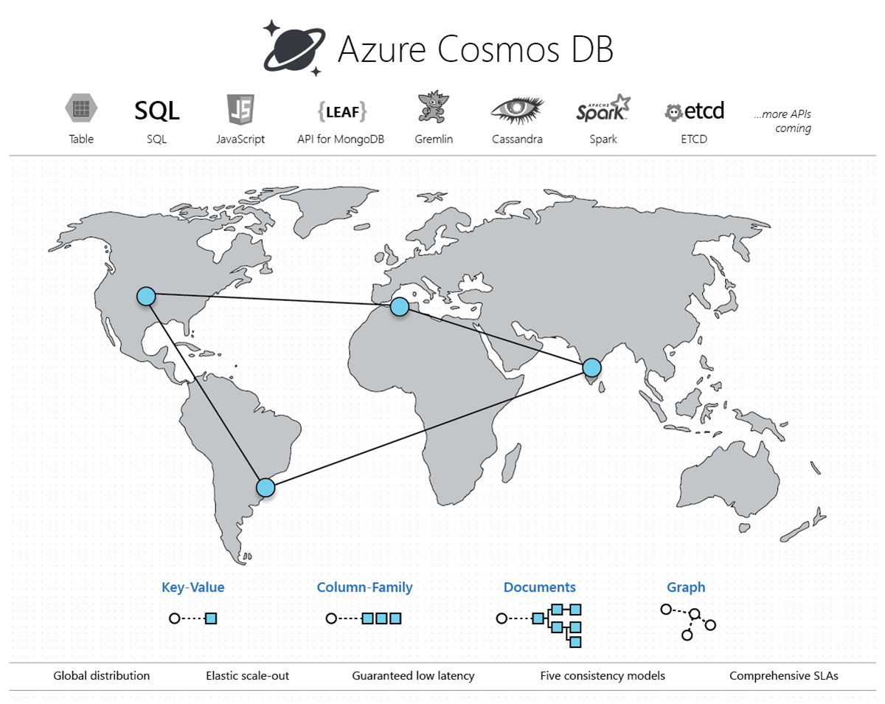
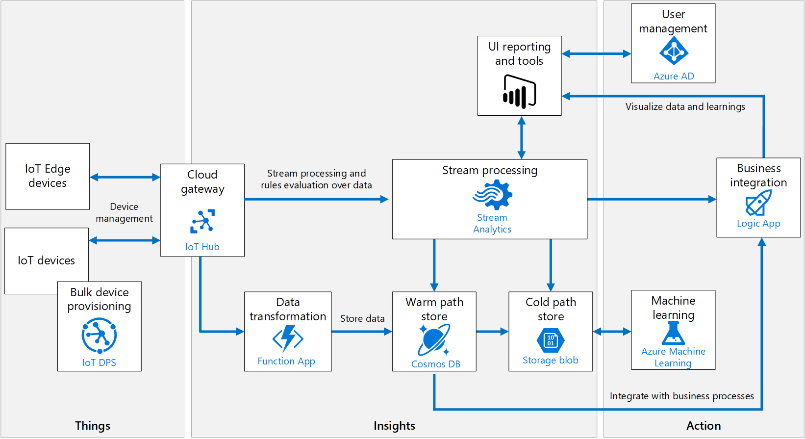

# Cosmos DB IoT solution accelerator

This accelerator helps you quickly build a solution that uses Azure Cosmos DB to ingest streaming telemetry from your IoT devices. The documentation and starter artifacts help you create a near-real-time analytics pipeline built on [Azure Cosmos DB](https://docs.microsoft.com/azure/cosmos-db/introduction), Azure Functions, Event Hubs, Azure Databricks, Azure Storage, Azure Stream Analytics, Power BI, Azure Web Apps, and Logic Apps.

## Table of contents

- [Cosmos DB IoT solution accelerator](#cosmos-db-iot-solution-accelerator)
  - [Table of contents](#table-of-contents)
  - [High-level concepts](#high-level-concepts)
    - [Non-relational data and NoSQL](#non-relational-data-and-nosql)
      - [Document data stores](#document-data-stores)
      - [Cosmos DB - managed NoSQL database on Azure](#cosmos-db---managed-nosql-database-on-azure)
    - [Event sourcing pattern](#event-sourcing-pattern)
    - [Serverless and no/low code processing](#serverless-and-nolow-code-processing)
    - [IoT reference architecture](#iot-reference-architecture)
    - [Reference architecture components](#reference-architecture-components)
    - [Scalability considerations](#scalability-considerations)
    - [Security considerations](#security-considerations)
      - [Use Azure Key Vault to protect secrets](#use-azure-key-vault-to-protect-secrets)
      - [Trustworthy and secure communication](#trustworthy-and-secure-communication)
      - [Physical tamper-proofing](#physical-tamper-proofing)
      - [Monitoring and logging](#monitoring-and-logging)
      - [Tracing telemetry](#tracing-telemetry)
      - [Logging](#logging)
  - [High-level architecture for the solution accelerator](#high-level-architecture-for-the-solution-accelerator)
    - [Adapting the sample scenario to your own](#adapting-the-sample-scenario-to-your-own)
    - [Architecture components](#architecture-components)
  - [Requirements](#requirements)
  - [References](#references)
  - [Next steps](#next-steps)

## High-level concepts

In this document, we cover the high-level concepts needed to understand the components of the reference architecture. Although Internet-of-Things (IoT) is the primary theme of this solution accelerator, _the concepts beyond the IoT devices and cloud gateway (IoT Hub) are applicable to many other, event-oriented scenarios_.

### Non-relational data and NoSQL

A *non-relational database* is a database that does not use the tabular schema of rows and columns found in most traditional database systems. Instead, non-relational databases use a storage model that is optimized for the specific requirements of the type of data being stored. For example, data may be stored as simple key/value pairs, as JSON documents, or as a graph consisting of edges and vertices.

What all of these data stores have in common is that they don't use a relational model. Also, they tend to be more specific in the type of data they support and how data can be queried. For example, time series data stores are optimized for queries over time-based sequences of data, while graph data stores are optimized for exploring weighted relationships between entities. Neither format would generalize well to the task of managing transactional data.

The term *NoSQL* refers to data stores that do not use SQL for queries, and instead use other programming languages and constructs to query the data. In practice, "NoSQL" means "non-relational database," even though many of these databases do support SQL-compatible queries. However, the underlying query execution strategy is usually very different from the way a traditional RDBMS would execute the same SQL query.

The following sections describe the major categories of non-relational or NoSQL database.

#### Document data stores

A document data store manages a set of named string fields and object data values in an entity referred to as a *document*. These data stores typically store data in the form of JSON documents. Each field value could be a scalar item, such as a number, or a compound element, such as a list or a parent-child collection. The data in the fields of a document can be encoded in a variety of ways, including XML, YAML, JSON, BSON, or even stored as plain text. The fields within documents are exposed to the storage management system, enabling an application to query and filter data by using the values in these fields.

Typically, a document contains the entire data for an entity. What items constitute an entity are application-specific. For example, an entity could contain the details of a customer, an order, or a combination of both. A single document might contain information that would be spread across several relational tables in a relational database management system (RDBMS). A document store does not require that all documents have the same structure. This free-form approach provides a great deal of flexibility. For example, applications can store different data in documents in response to a change in business requirements.

The application can retrieve documents by using the document key. This is a unique identifier for the document, which is often hashed, to help distribute data evenly. Some document databases create the document key automatically. Others enable you to specify an attribute of the document to use as the key. The application can also query documents based on the value of one or more fields. Some document databases support indexing to facilitate fast lookup of documents based on one or more indexed fields.

Many document databases support in-place updates, enabling an application to modify the values of specific fields in a document without rewriting the entire document. Read and write operations over multiple fields in a single document are typically atomic.

#### Cosmos DB - managed NoSQL database on Azure

Azure Cosmos DB is Microsoft's globally distributed, multi-model database service. With a click of a button, Cosmos DB enables you to elastically and independently scale throughput and storage across any number of Azure regions worldwide. You can elastically scale throughput and storage, and take advantage of fast, single-digit-millisecond data access using your favorite API including SQL, MongoDB, Cassandra, Tables, or Gremlin. Cosmos DB provides comprehensive [service level agreements](https://aka.ms/acdbsla) (SLAs) for throughput, latency, availability, and consistency guarantees, something no other database service offers.

### Event sourcing pattern

A vital pattern used in the solution accelerator is the [event sourcing pattern](https://docs.microsoft.com/azure/architecture/patterns/event-sourcing). This pattern defines an approach to handling operations on data that's driven by a sequence of events, each of which is recorded in an append-only store. In our implementation, IoT devices send telemetry as a series of events that imperatively describe the state of each device over time to the event store, where they're persisted. Each event represents a set of changes to the data, which is tied back to the source IoT device.

The event store acts as the system of record (the authoritative data source) about the current state of the data. The event store used in the solution accelerator is an [Azure Cosmos DB](https://docs.microsoft.com/azure/cosmos-db/introduction) container that is tuned for write-heavy workloads through minimal indexing, partitioning on a key with high cardinality, and by setting a throughput adjusted for a high rate of ingesting (more on these concepts later). The Cosmos DB [change feed](https://docs.microsoft.com/azure/cosmos-db/change-feed) is used to publish these events so that consumers are notified so they can handle them if needed.

Typical uses of the events published by the change feed are to maintain [materialized views](https://docs.microsoft.com/azure/architecture/patterns/materialized-view) of entities as telemetry is ingested or actions in the application change them, and for integration with external systems. For example, as device telemetry is saved, materialized views are updated with aggregated information about the IoT device telemetry, which is used to populate parts of the UI such as dashboards and reports. The aggregated data in this example is saved to a different container in Cosmos DB, eliminating the need to query against the event collection and perform expensive aggregates across multiple partitions. Other aggregated data is sent to Power BI to update a real-time dashboard to display the overall state of the IoT devices.

Implementing the event sourcing pattern allows data and software architects to think beyond typical CRUD operations that may be used to for their databases and applications. This pattern helps these architects consider how they can handle the rising velocity, variety, and volume of data in today's Big Data landscape.

### Serverless and no/low code processing

Serverless computing enables developers to build applications faster by eliminating the need for them to manage infrastructure. With serverless applications, the cloud service provider automatically provisions, scales, and manages the infrastructure required to run the code. Frequently, serverless computing is associated with consumption-based pricing, which means that you only pay for compute when needed without paying for resources you do not use.

In understanding the definition of serverless computing, it's important to note that servers are still running the code. The serverless name comes from the fact that the tasks associated with infrastructure provisioning and management are invisible to the developer. This approach enables developers to increase their focus on business logic and deliver more value to the core of the business. Serverless computing helps teams increase their productivity and bring products to market faster, and it allows organizations to optimize resources better and stay focused on innovation.

In this solution accelerator, we use [Azure Functions](https://docs.microsoft.com/azure/azure-functions/functions-overview) as a natural fit for the event-driven processing enabled by the IoT Hub and the Cosmos DB change feed. The consumption pricing plan provides a pay-per-execution model with sub-second billing that charges only for the time and resources it takes to execute the code. The first 1 million requests being free each month. Functions support bindings that make it easy to integrate with services such as IoT Hub, Cosmos DB, and Event Hubs. The functions manage connectivity to these services, including the lifecycle of the client components used to communicate with them. These bindings significantly reduce the amount of code required to create the functions, allowing developers to focus more on application logic and less on the plumbing code.

For low-code processing, we use [Azure Stream Analytics](https://docs.microsoft.com/azure/stream-analytics/stream-analytics-introduction) to analyze and process high volumes of event data from multiple sources simultaneously. Stream Analytics connects to inputs, such as IoT Hub and Event Hubs, and several outputs it can use as data sinks, including Cosmos DB, Power BI, and several other Azure services. It provides a SQL-like query language used to query over the incoming data, where you can easily adjust the event ordering options and duration of time windows when performing aggregation operations through simple language constructs or configurations. We use Stream Analytics in this solution accelerator to aggregate data over time windows of varying sizes. We use these aggregates to populate materialized views in Cosmos DB and to send small aggregates of data directly to Power BI to update a near real-time dashboard.

The service that provides no-code processing in the solution accelerator is [Azure Logic Apps](https://docs.microsoft.com/azure/logic-apps/logic-apps-overview). This service works as a powerful workflow orchestrator that natively [integrates with hundreds](https://docs.microsoft.com/azure/connectors/apis-list) of Azure and 3rd-party services. Users usually build logic apps with the Logic Apps Designer, which provides a simple web-based, drag-and-drop interface. Alternately, logic apps can be built using JavaScript Object Notation (JSON) for scripting, Azure PowerShell commands, and Azure Resource Manager (ARM) templates. We create a logic app in the solution accelerator to send email notifications to recipients when certain event milestones occur, such as when a package delivery is running behind schedule, or when an oil pump encounters an anomaly.

### IoT reference architecture

The IoT reference architecture has been adapted and slightly modified from the [source](https://docs.microsoft.com/azure/architecture/reference-architectures/iot/). The diagram below shows one recommended architecture for IoT applications on Azure using PaaS (platform-as-a-service) components.

IoT applications can be described as **things** (devices) sending data that generates **insights**. These insights generate **actions** to improve a business or process. An example is an engine (the thing) sending temperature data. This data is used to evaluate whether the engine is performing as expected (the insight). The insight is used to proactively prioritize the maintenance schedule for the engine (the action).

This reference architecture uses Azure PaaS (platform-as-a-service) components. Other options for building IoT solutions on Azure include:

- [Azure IoT Central](https://docs.microsoft.com/azure/iot-central/). IoT Central is a fully managed SaaS (software-as-a-service) solution. It abstracts the technical choices and lets you focus on your solution exclusively. This simplicity comes with a tradeoff in being less customizable than a PaaS-based solution.
- Using OSS components such as the SMACK stack (Spark, Mesos, Akka, Cassandra, Kafka) deployed on Azure VMs. This approach offers a great deal of control but is more complex.

At a high level, there are two ways to process telemetry data, hot path, and cold path. The difference has to do with requirements for latency and data access.

- The **hot path** analyzes data in near-real-time, as it arrives. In the hot path, telemetry must be processed with very low latency. The hot path is typically implemented using a stream processing engine. The output may trigger an alert or be written to a structured format that can be queried using analytical tools.
- The **cold path** performs batch processing at longer intervals (hourly or daily). The cold path typically operates over large volumes of data, but the results don't need to be as timely as the hot path. In the cold path, raw telemetry is captured and then fed into a batch process.

### Reference architecture components

This architecture consists of the following components. Some applications may not require every component listed here.

**IoT devices**. Devices can securely register with the cloud and can connect to the cloud to send and receive data. Some devices may be **edge devices** that perform some data processing on the IoT device itself or in a field gateway. We recommend [Azure IoT Edge](https://docs.microsoft.com/azure/iot-edge/) for edge processing.

**Cloud gateway**. A cloud gateway provides a cloud hub for devices to connect securely to the cloud and send data. It also provides device management, capabilities, including command and control of devices. For the cloud gateway, we recommend [IoT Hub](https://docs.microsoft.com/azure/iot-hub/). IoT Hub is a hosted cloud service that ingests events from devices, acting as a message broker between devices and backend services. IoT Hub provides secure connectivity, event ingestion, bidirectional communication, and device management.

**Device provisioning.** For registering and connecting large sets of devices, we recommend using the [IoT Hub Device Provisioning Service](https://docs.microsoft.com/azure/iot-dps/) (DPS). DPS lets you assign and register devices to specific Azure IoT Hub endpoints at scale.

**Stream processing**. Stream processing analyzes large streams of data records and evaluates rules for those streams. For stream processing, we recommend [Azure Stream Analytics](https://docs.microsoft.com/azure/stream-analytics/). Stream Analytics can execute complex analysis at scale, using time windowing functions, stream aggregations, and external data source joins. Another option is Apache Spark on [Azure Databricks](https://docs.microsoft.com/azure/azure-databricks/).

**Machine learning** allows predictive algorithms to be executed over historical telemetry data, enabling scenarios such as predictive maintenance. For machine learning, we recommend [Azure Machine Learning](https://docs.microsoft.com/azure/machine-learning/service/).

**Warm path storage** holds data that must be available immediately from a device for reporting and visualization. For warm path storage, we recommend [Cosmos DB](https://docs.microsoft.com/azure/cosmos-db/introduction). Cosmos DB is a globally distributed, multi-model database.

**Cold path storage** holds data that is kept longer-term and is used for batch processing. For cold path storage, we recommend [Azure Blob Storage](https://docs.microsoft.com/azure/storage/blobs/storage-blobs-introduction). Data can be archived in Blob storage indefinitely at low cost and is easily accessible for batch processing.

**Data transformation** manipulates or aggregates the telemetry stream. Examples include protocol transformation, such as converting binary data to JSON or combining data points. If the data must be transformed before reaching IoT Hub, we recommend using a [protocol gateway](https://docs.microsoft.com/azure/iot-hub/iot-hub-protocol-gateway) (not shown). Otherwise, data can be transformed after it reaches IoT Hub. In that case, we recommend using [Azure Functions](https://docs.microsoft.com/azure/azure-functions/), which has built-in integration with IoT Hub, Cosmos DB, and Blob Storage.

**Business process integration** performs actions based on insights from the device data. These actions could include storing informational messages, raising alarms, sending email or SMS messages, or integrating with CRM. We recommend using [Azure Logic Apps](https://docs.microsoft.com/azure/logic-apps/logic-apps-overview) for business process integration.

**User management** restricts which users or groups can perform actions on devices, such as upgrading firmware. It also defines capabilities for users in applications. We recommend using [Azure Active Directory](https://docs.microsoft.com/azure/active-directory/) to authenticate and authorize users.

### Scalability considerations

An IoT application should be built as discrete services that can scale independently. Consider the following scalability points:

**IoTHub**. For IoT Hub, consider the following scale factors:

- The maximum [daily quota](https://docs.microsoft.com/azure/iot-hub/iot-hub-devguide-quotas-throttling) of messages into IoT Hub.
- The quota of connected devices in an IoT Hub instance.
- Ingestion throughput &mdash; how quickly IoT Hub can ingest messages.
- Processing throughput &mdash; how quickly the incoming messages are processed.

Each IoT hub is provisioned with a certain number of units in a specific tier. The tier and number of units determine the maximum daily quota of messages that devices can send to the hub. For more information, see IoT Hub quotas and throttling. You can scale up a hub without interrupting existing operations.

**Stream Analytics**. Stream Analytics jobs scale best if they are parallel at all points in the Stream Analytics pipeline, from input to query to output. A fully parallel job allows Stream Analytics to split the work across multiple compute nodes. Otherwise, Stream Analytics has to combine the stream data into one place. For more information, see [Leverage query parallelization in Azure Stream Analytics](https://docs.microsoft.com/azure/stream-analytics/stream-analytics-parallelization).

IoT Hub automatically partitions device messages based on the device ID. All of the messages from a particular device will always arrive on the same partition, but a single partition will have messages from multiple devices. Therefore, the unit of parallelization is the partition ID.

**Functions**. When reading from the Event Hubs endpoint, there is a maximum of function instance per event hub partition. The maximum processing rate is determined by how fast one function instance can process the events from a single partition. The function should process messages in batches.

**Cosmos DB**. To scale out a Cosmos DB collection, create the collection with a partition key and include the partition key in each document that you write. For more information, see [Best practices when choosing a partition key](https://docs.microsoft.com/azure/cosmos-db/partitioning-overview#choose-partitionkey).

- If you store and update a single document per device, the device ID is a good partition key. Writes are evenly distributed across the keys. The size of each partition is strictly bounded because there is a single document for each key value.
- If you store a separate document for every device message, using the device ID as a partition key would quickly exceed the 10-GB limit per partition. Message ID is a better partition key in that case. Typically you would still include device ID in the document for indexing and querying.

### Security considerations

#### Use Azure Key Vault to protect secrets

[Azure Key Vault](https://docs.microsoft.com/azure/key-vault/key-vault-overview) is used to securely store and tightly control access to tokens, passwords, certificates, API keys, and other secrets. Also, secrets stored in Azure Key Vault are centralized, giving the added benefits of only needing to update secrets in one place, such as an application key value after recycling the key for security purposes.

In this solution accelerator, we store application secrets in Azure Key Vault, then configure the Function Apps, Web App, and Azure Databricks to connect to Key Vault securely. These services connect to Key Vault using managed identities and a Key Vault-backed Databricks secret store, respectively.

#### Trustworthy and secure communication

All information received from and sent to a device must be trustworthy. Unless a device can support the following cryptographic capabilities, it should be constrained to local networks, and all internetwork communication should go through a field gateway:

- Data encryption with a provably secure, publicly analyzed, and broadly implemented symmetric-key encryption algorithm.
- Digital signature with a provably secure, publicly analyzed, and broadly implemented symmetric-key signature algorithm.
- Support for either TLS 1.2 for TCP or other stream-based communication paths or DTLS 1.2 for datagram-based communication paths. Support of X.509 certificate handling is optional and can be replaced by the more compute-efficient and wire-efficient pre-shared key mode for TLS, which can be implemented with support for the AES and SHA-2 algorithms.
- Updateable key-store and per-device keys. Each device must have unique key material or tokens that identify it toward the system. The devices should store the key securely on the device (for example, using a secure key-store). The device should be able to update the keys or tokens periodically, or reactively in emergencies such as a system breach.
- The firmware and application software on the device must allow for updates to enable the repair of discovered security vulnerabilities.

However, many devices are too constrained to support these requirements. In that case, a field gateway should be used. Devices connect securely to the field gateway through a local area network, and the gateway enables secure communication to the cloud.

#### Physical tamper-proofing

We strongly recommend that device design incorporates features that defend against physical manipulation attempts, to help ensure the security integrity and trustworthiness of the overall system.

For example:

- Choose microcontrollers/microprocessors or auxiliary hardware that provide secure storage and use of cryptographic key material, such as trusted platform module (TPM) integration.
- Secure boot loader and secure software loading, anchored in the TPM.
- Use sensors to detect intrusion attempts and attempts to manipulate the device environment with alerting and potentially "digital self-destruction" of the device.

For additional security considerations, see [Internet of Things (IoT) security architecture](https://docs.microsoft.com/azure/iot-fundamentals/iot-security-architecture).

#### Monitoring and logging

Logging and monitoring systems are used to determine whether the solution is functioning and to help troubleshoot problems. Monitoring and logging systems help answer the following operational questions:

- Are devices or systems in an error condition?
- Are devices or systems correctly configured?
- Are devices or systems generating accurate data?
- Are systems meeting the expectations of both the business and end customers?

Logging and monitoring tools are typically comprised of the following four components:

- System performance and timeline visualization tools to monitor the system and for basic troubleshooting.
- Buffered data ingestion, to buffer log data.
- Persistence store to store log data.
- Search and query capabilities to view log data for use in detailed troubleshooting.

Monitoring systems provide insights into the health, security, and stability, and performance of an IoT solution. These systems can also provide a more detailed view, recording component configuration changes, and providing extracted logging data that can surface potential security vulnerabilities, enhance the incident management process, and help the owner of the system troubleshoot problems. Comprehensive monitoring solutions include the ability to query information for specific subsystems or aggregating across multiple subsystems.

Monitoring system development should begin by defining the normal operation, regulatory compliance, and audit requirements. Metrics collected may include:

- Physical devices, edge devices, and infrastructure components that are reporting configuration changes.
- Applications that are reporting configuration changes, security audit logs, request rates, response times, error rates, and garbage collection statistics for managed languages.
- Databases, persistence stores, and caches reporting query and write performance, schema changes, security audit log, locks or deadlocks, index performance, CPU, memory, and disk usage.
- Managed services (IaaS, PaaS, SaaS, and FaaS) reporting health metrics and configuration changes that impact dependent system health and performance.

Visualization of monitoring metrics alert operators to system instabilities and facilitate incident response.

#### Tracing telemetry

Tracing telemetry allows an operator to follow the journey of a piece of telemetry from creation through the system. Tracing is essential for debugging and troubleshooting. For IoT solutions that use Azure IoT Hub and the [IoT Hub Device SDKs](https://docs.microsoft.com/azure/iot-hub/iot-hub-devguide-sdks), tracing datagrams can be originated as Cloud-to-Device messages and included in the telemetry stream.

#### Logging

Logging systems are integral in understanding what actions or activities a solution has performed, failures that have occurred, and can provide help in fixing those failures. Logs can be analyzed to help understand and remedy error conditions, enhance performance characteristics, and ensure compliance with governing rules and regulations.

Though plain-text logging is a lower impact on upfront development costs, it is more challenging for a machine to parse/read. We recommend structured logging be used, as collected information is both machine-parsable and human-readable. Structured logging adds situational context and metadata to the log information. In structured logging, properties are first-class citizens formatted as key/value pairs, or with a fixed schema, to enhance search and query capabilities.

## High-level architecture for the solution accelerator

We have covered a lot of ground with concepts covered by the Cosmos DB IoT solution accelerator. When we apply those concepts to the starter artifacts provided in the accelerator, the outcome is the following high-level architecture:

### Adapting the sample scenario to your own

The sample devices and data provided in this solution accelerator are based on fleets of vehicles containing sensors used to track vehicle and refrigeration unit telemetry. Feel free to adapt this to your own scenario, whether you work with oil field pumps, temperature sensors, or any of the thousands of possibilities in the IoT space.

> We refer to vehicles and oil field pumps throughout the guide to help you adapt the sample scenario to your own.

### Architecture components

- Data ingest, event processing, and storage:

  The solution for the IoT scenario centers around **Cosmos DB**, which acts as the globally-available, highly scalable data storage for streaming event data, fleet, consignment, package, and trip metadata, and aggregate data for reporting. Vehicle telemetry (you may not have vehicles, but oil field pumps) data flows in from the data generator, through registered IoT devices in **IoT Hub**, where an **Azure function** processes the event data and inserts it into a telemetry container in Cosmos DB.

- Trip processing with Azure Functions:

  The Cosmos DB change feed triggers three separate Azure functions, with each managing their own checkpoints so they can process the same incoming data without conflicting with one another. One function serializes the event data and stores it into time-sliced folders in **Azure Storage** for long-term cold storage of raw data. Another function processes the vehicle (or pump) telemetry, aggregating the batch data and updating the trip and consignment status in the metadata container, based on odometer readings and whether the trip is running on schedule. This function also triggers a **Logic App** to send email alerts when trip milestones are reached. A third function sends the event data to **Event Hubs**, which in turn triggers **Stream Analytics** to execute time window aggregate queries.

- Stream processing, dashboards, and reports:

  The Stream Analytics queries output vehicle-specific aggregates to the Cosmos DB metadata container, and overall vehicle aggregates to **Power BI** to populate its real-time dashboard of vehicle status information. A Power BI Desktop report displays detailed vehicle, trip, and consignment information pulled directly from the Cosmos DB metadata container. It also displays batch battery failure predictions, pulled from the maintenance container.

- Advanced analytics and ML model training:

  **Azure Databricks** is used to train a machine learning model to predict vehicle battery failure, based on historical information. It saves a trained model locally for batch predictions, and deploys a model and scoring web service to **Azure Kubernetes Service (AKS)** or **Azure Container Instances (ACI)** for real-time predictions. Azure Databricks also uses the **Spark Cosmos DB connector** to pull down each day's trip information to make batch predictions on battery failure and store the predictions in the maintenance container.

  > We use vehicle battery data in this sample scenario to provide a concrete example of how Apache Spark, through an Azure Databricks workspace, can directly connect to Cosmos DB and use it as a source for advanced analytics and machine learning. The data, or the machine learning model, are not important. What we highlight is the Spark connector for Cosmos DB and the Azure Key Vault-backed secret store to securely access secrets, like the Cosmos DB connection string. You may choose to adapt the supplied notebooks to your scenario or skip the ML pieces altogether.

- Fleet management web app, security, and monitoring:

  A **Web App** allows Contoso Auto to manage vehicles and view consignment, package, and trip information that is stored in Cosmos DB. The Web App is also used to make real-time battery failure predictions while viewing vehicle information. **Azure Key Vault** is used to securely store centralized application secrets, such as connection strings and access keys, and is used by the Function Apps, Web App, and Azure Databricks. Finally, **Application Insights** provides real-time monitoring, metrics, and logging information for the Function Apps and Web App.

## Requirements

1. Microsoft Azure subscription must be pay-as-you-go or MSDN.
   - Trial subscriptions will not work.
   - **IMPORTANT**: To complete the OAuth 2.0 access components of this hands-on lab you must have permissions within your Azure subscription to create an App Registration and service principal within Azure Active Directory.
2. Install [Power BI Desktop](https://powerbi.microsoft.com/desktop/)
3. [Azure CLI](https://docs.microsoft.com/cli/azure/install-azure-cli?view=azure-cli-latest) - version 2.0.68 or later
4. Install [Visual Studio 2019 Community](https://visualstudio.microsoft.com/vs/) (v16.4) or greater
5. Install [.NET Core SDK 3.1](https://dotnet.microsoft.com/download/dotnet-core/3.1) or greater

## References

- For a more detailed discussion of the solution accelerator, see [Microsoft Azure Cosmos DB IoT solution accelerator](#) (PDF).

- For detailed documentation of the various Azure IoT services, see [Azure IoT Fundamentals](https://docs.microsoft.com/azure/iot-fundamentals/).

- For more information about various data architectures in Azure, see [Azure Data Architecture Guide](https://docs.microsoft.com/azure/architecture/data-guide/).

## Next steps

- Deploy and adapt the solution accelerator for your needs by following the step-by-step instructions in the [quickstart guide](HOL%20step-by%20step%20-%20Cosmos%20DB%20scenario-based%20labs%20-%20IoT.md).
