Contents

1.  [Overview 3](#overview)
    
    1.  [Architecture Overview 4](#architecture-overview)
    
    2.  [Core Subsystems 4](#core-subsystems)
    
    3.  [Optional Subsystems 5](#optional-subsystems)
    
    4.  [Cross-Cutting IoT application needs 6](#cross-cutting-iot-application-needs)

2.  [Foundational principles and concepts 8](#foundational-principles-and-concepts)
    
    1.  [Principles 8](#principles)
    
    2.  [Data concepts 8](#data-concepts)

3.  [Architecture Subsystem Details 11](#architecture-subsystem-details)
    
    1.  [Devices, Device Connectivity, Field Gateway (Edge Devices), Cloud Gateway 11](#devices-device-connectivity-field-gateway-edge-devices-cloud-gateway)
    
    2.  [Device identity store 16](#device-identity-store)
    
    3.  [Topology and entity store 17](#topology-and-entity-store)
    
    4.  [Device provisioning 20](#device-provisioning)
    
    5.  [Storage 21](#storage)
    
    6.  [Data flow and stream processing 26](#data-flow-and-stream-processing)
    
    7.  [Solution User Interface 31](#solution-user-interface)
    
    8.  [Monitoring and Logging 33](#monitoring-and-logging)
    
    9.  [Business System Integration and Backend Application Processing 42](#business-system-integration-and-backend-application-processing)
    
    10. [Machine Learning (At-rest data analytics) 45](#machine-learning-at-rest-data-analytics)

4.  [Solution design considerations 46](#solution-design-considerations)

5.  [Appendix 65](#appendix)
    
    1.  [Terminology 65](#terminology)
    
    2.  [References 67](#references)
    
    3.  [SaaS, PaaS, and IaaS Guidance 69](#saas-paas-and-iaas-guidance)

The information herein is for informational purposes only and represents the current view of Microsoft Corporation as of the date of this publication. Because Microsoft must respond to changing market conditions, it should not be interpreted to be a commitment on the part of Microsoft, and Microsoft cannot guarantee the accuracy of any information provided after the date of this presentation. MICROSOFT MAKES NO WARRANTIES, EXPRESS, IMPLIED OR STATUTORY, AS TO THE INFORMATION IN THIS PRESENTATION.

*© 2018 Microsoft. All rights reserved. This document is for informational purposes only. Microsoft makes no warranties, express or implied, with respect to the information presented here*

# Overview

Connected sensors, devices, and intelligent operations can transform businesses and enable new growth opportunities with Microsoft Azure Internet of Things (IoT) services.

The purpose of the document is to provide an overview of the recommended architecture and implementation technology choices for **how** to build Azure IoT solutions. This architecture describes terminology, technology principles, common configuration environments, and composition of Azure IoT services, physical devices, and Intelligent Edge Devices. The primary targets of this document are architects, system designers, developers, and other IoT technical decision makers who are building IoT solutions. Building, running, and maintaining IoT Solutions is a significant effort and we recommend customers evaluate IoT Central1, Microsoft’s IoT SaaS offering, when determining how to build a solution. See [Appendix 5.3 SaaS, PaaS, and IaaS Guidance](#saas-paas-and-iaas-guidance) for guidance on use of IoT Central.

IoT applications can be described as **Things** (or devices), sending data or events that are used to generate **Insights**, which are used to generate **Actions** to help improve a business or process. An example is an engine (a thing), sending pressure and temperature data that is used to evaluate whether the engine is performing as expected (an insight), which is used to proactively prioritize the maintenance schedule for the engine (an action). This document focuses on **how** to build an IoT solution, however it is important to be cognizant of the end goal of the architecture: taking action on business insights we find through gathering data from assets.

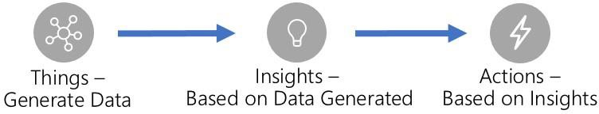

The document contains four sections: 1) an **overview -** containing the overall recommended architecture for IoT solutions (divided into subsystems), a brief introduction to IoT application subsystems, default technology recommendations per subsystem, and a discussion of cross-cutting concerns for IoT applications, 2) **foundational concepts and principles -** concepts and principles central to building scalable IoT applications are described in this section, 3) **subsystem details -** for each subsystem a subsection is dedicated to describing the subsystem responsibilities and technology alternatives for implementation, and 4) **solution design considerations** - a section describing implementation considerations of the architecture for solutions and industry verticals.

This document is a living document and will be updated as the cloud and technology landscape evolve. The document will track technology changes and provide up to date recommendations for Azure IoT solution architectures and technology best practices.

Every organization has unique skills and experience and every IoT application has unique needs and considerations. The reference architecture and technology choices recommended in this document should be modified as needed for each.

Technology recommendations per subsystem were generated using consistent criteria. Some criteria are common across all subsystems and technology alternatives; e.g. security, simplicity, performance, scale, and cost are critical no matter the subsystem or technology. Some criteria however are unique to a particular subsystem; e.g. query capabilities

1 [https://azure.microsoft.com/en-us/services/iot-central/](https://azure.microsoft.com/en-us/services/iot-central/)

for warm storage solutions. The criteria used to evaluate technical recommendations are described in the subsystems detail section.

# Architecture Overview

The architecture we recommend for IoT solutions is cloud native, microservice, and serverless based. The IoT solution subsystems should be built as discrete services that are independently deployable, and able to scale independently.

These attributes enable greater scale, more flexibility in updating individual subsystems, and provide the flexibility to choose appropriate technology on a per subsystem basis. It is critical to have the ability to monitor individual subsystems as well as the IoT application as a whole. We recommend subsystems communicate over REST/HTTPS using JSON (as it is human readable) though binary protocols should be used for high performance needs. The architecture also supports a hybrid cloud and edge compute strategy; i.e. some data processing is expected to happen on premise. We recommend use of an orchestrator (e.g. Azure Kubernetes Services - AKS or Service Fabric) to scale individual subsystems horizontally or PaaS services (e.g. Azure App Services) that offer built-in horizontal scale capabilities.

# Core Subsystems

At the core an IoT application consists of the following subsystems: 1) **devices** (and/or on premise edge gateways) that have the ability to securely register with the cloud, and connectivity options for sending and receiving data with the cloud, 2) a cloud gateway service, or **hub**, to securely accept that data and provide device management capabilities, 3) **stream processors** that consume that data, integrate with **business processes**, and place the data into **storage**, and 4) a **user interface** to visualize telemetry data and facilitate device management. Following, these subsystems are briefly described with prescriptive technology recommendations. Sections covering these subsystems in depth are in section 3 of this document.

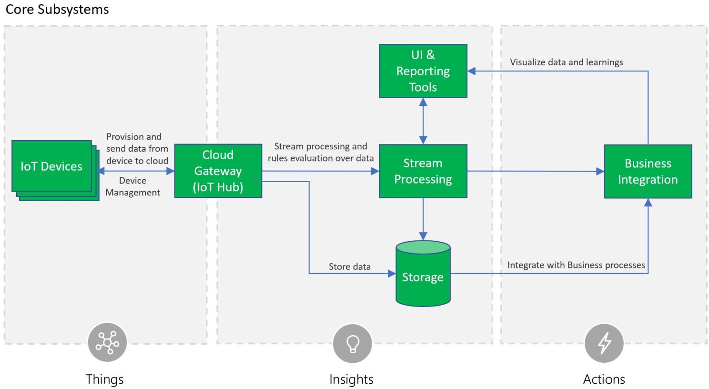

The Cloud Gateway provides a cloud hub for secure connectivity, telemetry and event ingestion and device management (including command and control) capabilities. We recommend using the **Azure IoT Hub service** as the cloud gateway.

The IoT Hub offers built-in secure connectivity, telemetry and event ingestion, and bi-directional communication with

devices including device management with command and control capabilities. In addition, the IoT Hub offers an entity store that can be used to store device metadata.

For registering and connecting large sets of **Devices** we recommend using the Azure IoT Hub Device Provisioning Service (DPS). DPS allows assignment and registration of devices to specific Azure IoT Hub endpoints at scale. We recommend use of the Azure IoT Hub SDKs to enable secure device connectivity and sending telemetry data to the cloud.

Stream processing processes large streams of data records and evaluates rules for those streams. For stream processing we recommend using Azure Stream Analytics for IoT applications that require complex rule processing at scale. For simple rules processing we recommend Azure IoT Hub Routes used with Azure Functions.

Business process integration facilitates executing actions based on insights garnered from device telemetry data during stream processing. Integration could include storage of informational messages, alarms, sending email or SMS, integration with CRM, and more. We recommend using Azure Functions and Logic Apps for business process integration.

Storage can be divided into warm path (data that is required to be available for reporting and visualization immediately from devices), and cold path (data that is stored longer term and used for batch processing). We recommend using Azure Cosmos DB for warm path storage and Azure Blob Storage for cold storage. For applications with time series specific reporting needs we recommend using Azure Time Series Insights.

The user interface for an IoT application can be delivered on a wide array of device types, in native applications, and browsers. The needs across IoT systems for UI and reporting are diverse and we recommend using Power BI, TSI Explorer, native applications, and custom web UI applications.

The Azure IoT Remote Monitoring2</supand Connected Factory3</supSolution Accelerators are open source offerings provide end to end examples showcasing use of Azure technologies with the bulk of the above described technology recommendations, allowing interested parties to get started quickly.

# Optional Subsystems

In addition to the core subsystems many IoT applications will include subsystems for: 5) **intelligent edge devices** which allow aggregation or transformation of telemetry data and on premise processing, 6) cloud telemetry **data transformation** which allows restructuring, combination, or transformation of telemetry data sent from devices, 7) **machine learning** which allows predictive algorithms to be executed over historical telemetry data, enabling scenarios such as predictive maintenance, and **8**) **user management** which allows splitting of functionality amongst different roles and users.

2 <https://azure.microsoft.com/blog/getting-started-with-the-new-azure-iot-suite-remote-monitoring-preconfigured-solution>

3 [https://github.com/Azure/azure-iot-connected-factory](https://github.com/Azure/azure-iot-connected-factory)

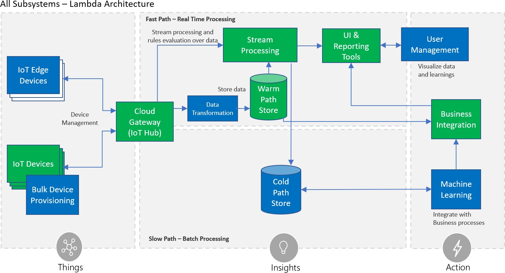

**Intelligent Edge Devices** serve an active role in managing access and information flow. They may assist in device provisioning, data filtering, batching and aggregation, buffering of data, protocol translation, event rules processing, and more. We recommend Azure IoT Edge4</supbe used for these on-premise needs. Azure IoT Edge also offers an extensible model for enabling custom functionality through Edge modules.

**Data transformation** involves manipulation or aggregation of the telemetry stream either before or after it is received by the cloud gateway service (the IoT Hub). Manipulation can include protocol transformation (e.g. converting binary streamed data to JSON), combining data points, and more. For translation of telemetry data before it has been received by the IoT Hub we recommend using the protocol gateway. For translation of data after it has been received by the IoT Hub we recommend using IoT Hub integration with Azure Functions.

The **machine learning (ML) subsystem** enables systems to learn from data and experiences and to act without being explicitly programmed. Scenarios such as predictive maintenance are enabled through ML. We recommend using Azure Machine Learning for Machine Learning needs.

The **user management subsystem** allows specification of different capabilities for users and groups to perform actions on devices (e.g. command and control such as upgrading firmware for a device) and capabilities for users in applications. It is further discussed as part of cross-cutting security requirements below.

# Cross-Cutting IoT application needs

There are multiple cross-cutting needs for IoT applications that are critical for success including: 8) **security** requirements; including user management and auditing, device connectivity, in-transit telemetry, and at rest security, 9) **logging and monitoring** for an IoT cloud application is critical for determining health and for troubleshooting failures

4 [https://azure.microsoft.com/en-us/services/iot-edge/](https://azure.microsoft.com/en-us/services/iot-edge/)

both for individual subsystems and the application as a whole, and 10) **high availability and disaster recovery** which is used to rapidly recover from systemic failures.

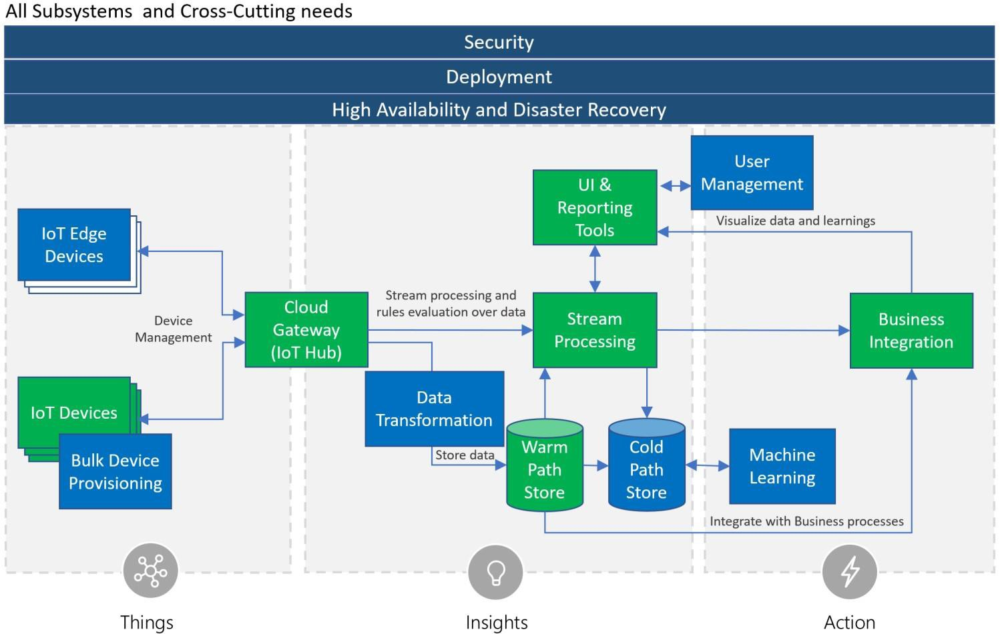

**Security** is a critical consideration in each of the subsystems. Protecting IoT solutions requires secure provisioning of devices, secure connectivity between devices, edge devices, and the cloud, secure access to the backend solutions, and secure data protection in the cloud during processing and storage (encryption at rest). As stated previously, we recommend using [Azure IoT Hub](https://docs.microsoft.com/en-us/azure/iot-hub/iot-hub-what-is-iot-hub) which offers a fully-managed service that enables reliable and secure bi-directional communication between IoT devices and Azure services such as [Azure Machine Learning](https://docs.microsoft.com/en-us/azure/machine-learning/studio/what-is-machine-learning) and [Azure Stream Analytics](https://docs.microsoft.com/en-us/azure/stream-analytics/stream-analytics-introduction) by using per-device security credentials and access control. For storage technologies we recommend using Azure Cosmos DB for warm path storage and Azure Blob Storage for cold storage both of which support encryption at rest. For user management, such as authenticating user credentials, authorization of user UI capabilities, reporting and management tools users have access to, and auditing application activities we recommend Azure Active Directory. Azure Active Directory supports the widely used OAuth2 authorization protocol, OpenID Connect authentication layer, and provides audit log records of system activities.

**Logging and monitoring** for IoT application is critical determining system uptime and troubleshooting failures. We recommend using Azure Operations Management Suite (OMS), Application Map, and App Insights for operations monitoring, logging, and troubleshooting.

**High availability and disaster recovery** (HA/DR) focuses on ensuring an IoT system is always available, including from failures resulting from disasters. The technology used in IoT subsystems have different failover and cross-region support characteristics. For IoT applications this can result in requiring hosting of duplicate services and duplicating application

data across regions depending on acceptable failover downtime and data loss. See the High Availability and Disaster Recovery section under Solution Considerations for a discussion on HA/DR.

2.  # Foundational principles and concepts
    
    1.  # Principles

The reference architecture allows assembling secure, complex solutions supporting extreme scale, yet allowing for flexibility with regard to solution scenarios. This motivates the following guiding principles across the different areas of the architecture.

**Heterogeneity.** This reference architecture must accommodate for a variety of scenarios, environments, devices, processing patterns, and standards. It should be able to handle vast hardware and software heterogeneity.

**Security5.** Because IoT solutions represent a powerful connection between the digital and physical worlds, building secure systems is a necessary foundation for building safe systems. This reference model contemplates security and privacy measures across all areas, including device and user identity, authentication and authorization, data protection for data at rest and data in motion, as well as strategies for data attestation.

**Hyper-scale deployments.** The proposed architecture supports millions of connected devices. It will allow proof of concepts and pilot projects that start with a small number of devices to be scaled-out to hyper-scale dimensions.

**Flexibility.** The heterogeneous needs of the IoT market necessitate open-ended composition of services and components. The reference architecture is built upon a principle of composability to allow creation of an IoT solution by combining a number of building blocks and enables the usage of various first-party or third-party technologies for the individual conceptual components. A number of extension points allow for integration with existing systems and applications. A high-scale, event-driven architecture with brokered communication is the backbone for a loosely coupled composition of services and processing modules.

# Data concepts

Understanding data concepts is a critical first step for building device-centric data collection, analysis, and control systems. The role of device and data models, data streams, and encoding are detailed in the following sections.

# Device and data models

Information models describing the devices, their attributes and associated data schema are key for implementing solution business logic and processing.

There are many different device modeling efforts underway across different industries, and this reference architecture takes a neutral stance in order to support these ongoing modeling and schematization efforts.

For example, in the case of an Industrial IoT scenario, the data semantics and structure may be based on the OPC UA information modeling framework.6</supOther implementations such as home automation and automotive applications may use entirely different industry-specific modeling and schema standards.

The architecture adopts a fundamental abstraction of data streams, where device and data models are not required to flow, route, or store information in the core platform components. At the solution layer, structured data will be guarded

5 <https://docs.microsoft.com/en-us/azure/iot-fundamentals/iot-security-architecture#threat-modeling-the-azure-iot-reference-architecture>

6 [https://opcfoundation.org](https://opcfoundation.org/)

by data models and schema whenever it is produced or consumed by the components. Developers have the option of using schemas for device-client development, backend analytics, or specific processing logic as required by the solution.

# Data records and streams

IoT solutions are designed considering the fundamental aspect of devices periodically transmitting **data records**, which are represented, analyzed and stored as multiple and continuous **data streams**. **Messages**, **events**, **telemetry, alerts** and **ingestion** are terms commonly used when describing IoT data streams.

Data records are usually timestamped, sorted by time and associated to at least one source. For instance, a telemetry record can contain the time of the measurement and the time when the data is received, and can be associated to the name of the device where the measurement is taken, to the gateway where the telemetry is collected, the hub where the telemetry is ingested, etc.

*Ingestion* is the process of uploading data records into storage, through a gateway such as Azure IoT Edge and Azure IoT Hub. Data records can be ingested one at a time or in bulk. The content of the streams can be real time data or past traffic replayed.

*Messages* and *events* are interchangeable terms used when referring to the data records generated by connected devices. The term *telemetr*y is used specifically for messages carrying data reported by device sensors, e.g. the current temperature sent from a temperature sensor on a device. Telemetry records can carry one or multiple *data points*, for example a device with one humidity and one temperature sensor might send the humidity and temperature measurements in the same message or in separate messages.

Devices can have multiple sensors installed and may send records with measurements reported by all sensors or only values that have changed since the last telemetry was sent, for example to reduce the amount of transferred data. The value of a data point in a telemetry record becomes the *last known state*. When sending only differential records, devices occasionally may also send a full snapshot of all sensor values (called a *key frame*), for consistency and synchronization purposes.

Telemetry records are usually analyzed, locally or in the cloud, against a set of rules. A different type of data record can be generated as a result, commonly referred as an *alert*.

# Data records format

Data records do not have a prescribed format. The assumption for each data stream is that all records use compatible structure and semantics. The format chosen by device manufacturers and IoT solutions depends on multiple factors, like the software running on devices, capacity of the CPUs, bandwidth, security, etc. We recommend IoT solutions adopt the JSON format, due to its readability and relatively low space required, however there are several binary formats, such as Avro, that can improve performance and reduce cost.

In order to simplify deserialization, non-breaking changes and segregation of streams by version should be allowed. A best practice is for IoT solutions to include metadata in each record, e.g. using message properties, specifying format and version. With a versioning model in place, solution developers can appropriately resolve potential conflicts of record fields in terms of semantics or type; e.g. if a specific device firmware changes and thereafter the device sends data records in a different format versioning will allow the solution developer to disambiguate between data streams.

The Azure IoT platform services are payload agnostic and do not require any particular field to be present in a message. Message completeness and compatibility is a responsibility of devices and solutions developers.

# Device interaction

The reference model adopts the principles of the Service Assisted Communication7</supapproach for establishing trustworthy bidirectional communication with devices that are potentially deployed in untrusted physical space. The following principles apply:

  - Devices do not accept unsolicited network connections. All connections and routes are established in an

*outbound-only* fashion.

  - Devices generally *only connect to or establish routes to well-known service gateways* that they are peered with. In case they need to feed information to or receive commands from a multitude of services, devices are peered with a gateway that takes care of routing information downstream and ensures that commands are only accepted from authorized parties before routing them to the device.

  - The communication path between device and service or device and gateway is *secured at the transport and application protocol layers*, mutually authenticating the device to the service or gateway and vice versa. Device applications do not trust the link-layer network.

  - System-level authorization and authentication should be based on *per-device identities*, and access credentials and permissions should be near-instantly revocable in case of device abuse.

  - Bidirectional communication for devices that are connected sporadically due to power or connectivity concerns may be facilitated through holding commands and notifications to the devices until they connect to pick those up.

  - Application payload data may be separately secured for protected transit through gateways to a particular service.

*Note:* A common pattern for informing power-constrained devices of important commands while disconnected is through the use of an out-of-band communication channel, such as cellular network protocols and services. For example, an SMS message can be used to “wake up” a device and instruct it to establish an outbound network

connection to its “home” gateway. Once connected, the device will receive the commands and messages.

# Communication protocols

There are many communication protocols available for device scenarios today and the number is growing. Choosing from among those for use with hyper-scale systems in order to ensure secure operations, while providing the capabilities and assurances promised by the chosen protocols, requires significant expertise in building out distributed systems. Yet, there is a vast number of existing devices for which protocol choices have already been made and these devices must be integrated into solutions.

This reference model discusses preferred communication protocol choices, explains potential trade-offs with these choices, and also explicitly allows for custom protocol extensibility, adaptation, and local processing at the field gateway (IoT Edge), a cloud-based protocol gateway, or during stream processing.

Please note that the communication protocol defines how payloads are moved and carries metadata about the payload that can be used for dispatching/routing and decoding, but commonly does not define the payload shape or format. For example, the communication may be enabled by the AMQP protocol, but the data encoding may be Apache Avro, or JSON, or AMQP’s native encoding.

7 <http://blogs.msdn.com/b/clemensv/archive/2014/02/10/service-assisted-communication-for-connected-devices.aspx>

# Architecture Subsystem Details

In this section each architectural subsystem is discussed in detail including the purpose of the subsystem, technology options for implementation, and recommended implementation choices.

# Devices, Device Connectivity, Field Gateway (Edge Devices), Cloud Gateway

Devices can be connected directly or indirectly via a field gateway (IoT edge device). Both devices and field gateways may implement edge intelligence capabilities. This enables aggregation and reduction of raw telemetry data before transport to the backend, and local decision-making capabilities on the edge.

Following is a conceptual representation of the different device connectivity options for IoT solutions. The numbers in the figure correspond to four key connectivity patterns, defined as follows:

1.  Direct device connectivity to the cloud gateway: For IP capable devices that can establish secure connections via the Internet.

2.  Connectivity via a field gateway (IoT Edge Device): For devices using industry specific standards (such as Constrained Application Protocol \[CoAP8\] or OPC UA), short-range communication technologies (such as Bluetooth or ZigBee), as well as for resource-constrained devices not capable of hosting a TLS/SSL stack, or devices not exposed to the Internet. This option is also useful when aggregation of streams and data is executed on a field gateway before transferring to the cloud.

8 <http://en.wikipedia.org/wiki/Constrained_Application_Protocol>

3.  Connectivity via a custom cloud gateway: For devices that require protocol translation or some form of custom processing before reaching the cloud gateway communication endpoint.

4.  Connectivity via a field gateway and a custom cloud gateway: Similar to the previous pattern, field gateway scenarios might require some protocol adaption or customizations on the cloud side and therefore can choose to connect to a custom gateway running in the cloud. Some scenarios require integration of field and cloud gateways using isolated network tunnels, either using VPN technology or using an application-level relay service.

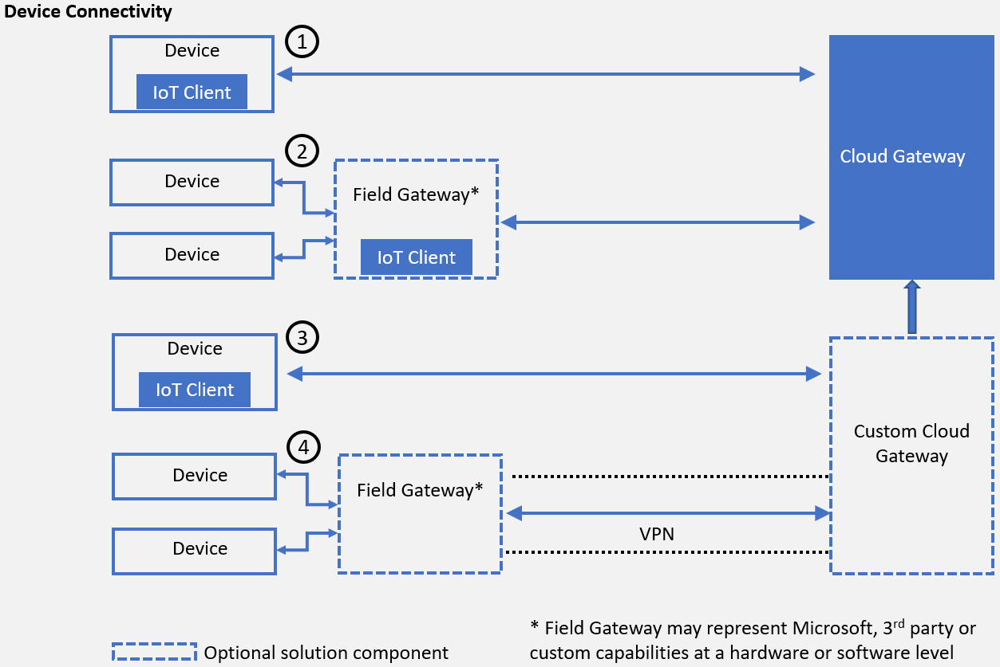

*Conceptual representation of device connectivity*

Direct device-to-device communication enables local network control activities and information flow, or collaborative operations where multiple devices perform coordinated actions. Purely local interactions are outside the scope of this architecture and covered by industry standards such as AllJoyn, UPnP/DLNA, and others.

It is important to understand the terminology and key components used to describe device connectivity in the Azure IoT reference architecture. The following sections provide more detailed descriptions.

# Devices

**Heterogeneous device support.** The goal is to enable secure, efficient, and robust communication between nearly any kind of device and a cloud gateway. This can be done both directly and through gateways.

**Target devices.** The devices in focus are line-of-business assets, from simple temperature sensors to complex factory production lines with hundreds of components with sensors inside them.

The purpose for these devices will dictate their technical design as well as the amount of resources needed for their production and scheduled lifetime operation. The combination of these two factors will define the available operational energy and physical footprint, and thus available storage, compute, and security capabilities. The reference architecture is generally neutral toward the runtime, platform, operating system, and performed function of the device.

# Field gateway (Edge Devices)

A field gateway, or edge device, is a specialized device-appliance or general-purpose software that acts as a communication enabler and, potentially, as a local device control system and device data processing hub. A field gateway can perform local processing and control functions for devices and can filter or aggregate device telemetry and thus reduce the amount of data being transferred to the cloud backend.

A field gateway’s scope includes the field gateway itself and all devices that are attached to it. As the name implies, field gateways act outside dedicated data processing facilities and are usually collocated with devices.

A field gateway is different from a mere traffic router in that field gateways can have an active role in managing access and information flow, i.e. they are “intelligent” devices. Field gateways may assist in device provisioning, data filtering, batching and aggregation, buffering of data, protocol translation, and event rules processing. We recommend Azure IoT Edge9</supbe used for Field Gateways in IoT solutions; Azure IoT Edge acts as an intelligent edge and facilitates on premise implementation of routing, protocol translation, machine learning, artificial intelligence, stream processing, and more. Azure IoT Edge offers an extensible model for enabling custom functionality through Edge modules.

# Cloud gateway

A cloud gateway enables remote communication to and from devices or edge devices, which potentially reside at several different sites. A cloud gateway will either be reachable over the public Internet, or a network virtualization overlay (VPN), or private network connections into Azure datacenters, to insulate the cloud gateway and all of its attached devices or edge devices from other network traffic.

It generally manages all aspects of communication, including transport-protocol-level connection management, protection of the communication path, device authentication, and authorization toward the system. It enforces connection and throughput quotas, and collects data used for billing, diagnostics, and other monitoring tasks. The data flow from the device though the cloud gateway is executed through one or multiple application-level messaging protocols.

In order to support event-driven architectures a cloud gateway typically offers a brokered communication model. Telemetry and other messages from devices are input into the cloud and the message exchange is brokered by the gateway. Data is durably buffered, which not only decouples the sender from the receiver, but also enables multiple consumers of the data. Traffic from the service backend to devices (such as notifications and commands) is commonly

implemented through an “inbox” pattern. Even when a device is offline, messages sent to it will be durably persisted in a store or queue (representing the inbox for a device) and delivered once the device connects. Due to possible time- delayed consumption of events, providing a time-to-live (TTL) value is important, especially for time-sensitive commands, such as "open car or home door" or "start car or machine." The inbox pattern will store the messages in the durable store for the given TTL duration, after which the messages will expire.

9 [https://azure.microsoft.com/en-us/services/iot-edge/](https://azure.microsoft.com/en-us/services/iot-edge/)

Brokering the communication through the described patterns allows decoupling the edge from the cloud components with respect to run-time dependencies, speed of processing, and behavior contracts. It also enables the composability of publishers and consumers as needed to build efficient, high-scale, event-driven solutions.

# Technology options

**Azure IoT Hub**. Azure IoT Hub is a high-scale service enabling secure bidirectional communication from a variety of devices. Azure IoT Hub connects millions of devices and supports high-volume telemetry ingestion to a cloud backend as well as command and control traffic to devices. Azure IoT Hub supports multiple consumers for cloud ingestion as well as the inbox pattern for devices. Azure IoT Hub provides support for the AMQP 1.0 with optional WebSocket10</supsupport, MQTT 3.1.111, and native HTTP 1.1 over TLS protocols.

**Azure Event Hubs**. Azure Event Hubs is a high-scale ingestion-only service for collecting telemetry data from concurrent sources at very high throughput rates. Event Hubs could also be used in IoT scenarios, in addition to IoT Hub, for secondary telemetry streams (that is, non-device telemetry), or collecting data from other system sources (such as

weather feeds or social streams). Event Hubs doesn’t offer per-device identity or command and control capabilities, so it might be suited only for additional data streams that could be correlated with device telemetry on the backend, but not as a primary gateway for connecting devices. Azure Event Hubs provides support for the AMQP 1.0 with optional WebSocket support, and native HTTPS protocols.

Support for additional protocols beyond AMQP, MQTT and HTTP can be implemented using a protocol gateway adaptation model. CoAP is an example of a protocol that can use this model.

# Custom cloud gateway

A custom cloud gateway enables protocol adaptation and/or some form of custom processing before reaching the cloud gateway communication endpoints. This can include the respective protocol implementation required by devices (or field gateways) while forwarding messages to the cloud gateway for further processing and transmitting command and control messages from the cloud gateway back to the devices. In addition, custom processing such as message transformations or compression/decompression can also be implemented as part of a custom gateway. However, this needs to be evaluated carefully because, in general, it’s beneficial to ingest the data to the cloud gateway as fast as possible and then perform transformations on the cloud backend decoupled from the ingestion.

Custom gateways help connect a variety of devices with custom or proprietary requirements and normalize the edge traffic on the cloud end. Solution-specific custom gateways will commonly act as a pass-through facility and can implement a custom authentication or rely on the authentication and authorization capabilities of the cloud gateway.

# Technology options

Custom gateways are typically built and operated to fulfill specific solution requirements. They may lean on shared open-source code that is built in collaboration with a system integrator (SI) or independent software vendor (ISV) community.

10 [http://en.wikipedia.org/wiki/WebSocket](http://en.wikipedia.org/wiki/WebSockets)

11 [http://mqtt.org](http://mqtt.org/)

**Azure IoT protocol gateway.** Azure IoT protocol gateway is an open-source framework for custom gateways and protocol adaptation. The Azure IoT protocol gateway facilitates high-scale, bidirectional communications between devices and Azure IoT Hub. It includes a protocol adapter for MQTT that showcases the techniques for implementing custom protocols and enables customizations of the MQTT protocol behavior, if required. The protocol gateway also allows for additional processing such as custom authentication, message transformations, compression/decompression, or encryption/decryption.

# IoT client

Cloud-communication with devices or edge devices must occur through secure channels to the cloud gateway endpoints (or cloud-hosted custom gateways).

In addition to a secure communication channel, the device usually needs to deliver telemetry data to the cloud gateway and allow for receiving messages and executing actions or dispatching those to appropriate handlers in the client. As stated earlier, all device and gateway connections should be established in an outbound only fashion.

There are three key patterns for client connectivity being used in IoT systems:

  - Direct connectivity from the device app/software layer

  - Connectivity through agents

  - Using client components integrated in the app/software layer of the device or gateway

**Direct connectivity.** In this case the communication to a cloud gateway endpoint is natively coded in the device or field gateway software layer using the desired protocols. This requires knowledge of the required protocols and message exchange patterns but provides full control over the implementation including the format of the data on the wire.

**Agents.** An agent is a software component installed on a device or field gateway that performs actions on behalf of another program or managing component. In the IoT space agents are typically controlled and act for components running on the cloud backend. For example, in the case of a command sent to a device, the agent will receive the command and can execute it directly on the device.

Agents could be proprietary agents, specifically written for a particular software solution, or standard-based agents

implementing particular standards such as OMA LWM2M. In both cases it’s convenient for device developers to integrate and rely on the encapsulated capabilities of the agents; however, there are some limitations. Typically, agents represent a closed system, constrained to the capabilities provided by the agent for a set of supported platforms.

Portability to other platforms or customizations and extensions beyond the provided functionality are typically not possible.

**Client components.** Client components provide a set of capabilities that can be integrated in the software code running on the device to simplify the connectivity to a backend. They are typically provided as libraries or SDKs that can be linked or compiled into the software layer of the device. For example, if a cloud backend sends a command to a device, the client components will simplify receiving the command, though the execution will be performed in the scope of the app/software layer.

Compared to agents, client components require integration effort into the device software, but they provide the greatest flexibility for extensibility and portability.

# Technology options

**Azure IoT device SDKs.** The Azure IoT device SDKs represent a set of client components that can be used on devices or gateways to simplify the connectivity to Azure IoT Hub. The device SDKs can be used to implement an IoT Client that facilitates the connectivity to the cloud. They provide a consistent client development experience across platforms and help abstract the complexity of distributed systems messaging from device developers. These libraries enable the connectivity of a heterogeneous range of devices and field gateways to an Azure based IoT solution. They simplify common connectivity tasks by abstracting details of the underlying protocols and message processing patterns. The libraries can be used directly in a device application or to create a separate agent running on the device that establishes connectivity with the cloud gateway and facilitates the communication between the device and the IoT solution backend.

The Azure IoT device SDKs are an open-source framework that is aligned with the Azure IoT platform capabilities. While these libraries simplify the connectivity to Azure IoT Hub, they are optional and not required if device developers choose to connect to the IoT Hub endpoints using existing frameworks and supported protocol standards.

# Device identity store

**Device identity authority.** The device identity store is the authority for all device identity information. It also stores and allows for validation of cryptographic secrets for the purposes of device client authentication. The identity store typically does not provide any indexing or search facility beyond direct lookup by the device identifier; that functional role is taken on by another store that keeps the application specific domain model (see next section for details). These stores are primarily separated for security reasons; lookups on devices should not allow disclosing cryptographic material.

Further, limiting the identity store to a minimal set of system-controlled attributes helps to provide fast and responsive operations, while on the other hand the schema of the domain model store is determined by the solution requirements.

The cloud gateway relies on the information in the identity store for the purposes of device authentication and management. The identity store could be contained in the cloud gateway, or alternatively the cloud gateway could use separate device identities externally.

**Provisioning**. Device provisioning uses the identity store to create identities for new devices in the scope of the system or to remove devices from the system. Devices can also be enabled or disabled. When they are disabled, they cannot connect to the system, but all access rules, keys, and metadata stay in place.

Changes on the device identity store should be made through Provisioning, described in section 3.4.

# Technology options

We recommend using the Azure IoT Hub which includes a built-in device identity store that is the authority for registered devices and provides per-device security credentials.

When a custom cloud gateway is used, it can also rely on the IoT Hub identity store and its authentication and authorization capabilities. In case there are specific solution requirements that necessitate a custom implementation of the identity store, it will be a separate component that will primarily enforce identifier uniqueness, store all required security keys for the device, and will potentially hold an “enabled/disabled” status. If it includes transmitted passphrases, those should be stored in the form of salted hashes. Please keep in mind that a custom implementation of the identity store needs to be secured appropriately, because it stores credential information.

The identity store should only permit access to privileged parts of the system as necessary; custom gateways will look up the required authentication material from this store.

If not using Azure IoT Hub, external implementations can be realized with Azure Cosmos DB, Azure Tables, Azure SQL Database, or third-party solutions:

  - **Azure Cosmos DB:** In Azure Cosmos DB,12</supeach device is represented by a document. The system-level device

identifier directly corresponds to the “id” of the document. All further properties are held alongside the “id” in

the document.

  - **Azure Tables:** In Azure Tables, the identity store maps to a table. Each device is represented by a row. The system-level device identifier is held in a combination of PartitionKey and RowKey, which together provide uniqueness. All further properties are held in columns; complex data can be stored as JSON, if needed. The concrete split of the identifier information across those fields is application specific and should follow the scale guidance for the service.13

  - **SQL Database:** In SQL, the identity store also maps to a table and each device is represented by a row. The system-level device identifier is held in a clustered index primary key column. All further properties are stored in columns; complex data or data requiring extensibility can be stored as JSON, if needed.

  - **Third-party options:** Third-party solutions available through the Azure Marketplace or directly deployed on Azure compute nodes can be used as well. For example, in Cassandra, each device can be represented by a row in a column family. The store will be partitioned and indexed for fast access as needed.

# Topology and entity store

**Device and application model**. Device and application models are foundational for building application business logic. Examples include the ability to define and configure business rules, perform search for a subset of devices or application entities, build User Interface and dashboards, and to ensure consistency across different components of the solution and other backend systems.

Device models often describe:

  - The schema for metadata about the device including characteristics and/or capabilities of a device. Metadata schema and values change rarely.

Examples of device metadata are device type, make, model, serial number, capacity, etc.

  - Data schemas for data emitted by the device, which define the telemetry attributes along with their data types and allowed ranges.

For example, an environmental monitoring device will emit temperature, defined as attribute name: temp, data type: decimal, measurement unit: Fahrenheit, and data range \[10 – 110\], and humidity defined as attribute name: humidity, data type: decimal, measurement unit: percent, data range \[0-100\].

  - Schemas for configuration parameters controlling device behaviors.

For example, some of the behavior of an environmental monitoring device can be control by parameters such as sampling frequency, telemetry transmission interval, and operations mode.

  - Operations and parameters for the control actions a device can perform.

For example, a device with connected actuator can expose remote operations such as *turn left(degrees)*, *turn\_right(degrees)*, and *flash\_warning\_light(number\_of\_times)*.

  - Device topologies representing a domain model, such as rich relationships between devices and other entities, and semantic connections for business operating context.

12 <https://azure.microsoft.com/services/cosmos-db>

13 <http://msdn.microsoft.com/library/azure/hh508997.aspx>

For example, a building management system may use a domain model including entities such as campus (or building complex), building, floor, room, resource, device, and sensor. The topology model defines the entity attributes (such as properties, operations, etc.) as well as the relationships between the entities.

The complexity of the application model highly depends on the domain specific requirements. In some cases, a hierarchical topology model will be used (e.g. for modeling campus/building/floor/room/resources and devices for a building management system), while in other cases a graph topology might be more appropriate (e.g. a transportation logistics company operating a fleet might require more flexible relationships, having for example one vehicle be associated with multiple fleet groups, and with often dynamically changing relationships.

Devices are represented as nodes in the overall application topology. In many solutions the entities of interest from a business perspective are not the same as the devices itself. The primary asset of a company can be a machine or product that has one or more devices embedded. In the case of a building management solution, the building and room entities are the ones that will have a plenty of application and business logic associated with them, while the devices provide supporting functionality for monitoring, and remote control. In a fleet management solution, a connected vehicle for example, has multiple devices associated with it and a subset of those devices help with the communication to and from the vehicle. The application business logic is primarily focused on vehicle and group of vehicles, while the devices represent important support functions for the operation of the vehicles.

**Definition and function**. The topology and entity store is a database that contains application entities and relationships among the entities. It also contains device metadata and attributes for provisioned devices (represented by device entity in the overall topology).

The topology and entity store contain a “run-time” representation of the application model. The Azure IoT reference architecture does not impose any particular entity or device model, schema, or structure for device metadata. It assumes that those are defined for the specific IoT solution at “design time”, i.e. during development or dynamically during configuration of the system through appropriate modeling tools. It is possible to define an own application model or select some vertical industry standard model.

During provisioning, each device is registered with a metadata record (instance of the device entity) in the topology and entity store, which can contain structured and/or unstructured metadata, based on the defined model (at design time).

**Device identity registry versus topology and entity store.** While the device identity store only contains system- controlled attributes and cryptographic material, the topology and entity store have a full representation of a device, including its relation to other entities, such as products, assets, or machines. The record in the identity store determines whether a device is registered and can authenticate with the system. For security reasons, it’s a good practice to keep the security related info separate from the device entity. The entity store must not store any key or other cryptographic information related to the device.

The device identity store represents the authoritative list of device identities (primarily for authentication purposes). The topology and entity store in contrast, has the full set of device metadata (device attributes, properties, operations, etc.) among relations to other application entities, required for the application to perform its business functions. This store is the one used for device discovery, as well as discovery of other application entities and provides reach indexing and powerful search capabilities.

The topology and entity store is the authoritative store for entities and their relationships for the IoT solution, ensuring consistent view across the system. For technical reasons, projections of the contained information can be stored or cached in other components for fast access. However, the source of truth for the entities and their relations is this store.

Changes to it might need to be synchronized or propagated to other components as needed. For example, some device metadata attributes might be necessary in the IoT Hub device twin for device management orchestration. In this case, changes of those attributes of the device entity need to be applied to the IoT Hub device twin. Vice versa, if an attribute value is changed on the device twin (coming from a device), this change will be propagated to the device entity in the topology and entity store. In other cases, specific advanced analytics tasks might need a copy of the device reference data in a specific storage component or format.

**Metadata**. The distinction between metadata describing the device itself and operational data reflecting the state of the device or its operating environment is important because it directly impacts how the device information can be used, cached, and distributed throughout the system. Metadata is typically slow-changing data, while the operational data is expected to be fast-changing.

For example, the geo-position of a traffic-light pole is metadata, but the current geo-position of a vehicle is considered operational data. The vehicle’s identification number, model, and make will be metadata. Discovery of all traffic lights on a particular stretch of a road can be performed as a query against the topology and entity store, while finding all vehicles currently driving on a particular stretch of a road would be an analysis task over operational data. The metadata in the topology and entity store can help as reference data for finding all vehicles of a particular model on the road, however.

# Technology options

The topology and entity store providing descriptive information about entities and devices should provide rich or freeform index capabilities with the goal of providing fast lookups.

The registry store can be implemented on top of one of the following technologies:

  - **Azure Cosmos DB:** Azure Cosmos DB is a fully managed graph database and allows modeling of IoT devices, entities and their topology as a graph. In Azure Cosmos DB, each device can be represented by a document. The system-level device identifier directly corresponds to the “id” of the document. All further properties are held alongside the “id.” Cosmos DB is well suited for the topology and entity store function because it accepts arbitrarily structured data and automatically creates indexes (unless disabled for specific attributes). This allows for fast and flexible lookups14</supacross the registered devices and other entities. It also allows for easy navigation of the topology using the Cosmos DB Graph API.

  - **Azure SQL Database:** In SQL, each device can be represented by a row in a table. The system-level device identifier is held in a clustered index primary key column. All further properties are stored in columns; complex data or data needing extensibility can be stored as JSON or XML, if needed. Based on query patterns the appropriate columns will need to be indexed. Other application entities can be represented by SQL tables. Relations between the entities can be expressed using SQL Database relational database functionality.

  - **Third-party options:** In addition to managed Azure services, third-party data services available through the Azure Marketplace or directly deployed on Azure compute nodes can be used as well. In this case the actual schema depends on the product used, but the structure is going to be similar to the one used for Azure Cosmos DB or Azure SQL Database. Partitioning and indexing will be applied as needed for fast access based on the appropriate device or entity properties. For example, for representing devices in Apache Cassandra database15,

14 <https://docs.microsoft.com/azure/cosmos-db/documentdb-sql-query>

15 [http://cassandra.apache.org](http://cassandra.apache.org/)

Cassandra’s column family could have the device identifier as partition key and could define additional indexes

on other properties of the device.

# Device provisioning

**Definition**. Provisioning represents the step of the device life cycle when a device is to be made known to the system. The Provisioning API is the common external interface for how changes are made to the internal components of the backend, specifically the device identity store and the topology and entity store. It provides an abstract interface with common gestures, and there is an implementation of that abstract interface for the device identity and topology and entity stores. The implementation can be extended to include other components and systems.

Device provisioning is typically initiated at the backend, by registering devices in the system before they become operational. In some cases, this may happen during manufacturing of the devices (including burning in device identity and credentials required to connect to the IoT backend). In other cases, the provisioning may be performed immediately before the device is turned on for usage, for example during device installation. The first time a device is trying to establish a connection to the backend, additional steps might be performed to finalize its configuration (or to

“bootstrap” it) for usage.

**Provisioning workflow**. A solution’s provisioning workflow takes care of processing individual and bulk requests for registering new devices and updating or removing existing devices. It will also handle the activation, and potentially the temporary access suspension and eventual access resumption. This may also include interactions with external systems such as a mobile operator’s M2M API to enable or disable SIMs, or with business systems such as billing, support, or customer relationship management solutions. The provisioning workflow ensures, that the device is registered with all backend systems that need to know about its identity and additional metadata attributes as needed.

**Bootstrapping workflow**. When a device wants to connect to the backend system for the first time, additional steps may be executed to finalize its configuration. This might include configuration or software updates to be applied before first usage of the device. During the bootstrapping step, the device might be assigned to a new “home” endpoint with new credentials for it. This is particularly important for multitenant systems or globally distributed deployments. Information about who is going to use the device (which tenant) or where the device is going to be used (geo location) impacts the decision of where to “home” the device (i.e. which cloud gateway will be responsible for connectivity with the device). In many cases, the provisioning component is implemented as a “global” service that delegates the registration of devices into regional deployments, as well as orchestrated devices to their “home” endpoints during bootstrapping. In this case, the global service can implement a higher-level workflow for provisioning, using the same or similar external interfaces as the regional components, and delegate operations to the regional provisioning components as appropriate.

# Technology options

We recommend using the Azure IoT Hub Device Provisioning Service16</sup(DPS) for device provisioning. DPS is a global provisioning service that supports registration and configuration (i.e. bootstrapping) of devices across multiple IoT Hubs. DPS simplifies the automation of device provisioning into the device identity store (part of IoT Hub), while providing flexibility to control the distribution of devices. DPS offers an API for backend systems for the device registration, as well as API for the device configuration (bootstrapping). DPS can be used in the provisioning workflow to automate the distribution of devices across IoT Hubs, alongside with other steps for registering devices in other backend components and systems (such as the topology and entity store, or a 3rd</supparty provider system). For globally distributed deployments, each of these steps might require registration with a global or regional system.

16 <https://azure.microsoft.com/roadmap/azure-iot-hub-device-provisioning>

Azure API Apps17</supcan be used for the implementation of the external provisioning API. API Apps provides a platform for building, hosting, and distributing APIs in the cloud and on-premises. API Apps integrates seamlessly with Azure Logic Apps,18</supwhich can be used for the implementation of an overarching provisioning workflow across the IoT solution components and external business systems.

The provisioning interface is a simple set of gestures for managing the device life cycle. The provisioning interface (API) should be implemented as the primary API over the device identity and topology and entity registry stores and optionally other internal solution components if required. It is not only used from the solution UI (for example, the device administration portal), but can also serves as the interface for higher-level workflows that can also interact with external systems, such as a mobile operator’s M2M API for managing SIM cards or a backend business system for activating a billing for a service.

Security keys can be generated outside of the API and passed in as parameters or can be created and assigned by the service as part of the provisioning API call.

Generating a security token can be performed in the Provisioning API using the required signing key. The token issued to a device will be limited in scope to a particular endpoint (for example, a device endpoint in the case of IoT Hub or Event Hub publisher policy). The data returned by the *Register* and *ResetCredentials* operation contains the required security tokens that must be transferred to the devices. Alternatively, security tokens could be generated on the device or externally and passed to the devices.

For custom gateways, the required credentials can be generated externally and passed into the API for storage, or the API can be extended to create the keys.

# Storage

**Definition.** IoT solutions can generate significant amounts of data depending on how many devices are in the solution, how often they send data, and the size of payload in the data records sent from devices. Data is often time series data and is required to be stored where it can be used in visualization and reporting as well as later accessed for additional processing. It is common to have data split into “warm” and "cold" data stores. The warm data store holds recent data that needs to be accessed with low latency. Data stored in cold storage is typically historical data. Most often the cold storage database solution chosen will be cheaper in cost but offer fewer query and reporting features than the warm database solution.

A common implementation for storage is to keep a recent range (e.g. the last day, week, or month) of telemetry data in warm storage and to store historical data in cold storage. With this implementation, the application has access to the most recent data and can quickly observe recent telemetry data and trends. Retrieving historical information for devices can be accomplished using cold storage, generally with higher latency than if the data were in warm storage. For general purpose scenarios we recommend Azure Cosmos DB for warm storage and Azure Blob Storage for cold storage. If the solution requires frequent queries that involve aggregation across many events and across many devices we recommend Time Series Insights for warm storage. See below for a detailed description of warm and cold storage and a deep dive into the technology evaluation performed for storage technology in each category.

# Warm Storage

A warm storage database stores device state for a pre-determined recent interval and may also store an easily accessible last known state per device. This data must be available in the database quickly (ideally within a matter of

17 <https://azure.microsoft.com/documentation/articles/app-service-api-apps-why-best-platform>

18 <https://azure.microsoft.com/documentation/articles/app-service-logic-what-are-logic-apps>

seconds from when the data is ingested into the cloud gateway from the device) and easily queried for simple scenarios such as visualizing current device sensor values or visualizing values over a recent timeframe. Common query patterns include: data for a device for a recent date and time range, aggregated data for one or many devices, and the last known value for a telemetry point for a specific device. The data stored in the warm database may be raw data, aggregated data, or both. See Section 3.6 - Data flow and stream processing for information on streaming processing.

If a solution has a high rate of ingestion (on the order of many hundreds of thousands or millions of messages per second), a specialized high ingestion database may be required. The recommendations for high ingestion databases are forthcoming.

# Evaluation Criteria

Warm storage solutions were evaluated based on the following criteria. These criteria will not apply for every IoT solution but were designed to be most generally applicable across IoT solutions.

1.  **Security**. The solution offers mature and robust features such as encryption at rest, authentication and authorization, and network security.

2.  **Simplicity**. The solution is well documented and has a well-defined architecture. Development tasks are

documented, supported by software development kits (“SDKs”), and are testable in a local development

environment. Deployment and operational tasks are supported by documentation, tools, and user interfaces.

3.  **Performance**. Reading and writing to the database is fast and scales to many concurrent reads and writes. Query performance is also fast.

4.  **Scalability**. The database supports storing gigabytes to terabytes of data. Scaling out does not require downtime. The ideal solution automatically adapts cost and computing power to the load provided.

5.  **Query Capability**. The database has the query capabilities necessary for the overall solution.

6.  **Price**. The database is affordable for both storage capacity and throughput needs.

# Technology options

Azure Services vs. Third Party Options

All Azure Services are secure and make setup and maintenance of the service simple. In addition to Azure services, third party, self-managed options hosted in Azure can be used for storage as well; e.g. Cassandra. Due to increased complexity and the higher developer operations costs (leading to a higher total cost of ownership) of self-managed services, we recommend using a managed service over a self-managed service. A self-managed service requires planning for storage and compute needs, and an operations team to manage the resources. It should be noted however that self-managed services offer great flexibility and control making them potentially suitable for your scenario.

# General Purpose

**Recommended: Azure Cosmos DB.** We recommend Azure Cosmos DB as a general purpose warm storage solution. Azure Cosmos DB is a secure, highly scalable (no limits on data storage or throughput), low latency NoSQL database. It is best for datasets that can benefit from [flexible, schema-agnostic,</spanautomatic](https://docs.microsoft.com/en-us/azure/cosmos-db/indexing-policies) indexing, and rich query interfaces. Azure Cosmos DB has 5 API types and data models—SQL, MongoDB, Graph, Table and Cassandra, which provide the flexibility to choose a data model based on the data needs of the solution. Cosmos DB allows multi-region read and write and supports manual failover in addition to automatic failover. In addition, Cosmos DB allows the user to set a time-to-live (TTL) on their data, which makes expiring old data automatic. Pricing is based on storage used and Request Units

provisioned19. Cosmos DB is best for scenarios that do not require queries involving aggregation over large sets of data across many devices, as those queries require more Request Units than a basic query such as the last event for a device.

**Azure SQL DB.** Azure SQL DB is best for datasets that require relational storage and query capabilities. Azure SQL DB also provides advanced features for data management, protection and security, and business continuity. Pricing is based on a combination of storage provisioned and Database Transaction Units or elastic Database Transaction Units provisioned20. Manual scaling to increase storage space has no downtime. SQL DB also has built in replication and automatic region failover to ensure data is not lost in an outage. We recommend Azure Cosmos DB over Azure SQL DB due to the requirement of relational storage, the need to manually scale the database, and the limits on scale and throughput for write ingest.

**Azure Time Series Insights** (TSI). Azure TSI is an analytics, storage and visualization service for time series data, providing capabilities including SQL-like filtering and aggregation, alleviating the need for user-defined functions. All data in Azure TSI is stored in-memory and in SSDs, which ensures data is quickly ready for interactive analytics. Azure TSI also provides visualizations such as overlays of different time series, dashboard comparisons, accessible tabular views, and heat maps. Azure TSI provides a data explorer to visualize and query data as well as REST Query APIs. Further, it exposes a [JavaScript](https://docs.microsoft.com/en-us/azure/time-series-insights/tutorial-explore-js-client-lib) [controls library](https://docs.microsoft.com/en-us/azure/time-series-insights/tutorial-explore-js-client-lib) that enables embedding time series charts into custom applications. Azure TSI is suited for solutions that need visualization services built in and do not need to report on data immediately (TSI has an approximate latency for querying data records of 30-60 seconds). TSI is well suited for solutions that need to query aggregates over large sets of data, as TSI allows any number of users to conduct an unlimited number of queries for no extra cost. Today, TSI has a maximum retention of 400 days and a maximum storage limit of 3 TB, so a solution using TSI will need to use a cold storage database (likely swapping data into TSI for querying as needed) as well if the customer needs a larger amount of storage or longer retention. TSI is our recommendation for time series data storage and analytics

**Third Party: Apache Cassandra.** Apache Cassandra is a linearly scalable, highly available NoSQL database and can span clusters across geographical regions. It uses the CQL query language, which is modeled after SQL. It offers authentication, encryption and firewall capabilities, as well as data replication. In addition, it performs well in write- heavy scenarios (it can achieve over 1 million writes per second21), which makes it a good fit for an IoT solution that has a high level of telemetry ingestion.

Comparison Grid—General Purpose

# Azure Cosmos DBAzure SQL DB23</supApache Cassandra
|                       |                    | Azure Cosmos DB                           | Azure SQL Database                                        | Apache Cassandra                               |
| *Security Simplicity* | Encryption at Rest | Yes                                       | Yes                                                       | Yes                                            |
|-----------------------|--------------------|-------------------------------------------|-----------------------------------------------------------|------------------------------------------------|
|                       | Authentication     | Master keys, Active Directory integration | SQL Authentication, Azure Active Directory Authentication | JMX usernames and passwords, role-based access |
|                       | Supports Firewalls | Yes                                       | Yes                                                       | Yes                                            |
|                       | Data Model         | Multi-Model                               | Relational                                                | Wide column                                    |

>   19 <https://azure.microsoft.com/en-us/pricing/details/cosmos-db/>

>   20 <https://azure.microsoft.com/en-us/pricing/details/sql-database/>

>   21
>   <https://medium.com/netflix-techblog/benchmarking-cassandra-scalability-on-aws-over-a-million-writes-per-second-39f45f066c9e>

>   22 <https://azure.microsoft.com/en-us/services/cosmos-db/>

>   23 <https://azure.microsoft.com/en-us/services/sql-database/>

|                       |                    | Azure Cosmos DB                           | Azure SQL Database                                        | Apache Cassandra                               |
|                     | Developer SDKs                    | .NET, Java, Node.js, Python for all APIs.                     | .NET, Java, Node.js, Python, Ruby, and more | .NET, C/C++, Java, Node.js, PHP, Python and more |
|---------------------|-----------------------------------|---------------------------------------------------------------|---------------------------------------------|--------------------------------------------------|
| *Perf/ Scalability* | Availability                      | 99.99% SLA                                                    | 99.99% SLA                                  | Highly available—no single point of failure      |
|                     | Regional Availability             | 30+ Azure regions                                             | 30+ Azure regions                           | N/A                                              |
|                     | Data Replication                  | Automatic local replication.                                  | Automatic local replication.                | Can enable replication with more nodes.          |
|                     | Disaster Recovery                 | Automatic failover.                                           | Automatic failover.                         | Need to configure. Can spread cluster across     |
|                     | Data Limits                       | None                                                          | Max 4 TB                                    | None                                             |
|                     | Throughput Limits                 | None                                                          | Max 4000                                    | None                                             |
|                     | Single Write Performance          | \< 1 second                                                   | \< 1 second                                 | \< 1 second                                      |
|                     | Single Read Performance           | \< 1 second                                                   | \< 1 second                                 | \< 1 second                                      |
|                     | Single Simple Query               | \< 1 second                                                   | \< 1 second                                 | \< 1 second                                      |
|                     | Aggregate Query Performance**26** | \> 1 second27                                                 | 1 second                                    | \> 1 second28                                    |
|                     | Query Language(s)                 | SQL                                                           | T-SQL                                       | CQL                                              |
|                     | Pricing Model                     | Storage usage and RU provisioned. Can scale RUs up or down as | Storage and                                 | Dependent on setup                               |

24 <https://docs.microsoft.com/en-us/azure/sql-database/sql-database-what-is-a-dtu>

25 Ex: Select data for a single device for the last minute

26 Ex. Return percentiles for device data for the last hour (assuming 3600 data points, calculating P25, P50, P75, P90, P99)

27</spanAggregate functions are not natively supported in Cosmos DB. A user-defined function would be required.

28 Functions such as sum are supported in SQL, but percentiles and more complex calculations are not. A user-defined function would be required.

# Cold Storage

Instead of keeping all data in a warm data store with low latency, high throughput, and full query capabilities, data can be split into warm and cold storage paths. This can provide lower storage costs while still preserving historical data. A cold storage database holds data that is not needed as quickly and/or frequently as warm storage, but still may be necessary to access in the future for reporting, analysis, machine learning use, etc.

# Evaluation Criteria

Cold storage solutions were evaluated based on the following criteria. These criteria will not apply for every solution but were designed to be the most generally applicable for an IoT solution.

1.  **Security**. The solution offers mature and robust features such as encryption at rest, authentication and authorization, and network security.

2.  **Simplicity**. The solution is well documented and has a well-defined architecture. Development tasks are documented, supported by software development kits (“SDKs”), and to some degree testable in a local development workstation. Deployment and operational tasks are supported by documentation, tools, and user interfaces.

3.  **Scalability**. The database supports storing a large amount of data. Scaling out does not require downtime. The database has very long (on the order of years) or unlimited retention. The ideal solution automatically adapts cost and computing power to the load provided.

4.  **Price**. The database is affordable for large amounts of data.

# Technology Options

The best cold storage database for a solution is highly dependent on what purpose the database will serve. The two data storage solutions below are designed for high scale at a low price, but each has strengths for different scenarios. We recommend Azure Blob Storage for the general case, as it is cheaper than Azure Data Lake, especially in terms of write requests, is currently available in more regions, and has better disaster recovery. However, if the solution requires cold storage data analytics (with Hadoop, Azure Data Analytics, etc.), or requires querying with U-SQL, Data Lake is designed with that scenario in mind and may be the better choice.

**Recommended: Azure Blob Storage.** Azure Blob Storage is a simple, inexpensive file storage database. Blobs can be used to store raw device data. Using page blobs instead of block or append blobs should be considered depending on frequency of write operations29. Azure blob storage has full security capabilities, local or geo-redundant storage options, and is available in all Azure regions. It is highly scalable—the maximum storage limit is 500 TB and the maximum request rate per account is 20,000 requests per second30.

**Azure Data Lake**. Azure Data Lake is a distributed data store that can persist large amounts of relational and nonrelational data without transformation or schema definition. It is a good choice for a storage database if big data analytics and/or unlimited storage are required. It is slightly more expensive than Azure Blob Storage (specifically in terms of write operations), but it is optimized for big data analytics workloads. The database can be accessed from Hadoop via WebHDFS-compatible REST APIs or using the U-SQL language. It has locally redundant storage and is available in some US Azure regions as well as North Europe. We recommend Blob Storage over Data Lake due to the slight premium in price, the smaller regional availability, and the lack of geo-redundant storage.

29 <https://docs.microsoft.com/en-us/azure/storage/blobs/storage-blobs-introduction>

30 <https://docs.microsoft.com/en-us/azure/azure-subscription-service-limits#storage-limits>

# Comparison Grid

|               |                       | Azure Blob Storage                                                                | Azure Data Lake |
|---------------|-----------------------|-----------------------------------------------------------------------------------|-------------------------------------------------------------------------------------|
| *Security*    | Encryption at Rest    | Yes                                                              | Yes                                                   |
|               | Authentication        | Shared Secrets, HMAC                                                              | Azure Active Directory, OAuth 2.0                                                   |
|               | Supports Firewalls    | Yes                                                                               | Yes                                                                                 |
| *Simplicity*  | Auditing              | Yes                                                                               | Yes                                                                                 |
|               | Data Model            | Object store with flat namespace                                                  | Hierarchical File System                                                            |
|               | API                   | REST API over HTTPS/HTTP                                                          | REST API Over HTTPS, U-SQL                                                          |
|               | Server-side API       | Azure Blob Storage REST API                                                       | WebHDFS-compatible REST API                                                         |
|               | Developer SDKS        | .NET, Java, Python, Node.js, C++, Ruby, PHP, Go, Android, iOS                     | .NET, Java, Python, Node.js                                                         |
|               | Availability          | Between 99.9-99.99% SLA for read (depending on replication), 99.9% SLA for writes | 99.9% SLA for read/write                                                            |
|               | Regional Availability | All Azure Regions                                                                 | East US 2, Central US, North Europe                                                 |
|               | Data Replication      | Locally redundant by default. Can also be read-only geo-redundant                 | Locally Redundant                                                                   |
|               | Disaster Recovery     | If have geo-replicated data: Can read from secondary in case of outage and will   | Can handle transient hardware failures. It is recommended to copy data to secondary |
| *Scalability* | Data Limits           | 500 TB                                                                            | None                                                                                |
|               | Throughput Limits     | 20,000 requests/second                                                            | None                                                                                |
| *Price*       | Pricing Model         | Data Usage and Request Count33                                                    | Data Usage and Request Count34                                                      |

# Data flow and stream processing

As data is ingested to the IoT backend, it is important to understand how the flow of data processing may vary. Depending on scenarios and applications, data records can flow through different stages, combined in different order, and often processed by concurrent parallel tasks.

These stages can be classified in four categories: **storage, routing**, **analysis** and **action/display**:

  - *Storage* includes in-memory caches, temporary queues and permanent archives.

31 <https://azure.microsoft.com/en-us/services/storage/blobs/>

32 <https://azure.microsoft.com/en-us/services/data-lake-store/>

33 [https://azure.microsoft.com/en-us/pricing/details/storage/blobs/](https://azure.microsoft.com/en-us/pricing/details/storage/blobs/)

34 [https://azure.microsoft.com/en-us/pricing/details/data-lake-store/](https://azure.microsoft.com/en-us/pricing/details/data-lake-store/)

  - *Routing* allows dispatching of data records to one or more storage endpoints, analysis processes, and actions.

  - *Analysis* is used to run input data records through a set of conditions and can produce different output data records. For instance, input telemetry encoded in Avro may return output telemetry encoded in JSON format.

  - Original input data records and analysis output records are typically stored and available to display, and may trigger actions such as emails, instant messages, incident tickets, CRM tasks, device commands, etc.

These processes can be combined in simple *graphs*, for instance to display raw telemetry received in real time, or more complex graphs executing multiple and advanced tasks, for example updating dashboards, triggering alarms, and starting business integration processes, etc.

For example, the following graph represents a simple scenario in which devices send telemetry records which are temporarily stored in Azure IoT Hub, and then are immediately displayed on graph on screen for visualization:

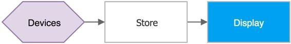

The following graph represents another common scenario, in which devices send telemetry, store it short term in Azure IoT Hub, shortly after analyzing the data to detect anomalies, then trigger actions such as an email, SMS text, instant message, etc.:

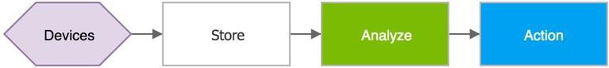

IoT architectures can also consist of multiple ingestion points. For instance, some telemetry storage and/or analysis may occur on premise, within devices and field/edge gateways; or protocol translations may be required to connect constrained devices to the cloud. While the resulting graph is more complex, the logical building blocks are the same:

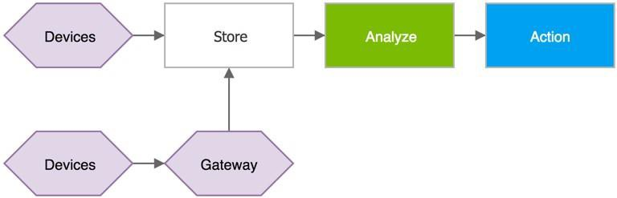

# Recommended data flow

This reference architecture assumes that a business runs multiple concurrent stream processors, either by partitioning the ingested stream, or by forwarding data records to multiple pipelines. We recommend partitioning be based on message properties (e.g. device ID, device location, payload format, etc.) to avoid payload de-serialization before routing but the document includes solutions capable of routing based on the content of JSON messages.

The following graph, also known as *Lambda architecture*, shows the recommended flow of device-to-cloud messages and events in an IoT solution. Data Records flow through two distinct paths:

1.  A fast process that archives and displays incoming messages, and also analyzes these records generating short- term critical information and actions, such as alarms.

2.  A slow processing pipeline executing complex analysis, for example combining data from multiple sources and over a longer period of time (e.g. hours or days), and generating new information such as reports, machine learning models, etc.

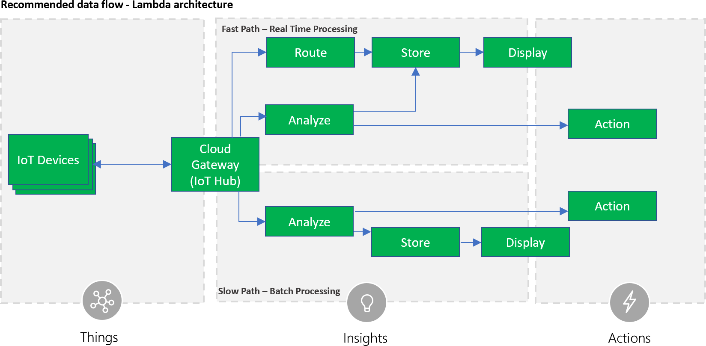

In the lambda architecture, the fast data flow is constrained by latency requirements, so there is a limit on the complexity of the analysis possible. Often, this requires a tradeoff of some level of accuracy in favor of data and analysis that is ready as quickly as possible. For example, averaging functions and trend analysis can be executed only on a limited amount of data, typically in the order of few seconds.

Data flowing into the slow path, on the other hand, is not subject to the same latency requirements, and allows for high accuracy computation across large data sets, which can be very time intensive. It is also notable that slow path analysis results can be leveraged by fast path analytics; e.g. a solution might need to compute a running revenue average over a week of data and provide that average for use as reference data to fast path computations.

# Technology options

There are several Azure and third-party services that can be used and combined to build a reliable and scalable IoT architecture, however, when choosing which service to deploy, some aspects should be considered first:

  - **Stateless vs stateful**: where possible, a solution should implement stateless processors, to reduce operational cost and increase availability. On the other hand, stateful processing allows for richer analysis, and is often required to implement higher level features.

  - **Static vs dynamic rules**: if analysis rules do not change and do not reference external data that changes, it is possible to choose simpler technologies at a lower cost. In scenarios where more flexibility is required to support variable load, frequent changes to stream processing logic, and mutable external reference data available technologies are more complex and expensive to deploy.

The document presents two options, one to address simple scenarios with stateless processors and fairly static rules, and one complex scenarios, e.g. stateful processors with dynamic analysis logic and reference data.

The following solutions are presented with the assumption that Azure managed services increase the overall system security and reduce the cost of setup and maintenance. On the other hand, solutions developers can create heterogeneous systems, combining managed services with proprietary, third-party or open source components, such as Spark and Cassandra through leveraging other Azure offers like Azure Virtual Machines, Azure Container Services, and Azure HDInsight.

# Stateless stream processing

The following architecture provides a solution for fast and scalable real-time analysis of ingested data records, in scenarios where only stateless analysis is required, using a small set of simple logic rules. Also included is a slower path, allowing execution of more complex analysis, for instance machine learning jobs, without the speed limitations of the fast path.

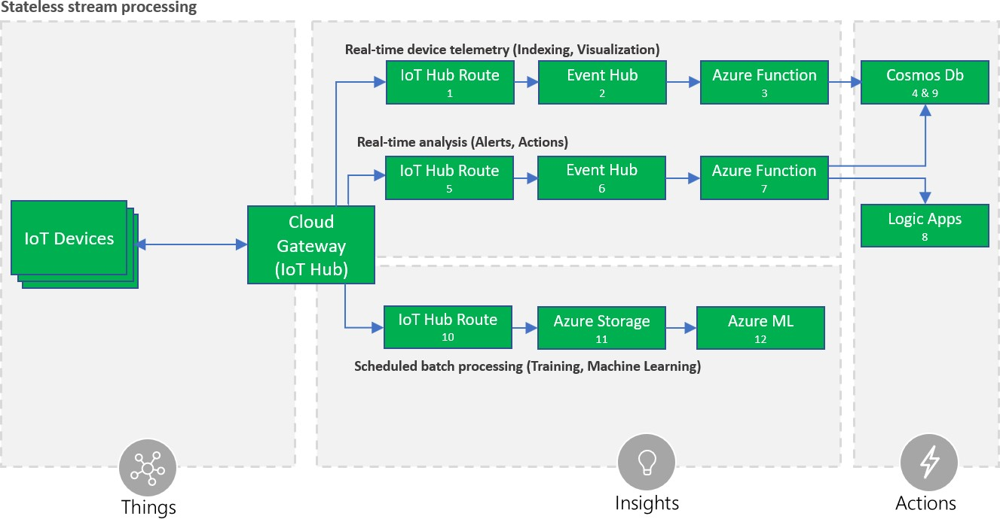

This architecture is recommended for scenarios where the input data records are serialized in JSON, and processing rules take in input one message at a time, without considering historic data. The architecture leverages the ability to define conditions on the payload (\#5) in Azure IoT Hub, in order to forward only specific messages and trigger actions in services connected via Logic Apps (\#8).

One Azure IoT Hub route is also used to forward all the telemetry (\#1) to an Azure function (\#3) that can transform it into a different format, e.g. joining external information, and store it to Azure Cosmos DB (\#4) for warm storage consumption, e.g. display on a dashboard.

Another Azure IoT Hub route (\#10) is used to copy all the incoming data records into Azure Storage Blobs (\#11) for cold storage, where it can be archived indefinitely at low cost, and is easily accessible for batch processing, such as Azure Machine Learning data science tasks (\#12).

Benefits of the architecture:

1.  High availability due to geographic redundancy and quick disaster recovery features of the Azure services.

2.  Low cost: most of the components automatically scale, adapting to variable work load, minimizing the cost whenever there is no data to process.

3.  Minimal operational costs, because all the components are managed Azure services.

4.  Flexibility: Azure Functions and Azure Cosmos DB allow transformation of ingested data to any desired schema, supporting multiple access patterns and APIs like MongoDB, Cassandra and Graph APIs.

5.  Actions and Business Integration: A wide choice of integrations are available via Logic Apps and Azure ML. When to use this architecture:

<!-- end list -->

1.  Input data records are serialized in JSON format.

2.  A small number of rules are required. Currently Azure IoT Hub supports up to 100 routes.

3.  Data records can be analyzed one at a time; i.e. there is no need to aggregate data over multiple data points (e.g. averaging) or data streams (e.g. merging data from multiple devices).

# Stateful stream processing

The following architecture describes a fast, flexible and scalable solution for stateful real-time analysis of ingested data records in multiple formats, with the ability to reference external data, without the limitations of the previous architecture, at the expense of a greater operational cost.

The architecture includes the same slow path seen in the previous architecture for use with machine learning and other complex analysis not possible in the fast path.

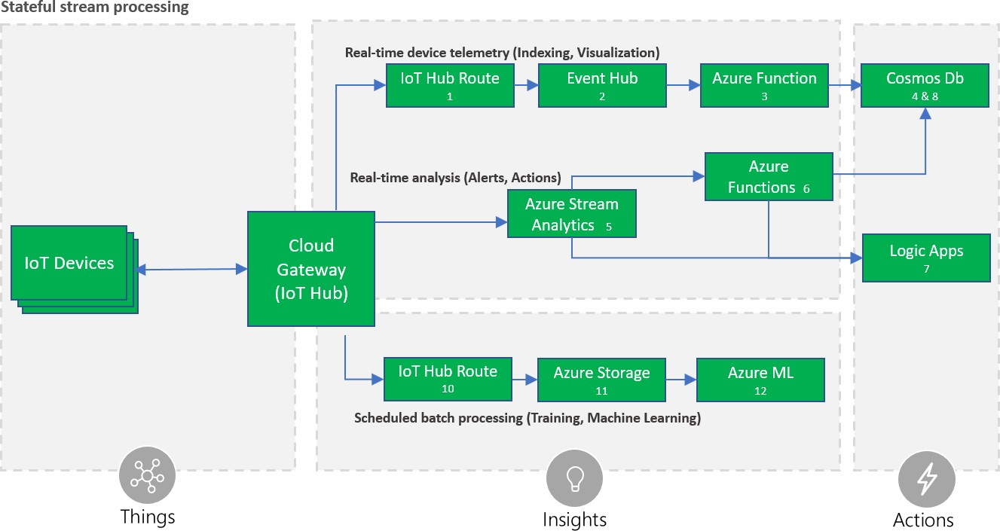

The architecture is similar to the solution recommended for stateless processing only the analysis path is replaced with Azure Stream Analytics (ASA) (\#5).

ASA is designed for hyper-scale analysis and routing of data records, in a stateful fashion, with the ability to apply complex queries over time periods and multiple streams. Queries are defined using a SQL-like language that allows transformations and computations. The service tolerates late (up to 21 days) and out-of-order (up to one hour) events, when processing by *application time35*, in which case the output is therefore delayed by the time difference.

ASA also guarantees *exactly once delivery* to the supported destinations, with few documented36</supexceptions that may generate duplicates. The query language allows optimized performance analysis via parallelization, and by breaking queries into steps.

ASA also supports data records in Avro format, a compact binary format used to reduce latency and bandwidth cost.

In addition to ASA performing stream processing, in this architecture one Azure IoT Hub route is used to forward all telemetry (\#1) to an Azure function (\#3) that can transform it into a different format, e.g. joining external information, and store it to Cosmos DB (\#4) for consumption, e.g. display on a dashboard.

A separate Azure IoT Hub route (\#10) is used to copy all incoming data records into Azure Storage Blobs (\#11), where it can be archived indefinitely at low cost, and is easily accessible for batch processing, such as Azure Machine Learning data science tasks (\#12).

Benefits of the architecture:

1.  High availability due to geographic redundancy and quick disaster recovery features of Azure services.

2.  Minimal operational costs, because all the components are managed Azure services.

3.  Azure Stream Analytics ability to execute complex analysis at scale, for instance use of tumbling/sliding/hopping windows, stream aggregations, and external data source joins.

4.  Flexibility: Azure Functions and Cosmos DB allow transformation of ingested data to any desired schema, supporting multiple access patterns and APIs like MongoDB, Cassandra and Graph APIs.

5.  Actions and Business Integration: A wide choice of integrations are available via Logic Apps and Azure ML.

6.  Performance: Support for binary data streams, in order to reduce latency. When to implement this architecture:

<!-- end list -->

1.  Input data records require complex analysis, such as time windows, streams aggregation, or joins with external data sources, which is not possible with the stateless architecture.

2.  The processing logic consists of several rules or logic units, which might grow in time.

3.  Input telemetry is serialized in a binary format like Avro.
    
    1.  # Solution User Interface

The solution user interface (UI) typically includes a website and reporting, but can also include web services and a mobile or desktop app.

35 <https://docs.microsoft.com/azure/stream-analytics/stream-analytics-out-of-order-and-late-events>

36 <https://msdn.microsoft.com/azure/stream-analytics/reference/event-delivery-guarantees-azure-stream-analytics>

The solution UI can provide access to and visualization of device data and analysis results, discovery of devices through the registry, command and control capabilities, and provisioning workflows. In many cases end users will be notified of alerts, alarm conditions, or necessary actions that need to be taken through push notifications.

The solution UI can also provide or integrate with live and interactive dashboards, which are a suitable form of visualizations for IoT scenarios with a large population of devices.

IoT solutions often include geo-location and geo-aware services and the UI will need to provide appropriate controls and capabilities.

As stated in beginning of this document, security is critical and the solution UI that provides control over the system and devices needs to be secured appropriately with access control differentiated by user roles and depending on authorization.

# Technology options

Azure App Service is a managed platform with powerful capabilities for building web and mobile apps for many platforms and mobile devices. Web Apps and Mobile Apps allow developers to build web and mobile apps using languages like .NET, Java, NodeJS, PHP, or Python. In addition, Azure API Apps allows easy exposure and management of APIs, which can be accessed by mobile or web clients.

Azure Time Series Insights (TSI) includes a time series data-optimized user interface including charting, a heat map, a perspective view for comparing visualizations, and Business Intelligence statistics associated with the underlying data. TSI also offers a JavaScript control library which facilitates integration of visualization of data stored in TSI in custom applications.

The TSI JavaScript control library enables developers with existing applications to embed charts for visualization of their IoT data. If a user would like to create a new application, starting with the Azure IoT Solution Accelerators (Remote Monitoring or Connected Factory) is the recommended approach. These open source reference architecture implementations use the TSI JavaScript control library for visualizations out of the box and alleviate the need to build a custom Web App from scratch. Note these Solution Accelerators are end to end, production-ready examples of IoT solutions; i.e. they include implementations for stream processing, storage, etc.

Azure Notification Hubs enables sending of push notifications to personal mobile devices (smartphones and tablets). It supports iOS, Android, Windows, and Kindle platforms, while abstracting the details of the different platform notification systems (PNS). With a single API call, a notification can target an individual user or an audience segment with a large number of users.

In addition to the traditional UI, dashboards are very important in IoT scenarios because they provide a natural way for aggregated views and help visualize a vast number of devices. Power BI is a cloud-based service that provides an easy way to create rich, interactive dashboards for visualizations and analysis. Power BI also offers live dashboards, which allow users to monitor changes in the data and indicators. Power BI includes native apps for desktop and mobile devices.

Another suitable technology for IoT visualizations is Azure Maps.37</supThe Azure Maps APIs includes map controls and services that can be used to incorporate Azure Maps in applications and websites. In addition to interactive and static

37 <https://azure.microsoft.com/en-us/services/azure-maps/>

maps, the APIs provide access to geospatial features such as geocoding, route and traffic data, and spatial data sources that can be used to store and query data that has a spatial component, such as device locations.

Web and mobile apps can be integrated with Azure Active Directory (AAD) for authentication and authorization control. The apps will rely on the management of user identities in AAD and can provide role-based access control for application functionality. In many cases there will be logical associations between IoT devices and users (or between groups of devices and groups of users). For example, a device can be owned by someone, used by someone else, and installed or repaired by another user. Similar examples can be true for groups of devices and users. Permissions and role-based access control can be managed as part of an association matrix between device identities (maintained in the device identity store) and user identities managed by AAD. The specific design of this matrix, granularity of permissions, and level of control will depend on the specific solution requirements. This matrix can be implemented on top of the device registry or can use a separate store using different technology. For example, the device registry can be implemented using Cosmos DB, while the association and permission matrix can be built using a relational SQL database. Please note that this topic is discussed in this section because user authentication and authorization is surfaced as part of the UX; however, the actual implementation will be spread across multiple underlying components, including the device registry and the app backend, discussed in the next section.

#  

IoT solution logging and monitoring systems are used to determine whether the solution is functioning as expected and to help troubleshoot what is wrong with the solution. Monitoring and logging systems aid in answering the following operational questions:

  - Are devices or systems in an error condition?

  - Are devices or systems correctly configured?

  - Are devices or systems generating accurate data?

  - Are systems meeting the expectations of both the business and end customers?

Monitoring and logging systems assist with answering these questions, and when the answer is “no”, they surface relevant information for operations teams to help mitigate problems.

IoT solutions logging and monitoring systems are often more complicated than those of standard line-of-business applications. The complexity arises from the fact that IoT solutions span:

  - Physical sensors interacting with an environment.

  - Applications on the intelligent edge performing data shaping, protocol translation, etc.

  - Infrastructure components such as on-premise gateways, firewalls and switches.

  - Ingestion and messaging services.

  - Persistence mechanisms.

  - Insight and reporting applications.

  - Subsystems that operate and scale independently in the cloud.

A further component of IoT solution complexity arises from the fact that there are a diverse set of stakeholders, including:

A monitoring and logging solution can include numerous specialty software applications and libraries targeted at each subsystem of the IoT solution. Logging and monitoring tools are typically comprised of the following four components:

  - System performance and timeline visualization tools –for monitoring the system and for basic troubleshooting.

  - Buffered data ingestion –to buffer log data (which can be verbose).

  - Persistence store –to store log data.

  - Search and query capabilities –to view log data for use in detailed troubleshooting.

Large scale IoT solutions can be composed of many smaller subsystems. It is often reasonable to deploy multiple instances of logging and monitoring components for each of these systems, with higher level instances aggregating data and analyses from the lower level systems. For example, in the Remote Monitoring solution accelerator multiple subsystems (IoT Hub, Cosmos Db, Azure Stream Analytics, custom microservices, and more) are used to provide operator capabilities for IoT devices. Logging for the subsystems is done at an individual level, and then can be aggregated to provide an end to end view of the solution.

Resiliency and redundancy must be considered when designing logging and monitoring systems. Increased logging and monitoring performance can be gained by co-locating a solution alongside systems; however, the strategy comes with the risk of systemic outage38</supand incurs the risk of the logging/monitoring system negatively affecting performance and scale of the core IoT solution itself. Early assessment of the monitored system ‘risk of failure’ will ensure the development of robust solutions.39

# Monitoring & Visualization

Monitoring systems provide insights into the health, security, and stability, and performance of an IoT solution. At a high level, monitoring systems provide a quick view of whether the end to end solution is functioning as expected.

Monitoring systems can also provide a more detailed view, recording component configuration changes and providing extracted logging data that can surface potential security vulnerabilities, enhance the incident management process40, and help the owner of the system troubleshoot problems. Comprehensive monitoring solutions include the ability to query information for specific subsystems or aggregating across multiple subsystems.

Monitoring system development should begin by defining healthy operation, regulatory compliance, and audit requirements. Metrics collected may include:

38 [https://medium.com/@adrianco/who-monitors-the-monitoring-systems-715a333f97fc](https://medium.com/%40adrianco/who-monitors-the-monitoring-systems-715a333f97fc)

39 [https://turbonomic.com/blog/on-technology/thinking-like-an-architect-understanding-failure-domains/](https://turbonomic.com/blog/on-technology/thinking-like-an-architect-understanding-failure-domains/)

40 [https://www.axelos.com/news/blogs/september-2014/service-monitoring-strategic-opportunity](https://www.axelos.com/news/blogs/september-2014/service-monitoring-strategic-opportunity)

  - Physical devices, edge devices, and infrastructure components reporting configuration changes; e.g. open network ports, patches, services, and users (for audit & compliance), along with general operational parameters such as power consumption, CPU, memory, and disk usage.

  - Applications reporting configuration changes, security audit logs, request rates, response times, error rates, and garbage collection statistics for managed languages.

  - Databases, persistence stores and caches reporting query and write performance, schema changes, security audit log, locks or deadlocks, index performance, CPU, memory and disk usage.

  - Managed services (IaaS, PaaS, SaaS and FaaS) reporting health metrics and configuration changes that impact dependent system health and performance.

Care should be taken to balance the performance cost of collecting and storing metrics against the value of the insights provided.

Strategies for collecting metrics are often complicated by the enhanced security contexts specific to IoT solutions. Applications on devices can be sandboxed from the host operating system which inhibits collecting device metrics through the applications deployed to them, requiring additional software solutions to facilitate collection. Additional system security design pressures arise from audit and compliance requirements. SaaS, PaaS and IaaS monitoring components often come with certifications41</supthat will narrow audit scopes for meeting regulatory compliance requirements.

Visualization of monitoring metrics alert stakeholders to system instabilities and facilitate incident response. Visualization should be customized to stakeholder roles and provide extensibility to accommodate solution growth and maturation. Data presented to operators should be limited to high-impact, actionable metrics that can be linked to system state changes, while providing the ability to deep dive into specific problems as needed. Visualization timelines should present correlated data, such as deployments, configuration changes or previous incidents. The added context of this correlated data enhances decision making and expedites response time.

# Tracing Telemetry

Tracing telemetry allows an operator to follow the journey of a piece of telemetry from creation through the system. Tracing is important for debugging and troubleshooting. For IoT solutions that leverage Azure IoT Hub and the Azure Device SDKs, tracing datagrams can be originated, ad hoc, as *Cloud-to-Device42* messages and included in the telemetry stream. Tracing IDs and message flags allow tracing datagrams to flow through the system’s processing chain while offering operational insights along the way.

In IoT solutions where only differential telemetry (e.g. only refrigeration temperature changes) is transmitted to the ingestion service, a similar approach for tracing messages can also be leveraged to build heartbeat circuits43. Heartbeat circuits are used to ensure that devices with low messaging rates are still active, infrequently used messaging connections remain alive, and to indicate forward progress during long running tasks. Heartbeat telemetry can be leveraged for building performance visualizations, Service Level Agreement (SLA) reports, and can be folded into an IoT solution’s monitoring tool chain.

41 [https://azure.microsoft.com/overview/trusted-cloud](https://azure.microsoft.com/overview/trusted-cloud)

42 Send cloud-to-device messages from IoT Hub [(https://docs.microsoft.com/azure/iot-hub/iot-hub-devguide-messages-c2d)](https://docs.microsoft.com/azure/iot-hub/iot-hub-devguide-messages-c2d)

43 [https://docs.microsoft.com/system-center/scom/manage-agent-heartbeat-overview](https://docs.microsoft.com/system-center/scom/manage-agent-heartbeat-overview)

# Logging

Logging systems are integral in understanding what actions or activities a solution has performed, failures that have occurred, and can provide help in fixing those failures. Logs can be analyzed to help understand and remedy error conditions, enhance performance characteristics, and ensure compliance with governing rule and regulations.

Text based and structured are two primary models for logging information.44Text based logging is typically implemented for debugging purposes during application development and provides developers with a narrative style recording of application behavior. Structured logging builds upon the text-based approach by adding situational context and metadata to the narrative log information with the intention that the logs will be parsed. In structured logging approaches, properties become first class citizens formatted as key/value pairs, or with a fixed schema, to enhance search and query capabilities.

*Text log example*:

2017-12-18T08:15:30 \[INFO\] - ClientAuthed, dev/opcpub, 35f634d7

2017-12-18T08:15:30 \[INFO\] - New device connection for device dev/opcpub 2017-12-18T08:15:30 \[INFO\] - Bind device proxy for device dev/opcpub

2017-12-18T08:15:30 \[INFO\] - Binding message channel for device dev/opcpub

*Structured log example*:

{“@t”:”2017-12-18T08:15:30”,”@l”:”info”,“deviceId”:”opcpub”,”@m”:” ClientAuthed, 35f634d7.”}

{“@t”:”2017-12-18T08:15:30”,”@l”:”info”,“deviceId”:”opcpub”,”@m”:” New device connection.”}

{“@t”:”2017-12-18T08:15:30”,”@l”:”info,“deviceId”:”opcpub”,”@m”:” Bind device proxy.”}

{“@t”:”2017-12-18T08:15:30”,”@l”:”info”,“deviceId”:”opcpub”,”@m”:” Binding message channel.”}

Though plain text logging is lower impact on upfront development costs, it is more challenging for a machine to parse/read. We recommend structured logging be used, as collected information is both machine parsable and human readable.

# Evaluation Criteria Monitoring

Monitoring & Visualization solutions were evaluated with the following criteria. While these criteria may not apply to every IoT solution, they were selected as the most generally applicable.

1.  Complete Solution: Solution offers buffered data ingestion, easily integrated data persistence, search and query capabilities, and a suite of easily navigable visualizations. The monitoring solution should offer Application Performance Monitoring (APM) capabilities, an alerting and notification rule system, extensibility for issue tracking system integration, and potentially a feedback loop that enables solution autoscaling.

2.  Security: The monitoring and associated visualization systems offers mature and robust security options such as Transport Layer Security (TLS) for communications, integrated authorization and authentication for resources, and data encryption at rest.

3.  Visualization: Solutions offer a suite of prebuilt visualizations, facilitate the building of custom visualizations and offer search and query of data. Access to underlying data sources and generated dashboards are protected by authorization and authentication mechanisms.

44 [https://www.thoughtworks.com/radar/techniques/structured-logging](https://www.thoughtworks.com/radar/techniques/structured-logging)

4.  Configuration & Machine Monitoring: Solutions have the capacity to scan and monitor for machine changes in ports, packages, services, users, etc. Application or service level configurations are monitored and checked for consistency across deployments or clusters of machines. The solution works across Windows and Linux operating systems.45

5.  Alerting: Solutions have an integrated rules engine that maps to either an integrated alerting and notification system or provides easily configurable hooks to third-party notification and ticketing systems.

6.  Compliance: Solution should meet compliance specifications for deployments that require auditing.

7.  Service Model: The solution is offered for self-hosting or as a SaaS solution with an SLA.

8.  Scale: Additionally, the monitoring system should easily scale with IoT solution growth.

# Technology Options

The following monitoring and visualization solutions were evaluated. Operations Management Suite is the recommended solution for Azure IoT solutions.

# Operations Management Suite (Recommended)

Operations Management Suite (OMS) is the recommended monitoring and visualization solution. OMS provides an operations management toolchain for IoT solutions (cloud and on-premise). Machine logs, services and applications, regardless of deployment location, can push log messages directly into OMS using OMS built-in connectors or via its Data Collector API.46</supOMS provides custom log parsing to facilitate decomposition of events and records into individual fields for indexing and search.47

Monitoring log search is available via the OMS Log Search feature, or the customizable Analytics service, which integrates with OMS and provides advanced visualization options.

Alerting is supported via Alert Rules. Alerts are defined using a query that monitors events happening within a specified time range. Threshold values, frequency options, and alert suppression are available to avoid alert flooding. The alerting engine supports integration via Webhook: this enables OMS to send messages with messaging solutions such as Microsoft Teams or Slack. An alert dashboard is also available to provide an overall view of active alerts.48

OMS data retention policies are configurable, and all activities performed on the Log Analytics service are logged and can be audited.49

# Elastic Stack (Elasticsearch, Logstash, Kibana and Beats)

Collectively, the Elastic Stack facilitates the ingestion, parsing and visualization of data. The Elastic Stack is available through an array of deployment options including self-hosted, in a public or private cloud, or through the Azure Marketplace. The Elastic stack is highly customizable with a broad community that contributes actively to both the core components and add-on solutions. Elastic provides a library of success stories across industries and use cases50.

Built upon the mature Apache Lucene library, the Elasticsearch component provides search engine capabilities and analytics over collected data. It is designed for performance and for scale, distributing shards across nodes and automatically detecting failures to rebalance data. One of the challenges with Elasticsearch is querying data across the

45. [https://www.upguard.com/product/core\#Features](https://www.upguard.com/product/core#Features)

46. [https://docs.microsoft.com/azure/log-analytics/log-analytics-data-collector-api](https://docs.microsoft.com/azure/log-analytics/log-analytics-data-collector-api)

47. [https://docs.microsoft.com/azure/log-analytics/log-analytics-data-sources-custom-logs](https://docs.microsoft.com/azure/log-analytics/log-analytics-data-sources-custom-logs)

48. [https://docs.microsoft.com/en-us/azure/log-analytics/log-analytics-alerts](https://docs.microsoft.com/en-us/azure/log-analytics/log-analytics-alerts)

49. [https://docs.microsoft.com/azure/log-analytics/log-analytics-data-security](https://docs.microsoft.com/azure/log-analytics/log-analytics-data-security)

50. [https://www.elastic.co/use-cases](https://www.elastic.co/use-cases)

indexed sources, so it is important to join the data as it is indexed51. Ingestion and parsing of logs via Logstash will be discussed further in the Logging section below.

Kibana is a data visualization tool which supports basic charts and graphs, geospatial features, and time series. Dashboards can be embedded in applications, shared, or exported to various formats.

Just as monitoring is intended to assert the health of the system, it is important to know that the monitoring solution itself remains healthy52. The Elastic Stack X-Pack add-on is core to solving this problem, as well as role-based access control down to the document field level, transport encryption, integrated audit log, alerting and automated report distributions. X-Pack allows sending data into a separate cluster so that monitoring is available when the production nodes have failed.

# Splunk

Splunk is a general-purpose, real-time data analysis platform with a powerful extensibility model, offered in both hosted and self-hosted configurations. Splunk supports an array of input data formats53</supand has the capability to collect telemetry and logs from machines using agentless scanning or with the Universal Forwarder54</supagent. Ingested raw data is transformed into time-series events and subsequently indexed for search and query. Splunk’s Common Information Model (CIM)55</suphelps to normalize data to match a shared semantic model, which acts as a search-time schema over

indexed data. Splunk’s Search Processing Language (SPL)56</supcombines SQL with data piping capabilities to query, enrich and transform (into the CIM) indexed data. SPL facilitates data visualization, machine learning and anomaly detection and trend analysis.

Splunk is often deployed for audit and regulatory compliance solutions, as it supports a wide range of monitoring and reporting utilities for financial services, healthcare and public-sector organizations. Splunk also benefits IoT workloads through integrated predictive maintenance, customizable alert and notifications, and device performance management.

# Comparison Grid

<table>
<thead>
<tr class="header">
<th></th>
<th></th>
<th><blockquote>

<em>Operations Management Suite</em>

<em>(OMS)</em>

</blockquote></th>
<th><em>Elastic Stack</em></th>
<th><blockquote>

<em>Splunk (Hosted)</em>

</blockquote></th>
</tr>
</thead>
<tbody>
<tr class="odd">
<td><blockquote>

<em>Solution Components</em>

</blockquote></td>
<td><em>Buffered Ingestion</em></td>
<td><em>Yes</em></td>
<td><em>Yes</em></td>
<td><em>Yes</em></td>
</tr>
<tr class="even">
<td></td>
<td><blockquote>

<em>Integrated</em>

<em>Persistence</em>

</blockquote></td>
<td><em>Yes</em></td>
<td><em>Yes</em></td>
<td><em>Yes</em></td>
</tr>
<tr class="odd">
<td></td>
<td><em>Search &amp; Query</em></td>
<td><em>Yes</em></td>
<td><em>Yes</em></td>
<td><em>Yes</em></td>
</tr>
<tr class="even">
<td></td>
<td><em>Visualization</em></td>
<td><em>Yes</em></td>
<td><em>Yes</em></td>
<td><em>Yes</em></td>
</tr>
<tr class="odd">
<td><blockquote>

<em>Security</em>

</blockquote></td>
<td>
<em>System Update</em>

<em>Assessment</em>
</td>
<td><em>Yes</em></td>
<td><em>No</em></td>
<td><em>Yes</em></td>
</tr>
<tr class="even">
<td></td>
<td><em>Antimalware</em></td>
<td><em>Yes</em></td>
<td><em>Possible</em></td>
<td><em>Yes</em></td>
</tr>
<tr class="odd">
<td></td>
<td>
<em>Encrypted</em>

<em>Communications</em>
</td>
<td><em>Yes</em></td>
<td><em>Possible</em></td>
<td><em>Yes</em></td>
</tr>
<tr class="even">
<td></td>
<td>
<em>Data Encryption at</em>

<em>Rest</em>
</td>
<td><em>Yes</em></td>
<td>
<em>Via encrypted</em>

<em>filesystem</em>
</td>
<td><em>Yes</em></td>
</tr>
</tbody>
</table>

51. [https://www.opsview.com/resources/elasticsearch/blog/using-elk-stack-business-intelligence](https://www.opsview.com/resources/elasticsearch/blog/using-elk-stack-business-intelligence)

52. [https://medium.com/@adrianco/who-monitors-the-monitoring-systems-715a333f97fc](https://medium.com/%40adrianco/who-monitors-the-monitoring-systems-715a333f97fc)

53. [http://dev.splunk.com/view/dev-guide/SP-CAAAE3A](http://dev.splunk.com/view/dev-guide/SP-CAAAE3A)

54. [https://docs.splunk.com/Documentation/Forwarder/7.1.0/Forwarder/Abouttheuniversalforwarder](https://docs.splunk.com/Documentation/Forwarder/7.1.0/Forwarder/Abouttheuniversalforwarder)

55. [http://docs.splunk.com/Documentation/CIM/4.10.0/User/Overview](http://docs.splunk.com/Documentation/CIM/4.10.0/User/Overview)

56. [https://docs.splunk.com/Documentation/Splunk/7.1.0/SearchReference/UnderstandingSPLsyntax](https://docs.splunk.com/Documentation/Splunk/7.1.0/SearchReference/UnderstandingSPLsyntax)

<table>
<thead>
<tr class="header">
<th><blockquote>

<em>Visualization</em>

</blockquote></th>
<th>
<em>Interleaved System</em>

<em>Events</em>
</th>
<th><em>Yes</em></th>
<th><em>Yes</em></th>
<th><em>Yes</em></th>
</tr>
</thead>
<tbody>
<tr class="odd">
<td></td>
<td><em>Heat Mapping</em></td>
<td><em>Customizable</em></td>
<td><em>Yes</em></td>
<td><em>Yes</em></td>
</tr>
<tr class="even">
<td></td>
<td>
<em>Data Cubing &amp;</em>

<blockquote>

<em>Slicing via Integrated Query</em>

</blockquote>

<em>Language</em>
</td>
<td><em>Yes</em></td>
<td><em>Yes</em></td>
<td><em>Yes</em></td>
</tr>
<tr class="odd">
<td>
<em>Configuration &amp;</em>

<blockquote>

<em>Machine Monitoring</em>

</blockquote></td>
<td>
<em>Remote Machine</em>

<em>Scanning</em>
</td>
<td><em>Yes</em></td>
<td><em>Manual</em></td>
<td><em>Yes</em></td>
</tr>
<tr class="even">
<td></td>
<td><em>Change Tracking</em></td>
<td><em>Yes</em></td>
<td><em>Manual</em></td>
<td><em>Yes</em></td>
</tr>
<tr class="odd">
<td></td>
<td>
<em>Event Push for Data</em>

<em>Correlation</em>
</td>
<td><em>Yes</em></td>
<td><em>Yes</em></td>
<td><em>Yes</em></td>
</tr>
<tr class="even">
<td><blockquote>

<em>Alerting</em>

</blockquote></td>
<td>
<em>Integrated</em>

<em>Notifications</em>
</td>
<td><em>Yes</em></td>
<td><em>Yes</em></td>
<td><em>Yes</em></td>
</tr>
<tr class="odd">
<td></td>
<td>
<em>3rd Party</em>

<em>Extensibility</em>
</td>
<td><em>Yes</em></td>
<td><em>Yes</em></td>
<td><em>Yes</em></td>
</tr>
<tr class="even">
<td><blockquote>

<em>Service Model</em>

</blockquote></td>
<td><em>Reliability/SLA</em></td>
<td><em>Yes</em></td>
<td><em>No</em></td>
<td><em>Yes</em></td>
</tr>
<tr class="odd">
<td></td>
<td><em>SaaS</em></td>
<td><em>Yes</em></td>
<td><em>Optional</em></td>
<td><em>Yes</em></td>
</tr>
<tr class="even">
<td></td>
<td><em>Self-hosted</em></td>
<td><em>No</em></td>
<td><em>Yes</em></td>
<td><em>Yes</em></td>
</tr>
<tr class="odd">
<td></td>
<td><em>Scalability</em></td>
<td><em>Yes</em></td>
<td><em>Yes</em></td>
<td><em>Yes</em></td>
</tr>
</tbody>
</table>

# Logging

Logging solutions were evaluated with the following criteria. While these criteria may not apply to every IoT solution, they were selected as the most generally applicable.

1.  **Security**: The logging system offers mature and robust security options such as TLS for communications, integrated authorization and authentication for resources, and data encryption at rest.

2.  **Programming Model**: The logging system offers in and out of process operational models, uses a structured logging approach, has well documented and easy to use APIs or libraries.

3.  **Storage & Persistence**: The logging system offers the flexibility to leverage multiple persistence stores/output mechanisms that are capable of being altered at runtime. This flexibility addresses the logging needs for distinct phases of application development: development, QA, integration, staging and production. The solution should also offer the capability to auto-expire or push to cold storage old log information.

4.  **Search & Query**: The logging system supports search and query mechanisms to sift through log information by origin or time slice.

5.  **Buffered Ingestion**: The logging system offers asynchronous log submission and a buffered ingestion layer.

6.  **Visualization**: The logging system offers a limited amount of visualization of logging metrics such as rates of ingestion, storage consumption, etc. Visualization is not a required component.

7.  **Service Model**: The solution is offered for self-hosting or as SaaS with an SLA.

8.  The logging system should scale with IoT solution growth.

# Technology Options

The following logging solutions were evaluated. Application Insights and Serilog are the recommended solutions for Azure IoT solutions.

# Serilog/SerilogJ (Recommended as the in-application logging framework)

Serilog(J) is the recommended diagnostic logging library for IoT solutions with a focus on structured logging. Serilog has broad OSS community support, is easily configurable, and supports an extensive range of “sinks”, which allow developers to easily adjust how and where logging information is sent.57</supSerilog includes the concept of log data enrichment, whereby developers can extend log events by folding in crosscutting information such as environment or process information.58</supSerilog can be used as a basic logging solution for custom code in any subsystem.

# Application Insights (Recommended for cloud log and metrics data ingest and persistence)

Application Insights is an extensible Application Performance Monitoring (APM) service.59</supApplication insights is the recommended APM solution as it provides integrated anomaly detection, eases application performance and metrics collection, and offers easy integration with DevOps and SDLC (Software Development Life Cycle) toolchains. Developers can instrument their software using the Serilog Application Insights Sink.

It is important to note that as of the publication of this document, Application Insights does not yet provide data encryption at rest for hot-path data, though all cold data is stored encrypted.

# log4J/log4Net

The Apache Software Foundation’s log4J™ (henceforth, log4\*) logging framework is a popular Java logging library and its architecture has been ported to 12 different languages, including to .NET-based runtimes.60</supThe text-based logging framework implements the notion of hierarchical loggers, which facilitate granularity of control for logging statements. The log4\* architecture works well for component-based application development61</supand the extensible configuration capabilities support the modification of logging granularity at runtime.

# Elastic Stack (Elasticsearch, Logstash Kibana, and Beats)

The Elastic Stack is a collection of tools composed of four OSS products:

  - Elasticsearch, a distributed search and analytics engine62

  - Logstash, a tool for collecting, parsing and storing logs63

  - Kibana, a data visualization and exploration tool for logging, time-series and APM use cases64

  - Beats, agents which send metrics, logs, heartbeats, packets, or other custom data into Elasticsearch or Logstash65

Searching, analyzing, and visualizing data via Elasticsearch and Kibana was previously discussed in the Monitoring section. Logstash and Beats are components of the Elastic Stack which support transfer of data into the Elastic system.

Logstash is the ingestion and processing pipeline for data, supporting at-least-once delivery via a persistent queue. Data can come from any number of sources to be transformed and stored in any number of sinks. There is a library of provided filters which can be leveraged in the transformation pipeline to perform tasks such as: parsing either structured

57. [https://github.com/serilog/serilog/wiki/Provided-Sinks](https://github.com/serilog/serilog/wiki/Provided-Sinks)

58. [https://github.com/serilog/serilog/wiki/Enrichment](https://github.com/serilog/serilog/wiki/Enrichment)

59. [https://docs.microsoft.com/azure/application-insights/app-insights-overview](https://docs.microsoft.com/azure/application-insights/app-insights-overview)

60. Marrs, Tom, and Davis, Scott. “JBoss at Work.” O’Reilly, 2005. “Appendix B: Logging and JBoss”, pp.254

61. [https://logging.apache.org/log4net/release/features.html\#Hierarchical-logging-architecture](https://logging.apache.org/log4net/release/features.html#Hierarchical-logging-architecture)

62. [https://www.elastic.co/products/elasticsearch](https://www.elastic.co/products/elasticsearch)

63. [https://www.elastic.co/products/logstash](https://www.elastic.co/products/logstash)

64. [https://aws.amazon.com/elasticsearch-service/kibana](https://aws.amazon.com/elasticsearch-service/kibana)

65. [https://www.elastic.co/products/beats](https://www.elastic.co/products/beats)

or unstructured data, aggregate events, mutate fields, and throttle events66. Over 200 plugins are available to create custom pipelines, and if a plugin is missing, it can be built and contributed67.

Beats is the latest addition to the Elastic Stack68. Each single-purpose agent runs across production nodes to perform lightweight collection and shipping of relevant data into Elasticsearch or Logstash. Elastic provides Beats for log files, metrics, network data, event logs, audit data, and heartbeats. There is also a repository of community Beats to which developers may continue to contribute69.

While the Elastic Stack features its own comprehensive set of data ingestion APIs, the tool set can be paired with sinks for Serilog(J) or log4j(net) that enhance toolchain performance and increase developer productivity. Self-hosted Elastic Stack deployments will require additional investment in operations, maintenance and security that hosted solutions will not.

# Comparison Grid

<table>
<thead>
<tr class="header">
<th></th>
<th></th>
<th><blockquote>

Serilog/

SerilogJ

</blockquote></th>
<th><blockquote>

log4J/ log4Net

</blockquote></th>
<th><blockquote>

AppInsights

</blockquote></th>
<th><blockquote>

Elastic Stack

</blockquote></th>
</tr>
</thead>
<tbody>
<tr class="odd">
<td><blockquote>

Security

</blockquote></td>
<td><blockquote>

Secure

Communications

</blockquote></td>
<td></td>
<td></td>
<td><blockquote>

Yes

</blockquote></td>
<td><blockquote>

Optional

</blockquote></td>
</tr>
<tr class="even">
<td></td>
<td><blockquote>

Encryption at

Rest

</blockquote></td>
<td><blockquote>

Via encrypted

file system

</blockquote></td>
<td><blockquote>

Via encrypted

file system

</blockquote></td>
<td><blockquote>

Q2/2018

</blockquote></td>
<td><blockquote>

Via encrypted

file system

</blockquote></td>
</tr>
<tr class="odd">
<td></td>
<td><blockquote>

Integrated

Authorization &amp; Authentication

</blockquote></td>
<td></td>
<td></td>
<td><blockquote>

Yes

</blockquote></td>
<td><blockquote>

No

</blockquote></td>
</tr>
<tr class="even">
<td><blockquote>

Programming Model

</blockquote></td>
<td><blockquote>

In/Out of Process

</blockquote></td>
<td><blockquote>

In process

</blockquote></td>
<td><blockquote>

In process

</blockquote></td>
<td><blockquote>

In process

</blockquote></td>
<td><blockquote>

API – In process

</blockquote></td>
</tr>
<tr class="odd">
<td></td>
<td><blockquote>

Text Based

</blockquote></td>
<td><blockquote>

No

</blockquote></td>
<td><blockquote>

Yes

</blockquote></td>
<td><blockquote>

No

</blockquote></td>
<td><blockquote>

No

</blockquote></td>
</tr>
<tr class="even">
<td></td>
<td><blockquote>

Structured

</blockquote></td>
<td><blockquote>

Yes

</blockquote></td>
<td><blockquote>

Workaround

</blockquote></td>
<td><blockquote>

Yes

</blockquote></td>
<td><blockquote>

Yes

</blockquote></td>
</tr>
<tr class="odd">
<td><blockquote>

Storage &amp; Persistence

</blockquote></td>
<td><blockquote>

File based

</blockquote></td>
<td><blockquote>

Yes

</blockquote></td>
<td><blockquote>

Yes

</blockquote></td>
<td><blockquote>

No

</blockquote></td>
<td><blockquote>

No

</blockquote></td>
</tr>
<tr class="even">
<td></td>
<td><blockquote>

Relational

</blockquote></td>
<td><blockquote>

Optional Sink

</blockquote></td>
<td><blockquote>

Optional Sink

</blockquote></td>
<td><blockquote>

No

</blockquote></td>
<td><blockquote>

No

</blockquote></td>
</tr>
<tr class="odd">
<td></td>
<td><blockquote>

Columnar

</blockquote></td>
<td><blockquote>

Optional Sink

</blockquote></td>
<td><blockquote>

Optional Sink

</blockquote></td>
<td><blockquote>

Yes

</blockquote></td>
<td><blockquote>

No

</blockquote></td>
</tr>
<tr class="even">
<td></td>
<td><blockquote>

Key-Value

</blockquote></td>
<td><blockquote>

Optional Sink

</blockquote></td>
<td><blockquote>

Optional Sink

</blockquote></td>
<td><blockquote>

No

</blockquote></td>
<td><blockquote>

No

</blockquote></td>
</tr>
<tr class="odd">
<td></td>
<td><blockquote>

Document

</blockquote></td>
<td><blockquote>

Optional Sink

</blockquote></td>
<td><blockquote>

Optional Sink

</blockquote></td>
<td><blockquote>

No

</blockquote></td>
<td><blockquote>

Yes

</blockquote></td>
</tr>
<tr class="even">
<td></td>
<td><blockquote>

Cold storage/archiving

</blockquote></td>
<td><blockquote>

Manual w/Rolling File

Appender

</blockquote></td>
<td><blockquote>

Manual w/Rolling File

Appender

</blockquote></td>
<td><blockquote>

Continuous export70

</blockquote></td>
<td><blockquote>

Yes71

</blockquote></td>
</tr>
<tr class="odd">
<td><blockquote>

Buffered Ingestion

</blockquote></td>
<td><blockquote>

Queuing

</blockquote></td>
<td><blockquote>

In Memory

</blockquote></td>
<td><blockquote>

In Memory

</blockquote></td>
<td><blockquote>

Integrated

</blockquote></td>
<td><blockquote>

Integrated

</blockquote></td>
</tr>
<tr class="even">
<td></td>
<td><blockquote>

Throttling

</blockquote></td>
<td></td>
<td></td>
<td><blockquote>

32K events/sec averaged over

1 min72

</blockquote></td>
<td><blockquote>

Index merge limitations

</blockquote></td>
</tr>
<tr class="odd">
<td></td>
<td><blockquote>

Scalable Service

Tiers

</blockquote></td>
<td></td>
<td></td>
<td><blockquote>

Yes

</blockquote></td>
<td><blockquote>

In SaaS model

</blockquote></td>
</tr>
</tbody>
</table>

66. [https://www.elastic.co/guide/en/logstash/current/filter-plugins.html](https://www.elastic.co/guide/en/logstash/current/filter-plugins.html)

67. [https://www.elastic.co/guide/en/logstash/current/contributing-to-logstash.html](https://www.elastic.co/guide/en/logstash/current/contributing-to-logstash.html)

68. [https://www.elastic.co/elk-stack](https://www.elastic.co/elk-stack)

69. [https://www.elastic.co/guide/en/beats/libbeat/current/community-beats.html](https://www.elastic.co/guide/en/beats/libbeat/current/community-beats.html)

70. [https://docs.microsoft.com/azure/application-insights/app-insights-data-retention-privacy\#how-long-is-the-data-kept](https://docs.microsoft.com/azure/application-insights/app-insights-data-retention-privacy#how-long-is-the-data-kept)

71. [https://www.elastic.co/guide/en/elasticsearch/reference/current/modules-snapshots.html](https://www.elastic.co/guide/en/elasticsearch/reference/current/modules-snapshots.html)

72. [https://docs.microsoft.com/azure/application-insights/app-insights-pricing\#data-rate](https://docs.microsoft.com/azure/application-insights/app-insights-pricing#data-rate)

<table>
<thead>
<tr class="header">
<th><blockquote>

Visualization

</blockquote></th>
<th><blockquote>

Data Correlation

</blockquote></th>
<th></th>
<th></th>
<th><blockquote>

Yes

</blockquote></th>
<th><blockquote>

Yes

</blockquote></th>
</tr>
</thead>
<tbody>
<tr class="odd">
<td></td>
<td><blockquote>

Customizable Dashboards &amp;

Drill-down

</blockquote></td>
<td></td>
<td></td>
<td><blockquote>

Yes

</blockquote></td>
<td><blockquote>

Yes

</blockquote></td>
</tr>
<tr class="even">
<td><blockquote>

Service Model

</blockquote></td>
<td><blockquote>

Reliability/SLA

</blockquote></td>
<td></td>
<td></td>
<td><blockquote>

Yes

</blockquote></td>
<td><blockquote>

Yes (SaaS

Deployment)

</blockquote></td>
</tr>
<tr class="odd">
<td></td>
<td><blockquote>

SaaS

</blockquote></td>
<td></td>
<td></td>
<td><blockquote>

Yes

</blockquote></td>
<td><blockquote>

Optional

</blockquote></td>
</tr>
<tr class="even">
<td></td>
<td><blockquote>

Self-hosted

</blockquote></td>
<td></td>
<td></td>
<td><blockquote>

No

</blockquote></td>
<td><blockquote>

Yes

</blockquote></td>
</tr>
<tr class="odd">
<td></td>
<td><blockquote>

Pricing Model

</blockquote></td>
<td></td>
<td></td>
<td><blockquote>

Consumption

</blockquote></td>
<td><blockquote>

Compute &amp; Consumption

based

</blockquote></td>
</tr>
</tbody>
</table>

# Logging and Monitoring Architecture

The following simplified logging and monitoring architecture shows examples of typical IoT solution components and how they leverage the recommended technologies detailed above.

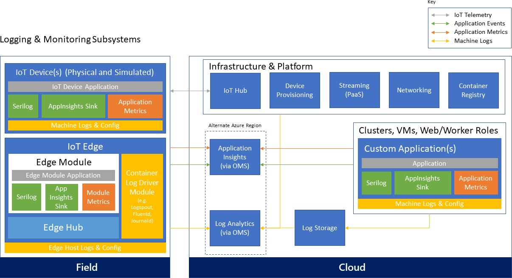

#  

IoT applications can integrate with technology systems across an organization. Devices, groups of devices, business rules and actions, and access and associations between devices and users are controlled. Important parts of the application backend are the “custom” control logic of the solution, device discovery and visualization, device state management and command execution, as well as device management which controls device life cycle, enables distribution of configuration and software updates, and allows remote control of devices. Business integration is often driven from backend processing systems; i.e. the integration of the IoT environment into downstream business systems such as CRM, ERP, and line-of-business (LOB) applications.

# Application backend processing

Unlike traditional business systems, the business logic of an IoT solution might be spread across different components of the system. Solution device management will commonly use compute nodes, whereas the analytics portion of the solution will be largely implemented directly inside the respective analytics systems.

In some cases, simple solutions may not have independently deployed and managed “business logic” application backend, but the core logic may exist as rule expressions hosted inside stream processing, some of the analytics capabilities, and/or as part of the business workflows and connector components.

# Technology options

There are several implementation options for the backend logic. As mentioned above, some of the logic will be implemented in the event processors and analytics components of the system. Implementation choices for those components were covered in their respective sections. This section focuses specifically on the business logic backend.

**Programming techniques that don’t support hyper-scale.** Many of the architectural patterns and programming techniques that have been popular for the past decades are applicable to IoT solutions but might face scalability challenges at large number of devices. Hence, for large IoT deployments, these models should only be used with stateless app backends running on scalable compute nodes. Scaling out a stateful application layer represents a difficult problem with traditional architectures. In those cases, scale appropriate compute models such as actor frameworks or batch processing can be used, as described in the next sections.

**Actor frameworks.** Actor frameworks represent a well-suited compute model for IoT scenarios. The actor programming model fits well where there are a high number of “independent” units with a specific behavior and independent local data/state. The actor framework provides a good abstraction model for devices that need to communicate with backend services. A (physical) device can be modeled as an actor with defined behavior and local state that will run on the backend. The actor becomes a virtual representation of the physical device. An actor can represent a stateful computation unit that manages its own state. Unlike traditional programming techniques, where an instance of an object is created, and the state needs to be loaded from outside, a stateful actor has immediately intrinsic state. With a 1:1 relationship between a device and backend “code,” the actual implementation becomes easier and developers can focus on the specific behavior that is required to manage a single type of device.

In addition, actor models provide a way to create hierarchies of actors, in order to represent relationships among devices or group of devices. For instance, it is easy to model all the sensors in a building as a hierarchy of actors: a building can be an actor that is composed of a set of floor actors, a floor actor is defined as a set of room actors, and each room actor can control a set of sensors in that room. This way, it is easy to write complex rules and logic that iterate the actor hierarchy. Each element of the hierarchy provides the right behavior and state required to act or aggregate information at the higher level.

An actor can process messages from devices, perform computations, and send commands or notifications to devices when certain conditions are met on the backend. From an abstraction perspective, developers can focus on the code that is required to manage one device, which results in a simple programming model. Most actor frameworks use a message-based architecture, and communication with and among actors is managed by the framework. Actors are invoked only when one or more messages are available and need to be processed; that is, the actor is activated by the framework when there is work to be performed. There is no need to have any “worker role” type of component in the architecture that needs to stay alive to check if there is work to be done. The actor framework scheduler is responsible to schedule actors for execution with the goal of optimizing resource utilization. In the context of this architecture, an

actor can be activated when a device event is received, or from the backend, based on events coming from business logic and rules, or a line-of-business system.

There are several actor frameworks available and developers can choose the one that best fits their programming background and scenario requirements. The following paragraphs introduce three popular actor frameworks: Azure Service Fabric Reliable Actors, Akka, and Akka.NET.

*Azure Service Fabric Reliable Actors*

Azure Service Fabric73</supenables developers to build and manage scalable and reliable applications composed of microservices running at very high density on a shared pool of machines, commonly referred to as a Service Fabric cluster. It provides a sophisticated runtime for building distributed, scalable, stateless and stateful microservices and comprehensive application management capabilities for provisioning, deploying, monitoring, upgrading/patching, and deleting deployed applications. Stateful services in Service Fabric offer the benefits of having fully replicated local data that can be used directly by the service without the need for relying on external tools such as cache systems or storage.

Service Fabric provides the Reliable Actors programming model. It is an actor-based programming model that uses the strength of the Service Fabric runtime infrastructure to provide a scalable and reliable model that developers with an object-oriented programming background will find very familiar. The Reliable Actors programming model is very similar to Orleans, and developers that are familiar with Orleans can easily migrate to Reliable Actors or can keep using the Orleans runtime.

In addition to the Reliable Actors, Service Fabric also provides a lower level programming model Reliable Services74</supthat has different tradeoffs between simplicity and flexibility in terms of concurrency, partitioning, and communication75.

With this model Reliable Collections76</supcan be used to store and manage device state.

*Akka*

Akka77</supis a well-known Actor programming model that runs on a Java virtual machine (JVM). It is developed using the Scala programming language but provides Java APIs as well. Akka-based backend applications can be hosted in Azure and can use Azure IoT services, while enabling a familiar programming model for developers that are already using Java or Scala as their language of choice.

*Akka.NET*

Akka.NET78</supis a port of the Akka programming model to the .NET runtime and supports both C\# and F\#. Along with Akka, it provides a way for developers to use the Akka programming model but run the code on top of the .NET runtime.

*Azure Batch*

Batch processing is well suited for workloads that require running a high number of automated tasks, such as performing regular (such as monthly or quarterly) processing, or risk calculations. Azure Batch79</supis a cloud-scale job scheduling and compute management service that enables users to run highly parallelizable compute workloads. The Azure Batch scheduler can be used to dispatch and monitor the execution of workloads across large-scale compute clusters. It takes care of starting a pool of compute virtual machines, installing processing jobs and staging data, running the jobs,

73 https://azure.microsoft.com/services/service-fabric

74 [https://azure.microsoft.com/documentation/articles/service-fabric-reliable-services-introduction](https://azure.microsoft.com/documentation/articles/service-fabric-reliable-services-introduction/)

75 [https://azure.microsoft.com/documentation/articles/service-fabric-choose-framework](https://azure.microsoft.com/documentation/articles/service-fabric-choose-framework/)

76 [https://azure.microsoft.com/documentation/articles/service-fabric-reliable-services-reliable-collections](https://azure.microsoft.com/documentation/articles/service-fabric-reliable-services-reliable-collections/)

77 [http://akka.io](http://akka.io/)

78 [http://getakka.net](http://getakka.net/)

79 https://azure.microsoft.com/services/batch

identifying failures, and re-queuing work as needed. It also automatically scales down the pool of resources as work completes.

# Business systems integration

The business integration layer is responsible for the integration of the IoT environment into downstream business systems such as CRM, ERP, and line-of-business (LOB) applications. Typical examples include service billing, customer support, dealers and service stations, replacement parts supply, third-party data sources, operator profiles and shift plans, time and job tracking, and more.

The IoT solution ties into existing line-of-business applications and standard software solutions through business connectors or EAI/B2B gateway capabilities. End users in B2B or B2C scenarios will interact with the device data and special-purpose IoT devices through this layer. In many cases the end users will use personal mobile devices to access the functionality. Those personal mobile devices are conceptually different than the IoT devices, although in some cases there will be association or mapping between the end user’s mobile device and IoT devices. For example, in a home automation scenario, a mobile phone might act as field gateway, connecting to IoT devices and facilitating the communication for those. From an authorization perspective the associations between end users, personal mobile devices, and IoT devices will be managed by the IoT solution backend.

# Technology options

Azure Logic Apps provide a reliable way to automate business processes. The service supports long-running process orchestrations across different systems hosted in Azure, on-premises, or in third-party clouds. Logic Apps allow users to automate business process execution and workflow via an easy-to-use visual designer. The workflows start from a trigger and execute a series of steps, each invoking connectors or APIs, while taking care of authentication, checkpointing, and durable execution. There is a very rich set of available connectors to a number of first-party and third-party systems, such as database, messaging, storage, ERP, and CRM systems, as well as support for EAI and EDI services and advanced integration capabilities.

For API integration, Azure API Management provides a comprehensive platform for exposing and managing APIs that includes end-to-end management capabilities such as: security and protection, usage plans and quotas, policies for transforming payloads, as well as analytics, monitoring, and alerts.

Integration at the data layer can be enabled by Azure Data Factory, which provides an orchestration layer for building data pipelines for transformation and movement of data. Data Factory works across on-premises and cloud environments to read, transform, and publish data. It allows users to visualize the lineage and dependencies between data pipelines and monitor data pipeline health.

#  

At-rest data analytics is performed over the collected device telemetry data, and often this data is blended with other enterprise data or secondary sources of telemetry from other systems or organizations. Analyzing and predicting device operational data and behavior, based on device telemetry correlated with ambient parameters and telemetry, is a powerful pattern.

There are a significant number of scenarios for when, why, and how to analyze data after it is at rest, and this reference architecture document does not aim to provide an in-depth explanation of these options or of at-rest data analytics. IoT scenarios and the general-purpose guidance for these capabilities directly applies to IoT solutions but is not limited to that. Advanced analytics and big data solutions can be used in these cases.

# Technology options

For data scientists acquainted with the algorithmic foundation, Azure Machine Learning provides a hosted machine learning capability. It offers ease of use with straightforward integration into solutions using a generated web service interface.

With HDInsight, the Azure platform provides a hosted implementation of the Apache Hadoop80</supplatform, providing Apache Hive,81</supApache Mahout,82</supMapReduce,83</supPig,84</supand Apache Storm85</supas analysis capabilities.

Power BI enables the creation of models, KPIs, and their visualization through interactive dashboards. It provides a powerful analytics solution for monitoring the performance of processes or operations and can help to identify trends and discover valuable insights.

Other options include Apache Spark, which can be used to run big data jobs, but also provides modules for graph analysis and machine learning.

# Solution design considerations

**Device intelligence**

Connected devices aim to form intelligent systems. A key question is how intelligent devices should be versus how intelligent the system as a whole should be. The answer will be different based on the specific device purpose, design, available computing resources, and power; however, there a set of common trade-offs for IoT systems to consider.

Designing a device happens at the beginning of its life cycle. Design failures at this stage can be impossible or very costly to correct after the device is manufactured, though some device behavior can be changed through firmware/software updates or through a configuration change. Software changes are much easier than changing or replacing hardware, so designing remote software update capabilities for devices is helpful.

Even if a device has software update capabilities, managing updates of potentially millions of edge components is far more complex than updating a centralized solution backend. In general, more intelligence on the edge equates to potentially more software updates of edge components at higher frequencies, while more intelligence on the solution’s backend means the maintenance can be performed in a centralized fashion. Without question, having more intelligence on the backend will most likely increase the dependency of edge components, although when designed properly they should be able to perform autonomously even without online connection to the backend.

Regardless of the functional capabilities of the devices, centralizing the security of the software operations in the backend typically allows for better security controls across the entire system (especially when devices are in an untrusted zone).

During the lifetime of an IoT solution, multiple device types of different generations and versions will potentially be connected to the system. Even if an IoT solution starts with one device type, heterogeneity of the deployed device population should be expected. With increased heterogeneity the maintenance of the edge components is expected to

80 [http://hadoop.apache.org](http://hadoop.apache.org/)

81 [http://hive.apache.org](http://hive.apache.org/)

82 [http://mahout.apache.org](http://mahout.apache.org/)

83 <http://en.wikipedia.org/wiki/MapReduce>

84 <http://en.wikipedia.org/wiki/Pig_(programming_tool)>

85 [http://storm.incubator.apache.org](http://storm.incubator.apache.org/)

increase significantly, while maintenance of the backend software shouldn’t be impacted to the same extent.

Maintaining simple, stable interfaces between the device and the backend will help in the long run.

In general, changes are gradually easier when moving from device hardware, to device/edge software, to the cloud backend. For this reason, it’s always a good practice to start designing in this sequence—that is, to design for devices first. The available power on the device, computing resources, as well as the choice of communication technology will affect how and when devices communicate with the service. In many cases certain processing will need to happen on the edge, such as when guaranteed response times are needed, or to perform filtering of data sent to the backend.

Having less intelligence on the devices may increase the dependency on the cloud backend but helps improve the agility of the system and reduces maintenance and operations cost.

These trade-offs should be considered in the specific context and business requirements of an IoT solution and may vary from scenario to scenario.

# Device telemetry

The type and frequency of telemetry data to be collected are fundamental aspects of an IoT solution. This decision process should be driven by the business requirements. Before deciding what information to collect, the business motivation and goals—such as transforming a business model toward a service provider, adding new services, improving customer engagement, or optimizing operations and maintenance—should be clarified. The requirements about what telemetry is needed should be derived from the business goals.

There is a key trade-off between the volume of data collected and its cost. Data that is not collected cannot be analyzed, but you pay for collected data in terms of performance and cost. Trying to collect as much data as possible doesn’t always guarantee that the right business questions can be answered when needed. Also, collecting too much or

unnecessary data makes it more difficult to differentiate useful information from “noise,” and also impacts the operations and management cost. In many cases, understanding the value of the collected data might be an iterative process.

One possible strategy is to program the devices to emit different granularity of telemetry data and then control that level from the cloud as needed. A configuration change command can then be used to instruct the device to change the collection profile and to start transmitting different levels of telemetry data.

In addition, different categories of data can be treated differently. Devices might split the data for hot-path processing— being sent in real time to the cloud—and cold telemetry, which can be collected locally and transferred on a delayed basis. For example, a device using network-condition detection can send hot-path data across a mobile network and transfer cold telemetry data after a Wi-Fi or wired connection is established.

In the case of complex devices containing multiple subcomponents (such as industrial equipment devices), the device telemetry most likely will need to be processed for each subcomponent separately (and treated logically as a separate device by the solution). As described previously, those telemetry streams can be segregated by using a protocol header property (such as “stream\_id”) to allow for differentiation and appropriate processing on the backend.

Another aspect to consider is how data will be correlated between devices, device topologies, components, and systems. The telemetry flow should contain appropriate attributes to enable linking the information on the backend for holistic insights across the entire system.

# Edge connectivity

Different topologies for direct or indirect device connectivity were discussed previously. When using Azure IoT Hub as the cloud gateway, the edge connectivity options are shown in Figure 1.

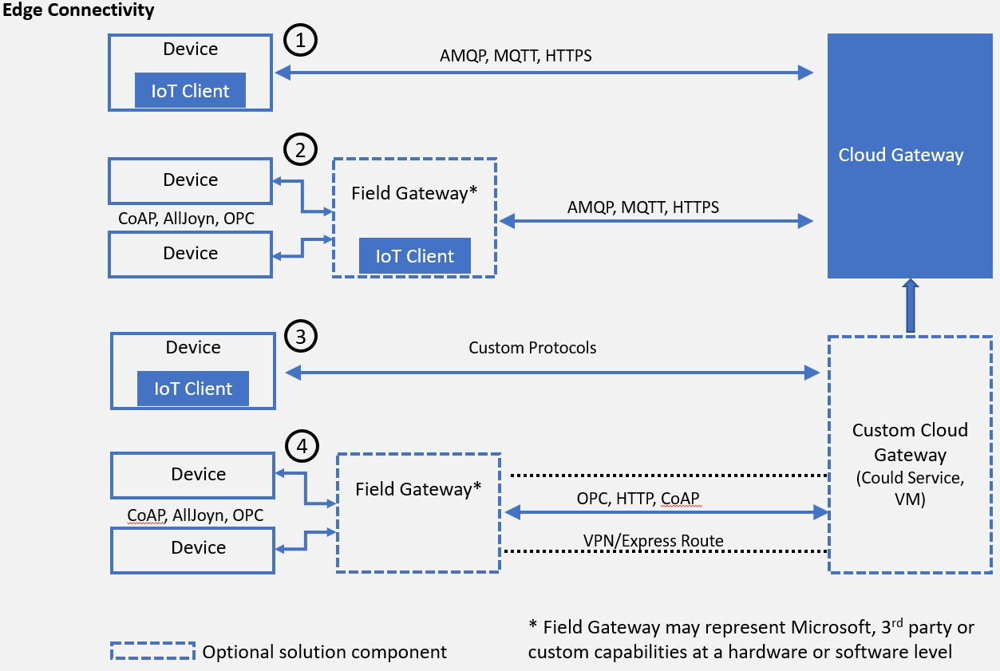

Figure 1 - Edge connectivity with IoT Hub

In addition to the topology, a number of other aspects need to be designed for the solution, as described in the following sections.

# Transport protocol

In the context of this architecture the focus of transport and messaging protocols is on IP-based communication between devices (including those acting as field gateways) and cloud gateways. Peer-to-peer and local network communication standards, link-layer protocols, and physical data transfer (wire, radio) are out of scope.

**Physical and link layer considerations.** While guidance on physical transfer, link layer, and local network technology choices and usage are out of scope for this document, it is important to understand the potential impact of their usage on the communication at and above the transport layer. The underlying communication technology will impact not only the quality of service but will also dictate the frequency and communication patterns used by devices.

Networks built on radio and power-line technology are susceptible to interference and other signal quality issues, which can cause data frame and packet corruption and loss. Battery-operated devices will optimize the send/receive patterns for lower power consumption, and often will use radio on-demand, which means that devices will not be reachable at all times. Mobile operator networks (such as GSM, 3G, 4G) compensate for many of the effects of radio-based technologies, but higher packet latencies and packet loss are nevertheless common. With domestic roaming, whereby devices are allowed to roam across different operator networks, devices may quite frequently switch connections and IP addresses. A moving vehicle may switch between base stations every couple of minutes, depending on the reach of the particular frequency band.

These examples provide context for the common need to design the device communication patterns based on the underlying communication technology. A device can detect which type of connectivity is used (network condition detection) and switch the communication mode. For example, large binary transfers can be performed over Wi-Fi or a wired connection, while on a cellular or radio network the device will implement a reduced communication profile.

Another common pattern for implementing the service-assisted communication principles described in section [2.5](#device-interaction) [Device interaction](#device-interaction) for power-constrained or battery-operated devices that are not always reachable, is to use an out-of- band communication channel (such as mobile carrier SMS) to “wake up” a device and instruct it to establish an

outbound network connection to its “home” gateway, when time-critical commands need to be transmitted.

Virtual private network (VPN) technology allows for integrating and isolating a network, creating a single address space functionally equivalent to a local network, while in reality spanning multiple underlying networks. It provides mechanisms to securely join and participate in an isolated network but does not secure the traffic inside the network. Without further components like per-endpoint firewalls, it intentionally does not limit how the participants of the virtual network can communicate with each other. In scenarios where devices participating in a VPN are in physical control of users or potentially unknown intruders, the virtual network environment must be considered as hostile as the Internet environment.

VPNs can provide stable addressing for devices; but even with fixed assignment of addresses to each device inside a VPN context, the addresses are only useful when the device is actively connected. More commonly, devices will be assigned a dynamic address in a VPN, via DHCP, and will then be registered in DNS for discovery. This model is common for information devices, but typically causes significant management burden for individual IoT devices, especially when devices are mobile and frequently drop connections. VPN has significant network transfer volume and computation overhead for establishing and reestablishing connections, as well as for all communications. Hence, it’s more appropriate for use with (field) gateways and powerful devices.

While a VPN is a recommended technology choice for integrating existing datacenter assets into Azure IoT solutions, it is not recommended for integrating mobile or wirelessly connected devices, or an exceptionally large numbers of devices, into the Azure cloud. In industrial automation and other environments with stable and reliable connectivity, where relatively few devices (dozens, not hundreds) or environments need to be attached into the cloud, using network

integration into Azure should be considered: Azure VPN,86</supExpressRoute87. For higher bandwidth, reliability, and lower latency needs ExpressRoute should be considered.

Field gateways (edge devices) at the edge of a production network should have separate access paths for the two environments. The edge device should broker information exchange between both environments at the application level, through a messaging application protocol. The gateway can be joined into an Azure point-to-site or site-to-site VPN,88</supand will then also be addressable and accessible from within the cloud solution. On the cloud side, the VPN and on-site endpoints must be integrated through a custom cloud gateway solution hosted in Cloud Services or an Azure VM.

**Transport protocol options.** This document discusses the two most widely used transport level protocols: TCP and UDP. Other protocols at that level, like SCTP (IETF RFC4960) or Multipath TCP (IETF experimental RFC6824), or high-bandwidth applications of UDP (such as UDT) may play a role in select custom cloud gateway applications for special scenarios or existing protocol support but are out of scope for this document.

TCP (IETF RFC79390) provides stream integrity, stream order, and flow control between two network endpoints and is the default transport option for all scenarios except those called out in the UDP section.

UDP (IETF RFC76891) is a simple datagram (frame of bytes) transport model as a thin layer over IP and has minimal overhead. Therefore, it is a popular candidate for constrained device applications. UDP does not deal with packet order or packet loss and does not have a feedback-based flow control scheme. These are desirable properties for scenarios where a signal needs to be transmitted with very minimal end-to-end latency, where loss is acceptable, and where order of the signal components can be reconstituted at the receiver side when necessary.

Audio and video signals are often organized in stream container formats (such as MPEG transport stream) that can be transferred via UDP or any other unidirectional transport method with potential data loss.

UDP routes should be secured in accordance with the overlaid application protocol’s rules, most commonly using DTLS (IETF RFC634792). For applications where it is not acceptable to incur loss of data for sustained periods of time, and where latency is not the highest priority, TCP-based communication should generally be preferred outside local network applications. Inside local networks, UDP can be a helpful option to limit the compute and memory footprint for extremely constrained devices and is a viable choice in combination with the CoAP protocol discussed in the next section.

86 <http://azure.microsoft.com/services/virtual-network>

87 <http://azure.microsoft.com/services/expressroute>

88 <https://docs.microsoft.com/azure/vpn-gateway/vpn-gateway-howto-site-to-site-resource-manager-portal>

89 <http://en.wikipedia.org/wiki/IPv6_transition_mechanisms>

90 <http://tools.ietf.org/html/rfc793>

91 [http://tools.ietf.org/html/rfc768](http://tools.ietf.org/html/rfc768)

92 <http://tools.ietf.org/html/rfc6347>

Devices and services that actively listen for UDP packets are prone to flooding attacks, which includes the DTLS handshake. In those scenarios additional protection, such as isolated network tunnels in a trusted network relationship, should be applied.

# Messaging protocol

**Hypertext Transfer Protocol (HTTPS).** HTTP (IETF RFC7230, RFC7231, RFC7232, RFC7233, RFC7234, RFC7235) is the core protocol of the web, optimized for request/response interactions. HTTP is secured using TLS with the binding defined in IETF RFC2818 (HTTPS). The HTTP 1.1 protocol is purely text-based and simple. The designated HTTP/2 successor protocol is more concise, supports all HTTP 1.1 capabilities, and provides quite sophisticated framing and connection management solutions allowing for multiplexing and for modeling bidirectional data flow. HTTP/2 implementations must support TLS 1.2 protection.

HTTP in the context of this document generally refers to HTTPS, that is, HTTP 1.1 + TLS 1.2 (RFC7230ff + RFC2818). HTTP/2 has very useful features for IoT scenarios and its use and adoption in the IoT space should be monitored. HTTP/2 is not the focus of this conversation.

The HTTP connection management model is optimized around relatively short client and server interactions. The interaction pattern supported by HTTP is a request/response model with responses correlated to requests by stream order. There are a number of techniques for modelling additional interaction patterns, such as notifications, or asynchronous message delivery over HTTP, such as “long polling.”

HTTPS can be considered a good option for scenarios where devices send data to the cloud gateway occasionally and as single messages or multi-record “uploads,” and where low-latency, bidirectional communication is not required. “Occasionally” means that the device sends data infrequently enough that maintaining an ongoing connection between the device and cloud gateway is not economical or technically feasible.

Secure, high-throughput event flow into an Azure-based solution using HTTPS is natively supported on Azure IoT Hub and Event Hubs. A device can receive commands or other information using periodical HTTPS lookups on a defined IoT Hub endpoint. If the device needs to receive remote commands with minimal latency instantly, a persistent bidirectional connection with a readily available network route to the device is required.

**Advanced Message Queueing Protocol (AMQP).** AMQP 1.0 (ISO/IEC 19464:2014, OASIS93) is a robust, connection- oriented, bidirectional, multiplexing message transfer protocol with inherent, compact data encoding. It provides optimizations for continuously connected devices, high-throughput communication, and has integrated flow control to protect sender and receiver from “overloading” each other.

Libraries for AMQP 1.0 are available for a number of languages and runtimes, across numerous operating systems.

AMQP 1.0 is a good choice for scenarios where devices keep a long-lived connection, communicate with the cloud gateway on an ongoing basis, and potentially transfer large amounts of data.

**WebSocket protocol.** The WebSocket protocol (IETF RFC645594) is a bidirectional layer over TCP with negotiation over HTTP/HTTPS. It allows for sharing (multiplexing) the HTTP/HTTPS infrastructure and ports with other protocols that run over TCP, even though those protocols and their implementations require explicit support for WebSockets.

93 <http://docs.oasis-open.org/amqp/core/v1.0/os/amqp-core-overview-v1.0-os.html>

94 [http://tools.ietf.org/html/rfc6455](http://tools.ietf.org/html/rfc6455)

The most common use case scenarios for WebSocket are enabling bidirectional communication in HTTP/HTML web contexts and tunneling other application protocols such as AMQP 1.0 through HTTP/HTTPS infrastructure and ports. The AMQP 1.0 protocol has explicit binding for the WebSocket protocol for purposes of firewall traversal through HTTP/HTTPS infrastructure. All direct applications of the WebSocket protocol, like flowing frames of one of the aforementioned data encodings directly over WebSocket frames, are considered custom protocols because they do not have a standardized way for addressing or metadata framing that AMQP or other messaging protocols provide.

**MQ Telemetry Transport (MQTT).** MQTT 3.1.1 (ISO/IEC 20922, OASIS MQTT 3.1.195) is a lightweight client-server transfer protocol for messages. MQTT is attractive for constrained devices, because it is extremely dense with a very small footprint on the device, and for message frames (and respectively network bandwidth).

One design trade-off to be noted is that MQTT uses a very compact header format, but has no support for message metadata, such as a custom content-type header, requiring out-of-band agreements between the sender and receiver.

There are a few MQTT features that represent a challenge when used in large-scale distributed, high-availability IoT infrastructures. In a multi-node messaging system, the QoS2 “exactly once” delivery assurance would require a fully consistent system (across multiple nodes) at all times. While this is technically possible, such an implementation would be highly complex and will impact the latency and availability of the entire system (for more details refer to the CAP theorem96). Hence, the usage of QoS2 is not recommended for large IoT deployments. Common alternatives to exactly once delivery are deduplication at the receiver, or the use of idempotent operations. For example, for systems that are modeled to exchange state changes, “at least once” semantics is sufficient, because receiving the same state more than once will lead to the same result (assuming message delivery order is preserved, which is commonly the case, including when using MQTT).

Another challenge represents the usage of “retain” messages. This imposes unbounded state management requirements on the server (for duration and number of messages), which conflicts with resource governance requirements in high- scale systems and provides potential denial-of-service attack vectors through forced resource exhaustion. Appropriate authorization models could be considered and applied to mitigate those risks.

If MQTT is a candidate in a particular scenario for its footprint advantages, the recommendation is to constrain the usage

to QoS 0 “at most once delivery” or QoS 1 “at least once delivery,” and avoid the usage of the “retain” feature.

**Constrained Application Protocol (CoAP).** The Constrained Application Protocol (CoAP, IETF RFC725297) is a datagram- based protocol that can be implemented over UDP or any other datagram transport, including GSM short-message service (SMS). CoAP is a very compact reformulation of the principles and methods of HTTP over a datagram transport. The Open Mobile Alliance’s (OMA) Lightweight M2M protocol (LWM2M) layers on top of CoAP (see the Management protocol section below for more details on OMA LWM2M).

The advantage of CoAP is its compactness compared to HTTP and other protocols. Because it is datagram based, there is also no immediate need to set up or maintain a connection or any state that spans multiple datagrams—until security is added in the form of DTLS, which introduces node affinity for the security context and which has properties of a connection. Supporting UDP-based protocols and DTLS is not trivial in conjunction with cloud gateways, because all communicating parties are easily susceptible to flooding attacks when traffic is admitted from across the open network

95 <http://docs.oasis-open.org/mqtt/mqtt/v3.1.1/mqtt-v3.1.1.html>

96 <http://www.julianbrowne.com/article/viewer/brewers-cap-theorem>

97 <http://tools.ietf.org/html/rfc7252>

(and large solutions can easily become a target for such attacks). Furthermore, packet loss on congested routes can be significant. TCP and TLS should be considered more robust for long-haul transfers.

For supporting LWM2M/CoAP on mobile carrier networks or to connect to field devices, the CoAP traffic can be isolated and reliably virtualized over VPN or ExpressRoute, either to a VPN gateway at the site where the devices reside or to the mobile carrier’s “private APNs.” (*Note:* CoAP is shown in Figure 1 as being implemented over a VPN tunnel between a field gateway and a custom cloud gateway.)

**OPC Unified Architecture (OPC UA).** The Open Platform Communications (OPC) Foundation’s Unified Architecture (OPC UA) includes a data model, security and a set of transport protocol mappings. An OPC UA server is an addressable entity that needs to be connected to in order to obtain data. An OPC UA field gateway can read data from an OPC server over a local network and forward it to the cloud gateway through a TLS-protected path using OPC UA PubSub, a JSON payload over MQTT or AMQP, like our open-source OPC Publisher. For individual machines, it’s also possible to use our OPC Proxy, to securely “bridge” the communication between an OPC UA server on the factory network and a, OPC UA client embedded in a web app in the Azure cloud, without opening the factory firewall.

# Security

**Trustworthy and secure communication**. All information received from and sent to a device must be trustworthy if anything depends on that information. *Trustworthy communication* means that information is of verifiable origin, correct, unaltered, timely, and cannot be abused by unauthorized parties in any fashion.

Even telemetry from a simple sensor that reports a room’s temperature every five minutes should not be left unsecured. If any control system reacts to this input, or draws any other conclusions from it, the device and the communication paths from and to it must be trustworthy.

Many IoT devices, such as inexpensive sensors or common consumer or industry goods enriched with digital service capabilities, will be optimized for cost, which commonly results in trading compute power and memory for cost savings. However, this also means trading away cryptographic capability and, more generally, resilience against potential attacks.

Unless a device can support the following key cryptographic capabilities, its use should be constrained to local networks and all internetwork communication should be facilitated through a field gateway:

  - Data encryption with a provably secure, publicly analyzed, and broadly implemented symmetric-key encryption algorithm, such as AES with at least 128-bit key length.

  - Digital signature with a provably secure, publicly analyzed, and broadly implemented symmetric-key signature algorithm, such as SHA-2 with at least 128-bit key length.

  - Support for either TLS 1.2 (IETF RFC524698) for TCP or other stream-based communication paths or DTLS 1.2 (IETF RFC6347) for datagram-based communication paths. TLS-typical support of X.509 certificate handling is optional and can be replaced by the more compute-efficient and wire-efficient pre-shared key mode for TLS (“TLS/PSK,” IETF RFC427999), which can be implemented with support for the aforementioned AES and SHA-2 algorithms.

  - Updateable key-store and per-device keys. Each device must have unique key material or tokens that identify it toward the system. The devices should be able to store the key securely on the device (for example, using a secure key-store). The device should be able to update the keys or tokens periodically, or reactively in

98 <http://tools.ietf.org/html/rfc5246>

99 <http://tools.ietf.org/html/rfc4279>

emergency situations in case of system breach. Key update might occur over the air or through some other means, but updateability is required.

  - The firmware and application software on the device must allow for updates to enable the repair of discovered security vulnerabilities.

As a foundational principle, *all cloud communication with devices or field gateways must occur through secure channels*

when the devices talk directly to endpoints provided by Microsoft Azure platform services.

If (legacy) devices must use insecure or nonstandard and proprietary communication paths into the cloud system, they should be connected through a separately hosted custom protocol gateway or a local field gateway.

There are and will be many cases where access control for devices on local networks has been solely realized through network-level access control, and all admitted members of the network can communicate freely without any, or with naïve, authentication and authorization. Devices existing in such networks *must communicate via a field gateway* at the edge of the insecure network.

# Physical tamper proofing and safety

Sensors and devices can and must often be placed in public areas, where anyone may potentially have physical access to them. Also, tampering with the device is not just the act of manipulating the device hardware or software. A digitally trustworthy sensor may be tricked into reporting misleading data by dismounting and relocating it. Or an attacker could impact the environment around the device, creating misleading physical conditions in the immediate proximity of the device, pushing the overall system into an erroneous reaction. A lit lighter held near a smoke or temperature sensor might, for instance, trick a digital building control system into flooding a hotel hallway with the sprinkler system.

IoT introduces a new dimension of security because IoT devices are used in a broad range of personal, commercial, and industrial applications, and not only does the threat landscape differ between the respective scenario environments, it also differs depending on the condition of the device related to its environment. For example, a vehicle in motion has a different threat landscape than a vehicle idling in front of a traffic light, and yet another from a parked vehicle. Securing the digital components of the vehicle is therefore much more complex than securing a “classic” software application— and this applies to many IoT scenarios in a similar fashion.

As the IoT space blurs digital and physical concerns, it also blurs security with safety. Suddenly, security threats become safety threats. If something “goes wrong” with automated or remote controllable devices—from physical defects to control logic defects to willful unauthorized intrusion and manipulation—production lots may be destroyed, buildings may be looted or burned down, and people may be injured or die. That is a different class of damage than someone maxing out a stolen credit card limit. The security bar for commands that make things move, and also for sensor data that eventually results in commands that cause things to move, must be higher than in any e-commerce or banking scenario.

Even though clearly beyond the control of a cloud-based system, it is therefore *strongly recommended that the device design incorporates features which defend against physical manipulation attempts* to help ensure the security integrity and trustworthiness of the overall system.

Some exemplary measures that can be taken to improve the security of the physical device are:

  - Choosing microcontrollers/microprocessors or auxiliary hardware that provide secure storage and use of cryptographic key material, such as trusted platform module (TPM)100</supintegration.

  - Secure boot loader and secure software loading, anchored in the TPM.

  - Using sensors to detect intrusion attempts and attempts to manipulate the device environment with alerting

and potentially “digital self-destruction” of the device.

# Data encoding

There is a large and growing number of data encoding formats available. The optimal data encoding choice differs from use-case to use-case and is sometimes even constrained by factors like how much space is available for extra footprint on a device.

XML and JSON are ubiquitous on the server and on many client platforms. Both enjoy very broad library or platform- inherent support but have very significant wire footprint due to their text-based nature.

CSV is simple, interoperable, and compact (for text), but it’s structurally constrained to rows of simple value columns—

which, however, is very often enough for time-series data.

BSON and MessagePack are efficient binary encodings that lean on the JSON model but have great encoding size advantages. Both require their own libraries and have some distinctive choices like lack of first-class array support in the case of BSON.

Google’s Protocol Buffers (“Protobuf”) and Apache Thrift yield very small encoding sizes but require distribution of an external schema (or even code) to all potential consumers, which represents challenges in systems of nontrivial composition complexity with multiple readers/consumers.

Apache Avro is generally as efficient—or more efficient—than the prior options and also natively supports layered-on compression. With Avro, the schema is embedded as a preamble for a set of records. This preamble requirement puts Avro at a disadvantage compared to MessagePack or BSON for small or highly structured payloads with minimal structural repetition.

# Data layout

Just as important as the encoding is the data layout, which can also have major impact on the encoded data size. A naïve JSON encoding approach where telemetry data is sent in the form of an array of objects, whereby each object carries explicit properties for all values, has enormously greater metadata overhead than a data layout mimicking CSV with a shared list of headers followed by an array carrying the row data.

The data layout convention defines how the structure of the data is constrained within the scope of the solution, so that data can be handled across the entire system, including devices, backend processing, analytics, and user interface. All those components will need to rely on a common model/schema.

An important principle in event-driven systems is that the data unit handled and processed in the context of a model is a record. A message, a storage block, or a document may contain one or multiple data records (or “events”). A sequence of records may span multiple messages or storage units.

100 <http://www.trustedcomputinggroup.org/developers/trusted_platform_module>

The row/column structure of CSV provides a natural set of constraints for the layout and allows for a not-explicitly bounded list of rows (each equating to a record), with a not-explicitly bounded set of columns, whereby each column value is of primitive type.

For the map/array/value structural model supported by the JSON, Avro, AMQP, and MessagePack data encodings, there are the following common layout options: single record, record sequence, or record sequence with metadata preamble that, similar to CSV, contains a header describing columns, followed by the rows representing the record sequence.

The following matrix may help in choosing an appropriate encoding. In the layout column, “flat” refers to records that

consist solely of primitive data types. “Complex” refers to data where records are structured beyond primitive types.

<table>
<thead>
<tr class="header">
<th><blockquote>

<strong>Layout</strong>

</blockquote></th>
<th><blockquote>

<strong>JSON</strong>

</blockquote></th>
<th><blockquote>

<strong>CSV</strong>

</blockquote></th>
<th><blockquote>

<strong>Avro</strong>

</blockquote></th>
<th><blockquote>

<strong>AMQP</strong>

</blockquote></th>
<th><blockquote>

<strong>MsgPack</strong>

</blockquote></th>
</tr>
</thead>
<tbody>
<tr class="odd">
<td><blockquote>

Single-Record, Flat Data

</blockquote></td>
<td><blockquote>

++

</blockquote></td>
<td><blockquote>

+

</blockquote></td>
<td><blockquote>

-

</blockquote></td>
<td><blockquote>

+++

</blockquote></td>
<td><blockquote>

+++

</blockquote></td>
</tr>
<tr class="even">
<td><blockquote>

Single-Record, Complex Data

</blockquote></td>
<td><blockquote>

++

</blockquote></td>
<td><blockquote>

n/a

</blockquote></td>
<td><blockquote>

-

</blockquote></td>
<td><blockquote>

+++

</blockquote></td>
<td><blockquote>

+++

</blockquote></td>
</tr>
<tr class="odd">
<td><blockquote>

Record Sequence, Flat Data

</blockquote></td>
<td><blockquote>

+

</blockquote></td>
<td><blockquote>

++

</blockquote></td>
<td><blockquote>

+++

</blockquote></td>
<td><blockquote>

+

</blockquote></td>
<td><blockquote>

+

</blockquote></td>
</tr>
<tr class="even">
<td><blockquote>

Record Sequence, Complex Data

</blockquote></td>
<td><blockquote>

+

</blockquote></td>
<td><blockquote>

n/a

</blockquote></td>
<td><blockquote>

+++

</blockquote></td>
<td><blockquote>

++

</blockquote></td>
<td><blockquote>

++

</blockquote></td>
</tr>
<tr class="odd">
<td><blockquote>

Record Sequence w/ Metadata Preamble

</blockquote></td>
<td><blockquote>

++

</blockquote></td>
<td><blockquote>

+++

</blockquote></td>
<td><blockquote>

+++

</blockquote></td>
<td><blockquote>

+++

</blockquote></td>
<td><blockquote>

+++

</blockquote></td>
</tr>
</tbody>
</table>

Table 1 Comparison of data layout encodings

**Legend**: (-) poor; (+) good; (++) better; (+++) best

# Edge processing

In many application scenarios, especially those where devices communicate with their cloud backend systems via metered networks, it is not desirable to send raw sensor readings or status information across the communication link to the cloud because of the associated cost and load put on the cloud-system, when very many unprocessed data streams must be handled in parallel.

Often, IoT solutions specifically require evaluation of signal data streams, with video and audio covering particular signal shapes and spectrums, by application of digital signal processing algorithms or pattern matching or discovery, so it is required to treat these kinds of signals in a first-class fashion.

A temperature sensor provides periodic readings, maybe at 1 Hz, that manifest in a number per reading. A vibration sensor on a ventilation fan helping with determining equipment health in an industrial environment provides periodic readings, maybe at 500 Hz, that manifest in a number per reading. An audio sensor—a microphone—provides periodic readings that manifest in a number per reading, but at 44 kHz. A video sensor provides periodic readings that manifest in a very large matrix per reading and it does so at 60 Hz or 50 Hz.

All these signals benefit from preprocessing and compression before transfer and depending on the kind of signal there may already be broadly accepted and applied industry standards for how to encode, encapsulate, and carry the signals. If this is the case, like the MPEG standards for audio and video signal compression and encoding, they should be preferred, and passed through all parts of the system that are not equipped to interpret them unchanged.

The most trivial aggregation that can be applied to any time-series is to group several point-in-time records into a single record for either a particular period where the reading has remained stable, or for a fixed period by providing the average or median for the readings.

Furthermore, many devices are quite capable of pre-analyzing the raw data and using local compute capability, should it be generally preferred over sending large amounts of data across a metered network.

In many cases devices can use network condition detection and apply different pre-analysis, aggregation, and compression algorithms based on the type of connectivity used. For example, if the raw data is needed for later at-rest analysis, hybrid models can be used, where data that is required instantly and in near real time is transferred through the mobile network and the raw data is held locally and transferred at a later point in time over wired (or Wi-Fi) connection.

The edge processing is typically coupled with appropriate components on the backend that are responsible for interpreting the received data before downstream processing. For example, compressed data needs to be decompressed, and encodings need to be decoded appropriately. In many cases, this is done in the stream processor, reading data from the cloud gateway. If there are multiple consumers of the data, one stream processor can be dedicated to interpreting the incoming data (such as decompressing or deserializing) and to output the transformed data to an internal flow buffer (such as Azure Event Hub). This way, it will act as the primary source of incoming traffic for all other event stream processors.

In some situations, this type of processing can be done in a custom gateway, before reaching the ingestion point of the cloud gateway. The Azure IoT protocol gateway showcases how this type of custom processing can be implemented using a concept of a processing pipeline, where different modules can be plugged in to perform specialized processing before passing the data to the next one.

# Management protocol

There is an evolving set of device management protocols in the industry. The use of predefined device models enables efficient use of network, processing, and power resources on IoT devices. OMA LWM2M (or Lightweight M2M) is a standard defined by the Open Mobile Alliance that uses a compact resource model and interactions between device and server in order to support very constrained devices. OMA LWM2M provides a transport binding with CoAP for constrained devices.

Other device management protocols, including OMA DM, TR-069, and CoMI define device models and interactions with devices. OMA DM, used in mobile device management and some IoT implementations, uses XML (defined by SyncML) to enable device management and therefore is more verbose than OMA LWM2M. TR-069 is a technical specification published by the Broadband Forum that uses a bidirectional SOAP/HTTP-based protocol to manage devices. In addition to the high number of device management standards, a number of custom device management protocols exist where device vendors have needed to provide system capabilities between devices and servers/services. Different layers of those device management protocols would impact implementations of this reference architecture. For example, an implementation of OMA LWM2M in the context of this reference architecture will have implications on the device IoT client, provisioning API, gateway(s), event processor, and device registry components.

# Device management

The IoT device landscape is vastly heterogeneous considering the variety of hardware options, environments, operating systems and programing languages, and means of communications between device and services. The use of device management protocols provides an abstraction simplifying this complexity by defining a protocol, from the lower

transport layer to the higher application layer, such that a service can provide the necessary information to a device to ensure the health of that device.

Service providers and enterprises need to enroll and discover, enable connectivity, remotely configure, and update software on devices in a way that is specified by defined policies and business processes. For example, depending on the industry, there will be vastly differing policies for the circumstances under which devices can be remotely configured and changed, with approval chains, regulatory auditing requirements, presence of physical safeguards, and more.

Every IoT system can provide a set of device management capabilities in order to ensure the health of devices and related business processes. The notion of a device registry is critical to enabling device management capabilities on remote devices and enabling a service-side interface for cloud applications to use the capabilities provided by remote devices. The following is a list of device management capabilities that may be enabled by the IoT system:

1.  Device provisioning and discovery

2.  Device access management

3.  Remote control

4.  Remote administration and monitoring

5.  Remote configuration

6.  Remote firmware and software update

# Device provisioning and discovery.

Most IoT device life cycles show that devices are manufactured and deployed to a variety of locations worldwide. The deployment location may not be known at the time of manufacturing; therefore, it may be important to enable a multiphase bootstrap process where devices are manufactured with the knowledge of a bootstrap service, which later provides connectivity details. When the device is deployed, the organization deploying the device provides further information, including device location and any other required information to the bootstrap service. The bootstrap service is configured to respond with the cloud gateway that will be used for this device. The device may need to repeat the provisioning process, for example in the scenario where device ownership changes.

In order to enable cloud applications to perform device management activities, the device may describe itself to the cloud when it creates a session with the cloud gateway. There are three core concepts related to how a device is described to the system:

  - # Self-defined device model

A device engineer (or developer using a device simulator) uses the self-defined device model through the process of iterating on the capabilities of the device as they build the device. A device engineer could start by creating a device that has few properties and supported commands and later add more. Similarly, that device engineer may have many devices, each of which provides unique capabilities; using the self-defined model, the device engineer is not required to register the structure of the device model.

  - # Predefined device model

A production IoT deployment that operates under network and power/processing constraints greatly benefits from a predefined device model where minimal use of the device’s processing and power consumption are used. Similarly, minimal network traffic enables devices to transmit through heterogeneous networks (Wi-Fi, 2G/3G/4G, BLE, Sat, etc.) especially when using limited and expensive infrastructure (such as a satellite). When implementing a predefined device model, a device engineer might send device information encoded in one or

two bytes that serve as a key into the predefined device model. The brevity of this approach results in efficiencies of one to two orders of magnitude compared to the self-defined device model.

  - # Predefined master model

The device model and metadata related to the device are stored and maintained on the cloud side, but the device will remain unaware of those. This pattern is especially useful in brownfield scenarios where the device firmware cannot be modified, or the device should not store metadata.

**Device access management.** Devices (potentially managed by multiple parties) may enforce control of their own properties and commands, including create, read, and write access rights for device properties and execute rights for device commands. Depending on the IoT application, multiple authority levels may need to exist in order to control access to device resources appropriately.

**Remote control.** In IT scenarios, remote control is often used to assist remote users or remotely configure remote servers. In IoT scenarios, most devices do not have engaged users, therefore remote control is a scenario that enables remote configuration and diagnostics. Remote control can be implemented using two different models:

  - # Interactive connection

In order to enable remote control through a direct connection to a device (for example, SSH on Linux or Remote Desktop on Windows) you need to create a connection to the device. Given the security risk of exposing a device to the open Internet, it’s recommended to use a relay service (such as Azure Service Bus relay service) to enable the connection and traffic to/from the device. Because a relay connection is an outbound connection from the device, it helps limit the attack surface of open TCP ports on the device.

  - # Device command

Remote control through device command uses the existing connection and communications channel established between the device and Azure IoT Hub. In order to enable device command-based remote control, the following requirements need to be implemented:

  - The IoT backend is aware of device commands available on the device. This is usually defined as part of the device model.

  - The software that runs on the device needs to implement the remote-control commands. These device commands should follow a request (from the IoT backend to the device) and a response (from the device to the IoT backend) pattern.

The IoT service backend can keep record of historical response messages from device commands for auditing purposes. Updates to device state are made through device commands. Changes to the device metadata and state need to be pushed to the device registry and state stores, respectively. Updating the device state can be forced by a request from the IoT backend to the device, or the device can automatically update the backend upon recognizing a change in state. Automatic updating of the backend from the device should be done sparingly because it may generate network traffic and increase usage of the device processor and available power.

**Remote administration and monitoring.** Because most IoT devices do not have a direct user after deployment in a solution, remote administration is the experience where administrators can monitor the state of their devices and remotely update the state or configuration of devices through the use of device commands.

The health of devices can be determined by monitoring the data they are sending to the backend. This may include both operational data and metadata.

**Remote configuration.** Remotely changing a device’s configuration is a requirement for several stages in a device’s life

cycle: provisioning, diagnostics, or integration with business processes.

**Remote firmware and software update.** Software defects can be security vulnerabilities, which makes the update of firmware or software to fix defects or deliver new functionality a critical capability of every IoT system. Remotely updating firmware and software on a device is an example of a distributed, long-running process that usually involves business processes. For example, updating the firmware on a device that controls a high-powered fuel pump may require steps in adjacent systems for rerouting fuel while the update is performed and verified.

Devices that support firmware and software updates are defined through the device model (or through a device type that is associated with a device model). Device updates are initiated at the IoT backend and devices are informed at an appropriate time through a device command. When a device explicitly supports remote update of firmware or software, the IoT backend should deliver the update commands based on defined business processes and policies. Upon receiving the device command to update, the device needs to download the update package, deploy the update package, reboot to the newly deployed (in the case of firmware update) or start the new software package, and verify that the new firmware or software is running as expected. Throughout this multistep process, the device should inform the IoT backend of the updated state of the device as it progresses through the multiple steps.

Delivering the update package can be done through a storage service like Azure Storage or through a CDN. Verifying the integrity of the downloaded package is important to ensure that the package originated from the expected source.

After completing a firmware update, the device must be able to verify and identify a good state. If the device does not successfully enter that good state, the software on the device should initiate a rollback to a known good state. The

known good state could be the last known good state or a device firmware image known as a “golden state” stored in a

storage partition.

# High Availability and Disaster Recovery (HA/DR) Deployment topologies

IoT assets and devices commonly form distributed environments. They can be stationary or moving, dispersed or collocated and sometimes associated with local sites. Based on solution requirements, the devices might connect to a single centralized or distributed backend deployment.

The are several cloud backend deployment topologies and options for distribution of work across the different sites:

  - **Single-site.** This is the simplest model and, in this case, the cloud gateway(s) and all device-related stores are collocated in a single datacenter region, while leaning on the high availability of the services used and on the platform-inherent support for disaster recovery. Because of its simplicity, this topology is often the starting point for most solutions.

  - **Regional failover.** In a regional failover model, the solution backend will be running primarily in one datacenter location as in the single-site model, but the solution’s cloud gateway and backend will be deployed in an additional datacenter region for failover purposes, in case the cloud gateway in the primary datacenter suffers an outage or the network connectivity from the device to the primary datacenter is somehow interrupted. The devices will need to use a secondary service endpoint whenever the primary gateway cannot be reached. With a cross-region failover capability, the solution availability can be improved beyond the high availability of a single region. Disaster recovery and geo-failover concepts will be covered more deeply later in this section.

  - **Multisite.** In the multisite topology, the solution runs concurrently and largely independently in multiple sites, but it is conceptually a single solution. Multiple sites can be collocated in the same datacenter regions to form “scale units” for which the entire data processing pillar can be stress-tested to maximum capacity, and then

more capacity can be added safely by adding further scale units. Sites of the system may also be located across different datacenter regions for a variety of reasons, including proximity for reduced latency to the devices or policy concerns around data location. Each of these sites may also have a regional failover site. In the multisite model, devices are registered and thus “homed” in one of the sites.

  - **Multisite with roaming.** In this variant of the multisite model, devices are homed in one of the sites (scale units) but may connect to the closest datacenter location based on some form of proximity estimation. The collected

information is routed to the “home” site of the device.

  - **Multisite, multihome.** In this variant, the device may roam across sites and captured data is stored across the various sites the device connects to and can be collected and consolidated as required.

This list of topologies is not exhaustive but helps to illustrate key patterns and trade-offs when planning an IoT deployment. Sometimes a certain topology can be applied to a subset of services and components, while other parts of the solution might use different deployment topology based on the specific solution requirements.

From a device perspective there are three possibilities of how a device or field gateway communicates with the service backend: to a single “home” endpoint, to a primary or secondary endpoint (for geo-failover), or to a set of endpoints in the multisite, multi-home scenario. The configuration of those endpoints can be static (for example, set on the device during provisioning) or managed as dynamic device configuration using commands from the solution backend.

There is also an additional option for devices using a token service. If a device cannot reach the destination endpoint, it can contact the token service to acquire a new endpoint and the appropriate token for it. This mechanism provides for dynamic reactive redirection of devices if needed (in contrast to proactive changes of a predefined configuration held on the device). It can be applied in addition to managing the endpoint configuration on devices. The token service can intelligently manage the map of sites, but can also be reconfigured for, as an example, maintenance purposes.

Apart from managing the endpoints that devices use to connect, Domain Naming System (DNS) entries and related services such as Azure Traffic Manager can be used for redirection of traffic to the desired backend endpoints. It is important to note that this technique depends on the ability of devices to use DNS and that its accuracy is driven by the Time-to-Live (TTL) value of the DNS host entries kept in local DNS caches.

# Cross-region availability

Applications running in Azure benefit from the high availability (HA) of the underlying services provided by Azure. For many Azure services and solutions, high availability is provided by using redundancies at the Azure region level. In addition, Azure offers a number of features that help to build solutions with disaster recovery (DR) capabilities or cross- region availability if required. Solutions need to be designed and prepared to take advantage of those features in order to provide global, cross-region high availability to devices or users. The article “Azure Business Continuity Technical

Guidance”101</supdescribes built-in Azure features for business continuity and DR. The paper “Disaster Recovery and High Availability for Azure Applications”102</supprovides architecture guidance on strategies for Azure applications to achieve HA/DR.

Because cloud solutions are composed of multiple services, it is important to consider what is necessary to achieve HA/DR for the individual services or components of the solution, instead of thinking about one approach for the entire solution. Before deciding on techniques to be applied, it is important to define the requirements and expected availability for the subservices/components of the solution. Typically, subcomponents will have different requirements

101 <https://msdn.microsoft.com/library/azure/hh873027.aspx>

102 [https://msdn.microsoft.com/library/azure/dn251004.aspx](https://msdn.microsoft.com/library/azure/dn251004.aspx)

for availability, scalability, performance, and consistency. For example, device telemetry, commands to devices, backend analytics, LOB system transactions, and end-user UI will all have different availability, latency, and consistency targets.

Even different telemetry streams or command types will have different requirements (for example, a telemetry stream for the infotainment system of a vehicle has different processing requirements than telemetry coming from the engine). In case of a disaster, some components can be operated in degraded mode, or some of them might not even be required for a certain period of time. The disaster recovery techniques need to be designed for each category/type of service or function of the system individually, based on the specific requirements. There is always a trade-off between availability, other system requirements (including per-CAP theorem103), and the cost of implementation and operations.

A major factor for geo-distributed topologies to consider is where state is stored and if services perform stateless or stateful processing. Stateless processing can be redirected (or failed over) to another scale unit, site, or region by ensuring the appropriate services (such as compute nodes, websites) are provisioned there. These can be actively running all the time, be available but not active (that is, in standby mode), or can be provisioned on demand as part of a disaster recovery procedure. Stateful services, however, represent a bigger challenge because, in addition to the service runtime, state and data need to be replicated and synchronized. Dependent on the consistency level required, state and data can be replicated synchronously or asynchronously where eventual consistency is sufficient. In some cases, data might not need to be replicated to each site if it’s sufficient to collect and consolidate the data to a centralized location at a later point. This dependents on the amount of data and specific solution needs.

With the proposed IoT reference architecture, the relevant state is kept in the following components and an appropriate technique for state replication should be defined for each category:

  - **Device identity store.** The device identities and the associated security material need to be known at each site to which a device is expected to establish a connection. This includes secondary sites for failover or any other site a device can connect to in multisite scenarios. Typically, identities are slowly changing data managed through the provisioning workflow. The provisioning API provides a good abstraction layer that encapsulates the provisioning operations and is a natural place to extend and manage cross-site identities as needed. For example, when a new device is created, the identity record can be immediately written to a secondary site. For standby or on-demand deployed DR sites, it might be also sufficient to perform a regular export/import of the primary into the secondary store. The time interval between exports will define the recovery point objective.

In many cases devices will be provisioned long before they effectively try to connect to an endpoint. In those cases, eventual consistency between the identity stores is acceptable. Batch provisioning operations might be even performed in parallel against multiple locations. Using techniques such as check pointing, and appropriate error handling should ensure that a consistent state is established across the sites.

  - **Topology store.** The topology store serves as an index for device discoverability, and for the majority of scenarios, implementations can be assumed to be eventually consistent, with a well-known time-to-live for replicated records. This means that an update of metadata may take up to this time-to-live limit to replicate. The DNS infrastructure uses a similar strategy. It will be beneficial if at least an initial record for each device is inserted into the device registry through the same mechanism used for the identity store (that is, the provisioning API). Attributes and metadata changes can be replicated asynchronously through the system.

103 <https://en.wikipedia.org/wiki/CAP_theorem>

In many cases the device registry contains only slowly changing data, and regular import/export might represent a sufficient alternative to a continuous replication of entries.

  - **State store.** Device operational data is commonly characterized as high-volume and high-velocity data. As discussed previously, this data will be segregated in different stores based on needs and access patterns. The need for transferring or replicating each data category should be analyzed. Raw telemetry data most likely doesn’t need to be available on a secondary site. Aggregated data will represent a reduced data volume which might be easier to replicate if needed.

Often, the history or previous state might not be necessary for the application backend logic. In many scenarios, alerts, notifications, or even command and control events to devices can be applied just based on device metadata (such as type of device, group, category) or attributes (such as state received in a telemetry message).

Once it’s decided which types of operational data will need to be replicated, one of multiple options can be

applied:

1.  Use the built-in capabilities of the underlying storage service (Azure Storage104</supand SQL Database,105</supfor example, already provide built-in geo-replication capabilities).

2.  Use a dedicated event processor that picks up the relevant information and transfers it to an Event Hub in the remote site (this represent a special data replication channel that will need to be processed by another event processor on the remote site and transformed into the desired storage format).

3.  Use some other mechanism built as part of the application layer (for example, write operations to a remote storage account or scheduled regular export and respective import on the remote site, which can be performed regularly or on demand).

<!-- end list -->

  - **Brokered messaging.** The cloud gateway and other backend internal queues, topics, or Event Hubs that are used to decouple components of the solution, durably store messages. Typically, after a message is accepted from the cloud gateway it will be processed by the solution backend and there is no need to replicate such a message to another site. In a case of a broker outage, the messages are still protected, but unavailable to be read. If those messages “in-flight” are considered absolutely critical for cross-region failovers, then they might need to be replicated to a secondary site. However, typically the messages are brokered for a very short period of time and then consumed and transferred into one of the described persistent data stores. Protecting data in the persistent stores is the typical strategy because the total latency of replicating messages in flight will be almost the same as the latency for protecting the persistent data stores. Thus, protecting messages in flight typically

won’t significantly impact the RPO/RTO targets.

  - **Hot-path analytics state.** Analytics and complex event processing engines keep in-memory state for aggregations or over certain time periods. There is no easy way to restore the in-memory state of those engines without a sophisticated event-replay mechanism. If critical business logic relies on this type of state, alternative calculations based on persisted historical data might be necessary.

104 <https://azure.microsoft.com/documentation/articles/storage-redundancy>

105 <https://docs.microsoft.com/azure/sql-database/sql-database-business-continuity>

  - **Actor state.** Actor state is typically backed up by durable storage that should be replicated to a remote site if needed. In case of recovery, the actors can reload their state on the remote site.

  - **System configuration.** Changes to the solution configuration (for example, changing threshold limits or business rules) will need to be propagated to secondary sites as needed.

Independent of the individual design choices, in distributed computing environments, it is always a good practice to use idempotent operations to minimize side effects not only from eventual consistent distribution of events, but also from duplicates or out-of-order delivery of events. In addition, the application logic should be designed to tolerate potential

inconsistencies or “slightly” out-of-date state, because of the additional time it takes for the system to “heal” or based on recovery point objectives (RPO). The following article provides more guidance on this topic: “Failsafe: Guidance for Resilient Cloud Architectures.”106

# Data protection and privacy

As IoT scenarios receive growing attention from consumer protection groups and data protection regulators of various governments, it is expected data collection as well as remote control scenarios to be subject to increased regulation.

Solution builders must anticipate regionally differing regulation on what data collection is allowed by default, where owners or equipment operators have a right to opt-out, or where they must opt-in for data collection even to be permitted. They should also anticipate that any data collection and remote-control capability must allow temporal suspension, and that owners or equipment operators may want to erase collected data for past periods. Anonymized data collection may be an option in this context.

In spite of equipment manufacturers, insurers, leasing firms, and other corporations driving the data collection initiatives, it is not clear whether the data collected from a vehicle is legally owned by the collecting company. Solution builders must anticipate that regulation, varying by jurisdiction, will empower owners and equipment operators to have full control over the usage rights and retention duration of their data.

Assuming the example of a vehicle, there are many cases where the geolocation of the vehicle at any given time may be a very private matter that the current driver would not want to make known to anybody. That means that the geolocation cannot appear, associated with the vehicle, as long as there is a way to correlate the driver with the vehicle, and it also cannot appear to be associated with the driver in any permanent record.

However, the geolocation may be important and potentially acted upon should the driver get into an accident, because harm to him/herself, potential passengers, and other third parties will likely constitute an overriding priority.

Solution builders also need to anticipate opt-in and opt-out scenarios and (potentially regulation-mandated) opt-out actions to occur retroactively long after the data has been collected. Some data held in the system may also not be legally owned by the collecting party and may therefore not be present in the system after an opt-out.

It is therefore recommended for non-aggregated information existing anywhere in the system to retain attestation and link to its source and to any immediately related parties that may have entitlement to the data being erased. In order to enforce strong segregation of data and protection of sensitive information through bulk theft, it may further be required to encrypt information on a source-by-source basis.

It should also be anticipated that IoT systems and the collection of data might play a critical role in investigation scenarios as well as in the analysis of accidents or other mishaps and may become grounds for litigation. Therefore,

106 [https://docs.microsoft.com/aspnet/aspnet/overview/developing-apps-with-windows-azure/building-real-world-cloud-apps-with-windows-azure/more-patterns-](https://docs.microsoft.com/aspnet/aspnet/overview/developing-apps-with-windows-azure/building-real-world-cloud-apps-with-windows-azure/more-patterns-and-guidance) [and-guidance](https://docs.microsoft.com/aspnet/aspnet/overview/developing-apps-with-windows-azure/building-real-world-cloud-apps-with-windows-azure/more-patterns-and-guidance)

strong attribution including proof of authenticity that disallows repudiation of the data origin will be of high value and likely required in regulated scenarios.

When building IoT solutions, it is important to consider compliance and certification requirements layer by layer. In order to achieve compliance for the overall IoT solution, each underlying layer will have to fulfil specific requirements. Typically, not all solution and platform components or services have the same requirements or fulfil the same accreditations. For example, not all Azure services have the same certifications (for example, ISO 27001, SSAE 16) and the solution builder should take into account which ones they need to use to allow them to achieve the intended solution accreditations.

5.  # Appendix
    
    1.  # Terminology

This section provides scoped definitions for several terms that are used throughout this document.

**Devices.** There are several categories of devices: personal devices, special-purpose devices, or industrial equipment to name a few. Personal computers, phones, and tablets are primarily interactive information devices. From a systems perspective, these information technology devices are largely acting as proxies toward people. They are “people actuators” suggesting actions and “people sensors” collecting direct input or input related to the device use. These

devices are referred to as “personal mobile devices” in the document.

Special-purpose devices, from simple temperature sensors to complex factory production lines with thousands of components inside them, are different. These devices are much more scoped in purpose, and even if they provide some level of a user interface (for interactions with people), they’re largely scoped to interface with or be integrated into assets in the physical world. They measure and report environmental circumstances, turn valves, control servos, sound alarms, switch lights, and do many other tasks. They help doing work for which an information device is either too generic, too expensive, too big, or too brittle. The actual purpose for these devices will dictate their technical design as well as the amount of resources needed for their production and scheduled lifetime operation. The combination of these two key factors will define the available operational energy, physical footprint, and thus available storage, compute, and security capabilities. Special-purpose devices, especially industrial equipment devices, may also be complex systems, with multiple subcomponents or subsystems in them.

These special-purpose devices, referred to as “devices,” are the primary focus for this discussion, whereas information devices (that is, personal mobile devices) are merely playing a proxy role toward human actors in the scenarios discussed in this document.

**Device environment.** The device environment is the immediate physical space around the device where physical access and/or “local network” peer-to-peer, digital access to the device is feasible.

**Local network.** A “local network” is assumed to be a network that is distinct and insulated from—but potentially bridged to—the public Internet and includes any short-range wireless radio technology that permits peer-to-peer

communication of devices. This notion of “local network” does *not* include network virtualization technology creating the illusion of such a local network and it does also *not* include public operator networks that require any two devices to communicate across public network space if they were to enter a peer-to-peer communication relationship.

**Field gateway (Edge device).** A field gateway is a specialized appliance, or some general-purpose server computer software that acts as communication enabler and, potentially, as a device control system and device data processing hub.

The field gateway’s scope includes the field gateway itself and all devices that are attached to it. As the name implies,

field gateways act outside dedicated data processing facilities and are usually location bound. They are potentially subject to physical intrusion and might have limited operational redundancy.

A field gateway is different from a mere traffic router in that it plays an active role in managing access and information flow, meaning it is an application-addressed entity and network connection or session terminal. NAT devices or firewalls, in contrast, do not qualify as field gateways because they are not explicit connection or session terminals, but rather route (or block) connections or sessions made through them.

A field gateway has two distinct surface areas. One faces the devices that are attached to it and represents an inside of a zone, and the other faces external parties (such as a cloud gateway) and is the edge of the zone.

**Cloud gateway.** A cloud gateway is a system that enables remote communication from and to devices or field gateways, potentially residing at several different sites, connecting across public network space.

The cloud gateway handles both inbound and outbound communication between devices and a cloud-based backend system, or a federation of such systems.

In the context discussed here, “cloud” is meant to refer to a dedicated data processing system that is not bound to the same site as the attached devices or field gateways, and where operational measures prevent targeted physical access, but is not necessarily a “public cloud” infrastructure.

A cloud gateway may potentially be mapped into a network virtualization overlay to insulate the cloud gateway and all of its attached devices or field gateways from any other network traffic.

The cloud gateway itself is neither a device control system nor a processing or storage facility for device data; those facilities interface with the cloud gateway. The cloud gateway’s scope includes the cloud gateway itself along with all field gateways and devices directly or indirectly attached to it.

A cloud gateway has two distinct surface areas. One faces the devices and field gateways that are attached to it, and the other faces backend services and potentially external parties.

**Service.** In the context of this document a service is defined as any software component or module that is interfacing with devices through a field gateway or cloud gateway for data collection and analysis, as well as for command and control interactions. Services are mediators. They act under their own identity toward gateways and other subsystems, store and analyze data, autonomously issue commands to devices based on data insights or schedules and expose information and control capabilities to authorized end users.

**Solution.** A solution for a particular IoT scenario is a composition of system building blocks, including all user-contributed rules, extensions, and code. It includes all data storage and analysis capabilities specific to the known scope of the solution.

The solution interacts and integrates with other systems that exist as shared enterprise resources such as CRM or ERP systems or other line-of-business solutions. A CRM system used as a job ticketing system for support technicians that is specifically introduced for a predictive maintenance solution would be in the solution scope, but very often CRM systems are already in place for customer support. In these cases, the new solution will integrate with the existing support job ticketing system rather than introducing a new one.

# References

To learn more about Azure IoT, [visit our website.](http://www.microsoft.com/en-us/server-cloud/internet-of-things.aspx)

The following Microsoft products support Azure IoT scenarios: [Azure IoT solution accelerators](https://azure.microsoft.com/en-us/overview/iot/accelerators/)

[Azure IoT Hub](https://azure.microsoft.com/en-us/services/iot-hub/)

[Azure IoT Edge](https://azure.microsoft.com/en-us/services/iot-edge/)

[Azure Storage](http://azure.microsoft.com/en-us/documentation/services/storage/)

[Azure Data Lake](https://azure.microsoft.com/en-us/solutions/data-lake/)

[Azure Cosmos DB](https://azure.microsoft.com/en-us/services/cosmos-db/)

[Azure SQL Database](http://azure.microsoft.com/en-us/services/sql-database/)

[Azure HDInsight](http://azure.microsoft.com/en-us/services/hdinsight/)

[Azure Stream Analytics](http://azure.microsoft.com/en-us/services/stream-analytics/)

[Azure Service Bus](http://azure.microsoft.com/en-us/documentation/services/service-bus/)

[Azure Event Hubs](http://azure.microsoft.com/en-us/services/event-hubs/)

[Azure Web Apps](https://azure.microsoft.com/en-us/services/app-service/web/)

[Azure Mobile Apps](https://azure.microsoft.com/en-us/services/app-service/mobile/)

[Azure Logic Apps](https://azure.microsoft.com/en-us/services/app-service/logic/)

[Azure Notification Hubs](http://azure.microsoft.com/en-us/services/notification-hubs/)

[Azure Machine Learning](http://azure.microsoft.com/en-us/services/machine-learning/)

[Azure Machine Learning Studio](http://azure.microsoft.com/en-us/documentation/articles/machine-learning-what-is-ml-studio/)

[Power BI](https://powerbi.microsoft.com/en-us/)

[Azure Active Directory](https://azure.microsoft.com/en-us/services/active-directory/)

[Azure Key](https://azure.microsoft.com/en-us/services/key-vault/) Vault

For more references and information supporting this document, please read:

<table>
<tbody>
<tr class="odd">
<td><blockquote>

Service assisted communication

TCP UDP DTLS

AMQP

AMQP Core MQTT

CoAP

</blockquote></td>
<td><blockquote>

<a href="http://blogs.msdn.com/b/clemensv/archive/2014/02/10/service-assisted-communication-for-connected-devices.aspx">http://blogs.msdn.com/b/clemensv/archive/2014/02/10/service-assistedcommunication-</a>

<a href="http://blogs.msdn.com/b/clemensv/archive/2014/02/10/service-assisted-communication-for-connected-devices.aspx">for-connected-devices.aspx</a<a href="http://tools.ietf.org/html/rfc793">http://tools.ietf.org/html/rfc793</a<a href="http://tools.ietf.org/html/rfc768">http://tools.ietf.org/html/rfc768</a<a href="http://tools.ietf.org/html/rfc6347">http://tools.ietf.org/html/rfc6347</a>

<a href="http://www.amqp.org/">http://www.amqp.org</a>

<a href="http://docs.oasis-open.org/amqp/core/v1.0/os/amqp-core-overview-v1.0-os.html">http://docs.oasis-open.org/amqp/core/v1.0/os/amqp-core-overview-v1.0os.html</a<a href="http://mqtt.org/">http://mqtt.org</a>

<a href="http://docs.oasis-open.org/mqtt/mqtt/v3.1.1/mqtt-v3.1.1.html">http://docs.oasis-open.org/mqtt/mqtt/v3.1.1/mqtt-v3.1.1.html</a<a href="http://en.wikipedia.org/wiki/Constrained_Application_Protocol">http://en.wikipedia.org/wiki/Constrained_Application_Protocol</a>

</blockquote></td>
</tr>
</tbody>
</table>

<table>
<thead>
<tr class="header">
<th><blockquote>

OPC Foundation

</blockquote></th>
<th><blockquote>

<a href="https://opcfoundation.org/">https://opcfoundation.org</a>

<a href="http://en.wikipedia.org/wiki/OPC_Foundation">http://en.wikipedia.org/wiki/OPC_Foundation</a>

</blockquote></th>
</tr>
</thead>
<tbody>
<tr class="odd">
<td><blockquote>

WebSockets

</blockquote></td>
<td><blockquote>

<a href="http://en.wikipedia.org/wiki/WebSockets">http://en.wikipedia.org/wiki/WebSockets</a>

</blockquote></td>
</tr>
<tr class="even">
<td><blockquote>

TLS

</blockquote></td>
<td><blockquote>

<a href="http://tools.ietf.org/html/rfc5246">http://tools.ietf.org/html/rfc5246</a<a href="http://tools.ietf.org/html/rfc4279">http://tools.ietf.org/html/rfc4279</a>

</blockquote></td>
</tr>
<tr class="odd">
<td><blockquote>

TPM integration

</blockquote></td>
<td><blockquote>

<a href="http://www.trustedcomputinggroup.org/developers/trusted_platform_module">http://www.trustedcomputinggroup.org/developers/trusted_platform_module</a>

</blockquote></td>
</tr>
<tr class="even">
<td><blockquote>

Azure VPN

</blockquote></td>
<td><blockquote>

<a href="http://azure.microsoft.com/en-us/services/virtual-network/">http://azure.microsoft.com/services/virtual-network</a>

</blockquote></td>
</tr>
<tr class="odd">
<td><blockquote>

ExpressRoute

</blockquote></td>
<td><blockquote>

<a href="http://azure.microsoft.com/en-us/services/expressroute/">http://azure.microsoft.com/services/expressroute</a>

</blockquote></td>
</tr>
<tr class="even">
<td><blockquote>

VPN Gateways and Secure Cross- Premises Connectivity

</blockquote></td>
<td><blockquote>

https://docs.microsoft.com/azure/vpn-gateway

</blockquote></td>
</tr>
<tr class="odd">
<td><blockquote>

Azure API applications

</blockquote></td>
<td><blockquote>

https://azure.microsoft.com/documentation/articles/app-service-apiapps-why-best-</spanplatform

</blockquote></td>
</tr>
<tr class="even">
<td><blockquote>

Azure Search

</blockquote></td>
<td><blockquote>

https://azure.microsoft.com/documentation/articles/search-what-isazure-search

</blockquote></td>
</tr>
<tr class="odd">
<td><blockquote>

Azure Maps

</blockquote></td>
<td><blockquote>

https://azure.microsoft.com/en-us/services/azure-maps/

</blockquote></td>
</tr>
<tr class="even">
<td><blockquote>

Service Fabric

</blockquote></td>
<td><blockquote>

https://azure.microsoft.com/services/service-fabric

</blockquote></td>
</tr>
</tbody>
</table>

<table>
<thead>
<tr class="header">
<th><blockquote>

Akka

</blockquote></th>
<th><blockquote>

<a href="http://akka.io/">http://akka.io</a>

</blockquote></th>
</tr>
</thead>
<tbody>
<tr class="odd">
<td><blockquote>

Akka.Net

</blockquote></td>
<td><blockquote>

<a href="http://getakka.net/">http://getakka.net</a>

</blockquote></td>
</tr>
<tr class="even">
<td><blockquote>

Azure Batch

</blockquote></td>
<td><blockquote>

https://azure.microsoft.com/services/batch

</blockquote></td>
</tr>
<tr class="odd">
<td><blockquote>

MapReduce

</blockquote></td>
<td><blockquote>

<a href="http://en.wikipedia.org/wiki/MapReduce">http://en.wikipedia.org/wiki/MapReduce</a>

</blockquote></td>
</tr>
<tr class="even">
<td><blockquote>

Pig

</blockquote></td>
<td><blockquote>

<a href="http://en.wikipedia.org/wiki/Pig_(programming_tool)">http://en.wikipedia.org/wiki/Pig_(programming_tool)</a>

</blockquote></td>
</tr>
<tr class="odd">
<td><blockquote>

Apache Storm

</blockquote></td>
<td><blockquote>

<a href="http://storm.incubator.apache.org/">http://storm.incubator.apache.org</a>

</blockquote></td>
</tr>
<tr class="even">
<td><blockquote>

Apache HBase

</blockquote></td>
<td><blockquote>

<a href="http://hbase.apache.org/">http://hbase.apache.org</a>

</blockquote></td>
</tr>
<tr class="odd">
<td><blockquote>

Apache Hadoop

</blockquote></td>
<td><blockquote>

<a href="http://hadoop.apache.org/">http://hadoop.apache.org</a>

</blockquote></td>
</tr>
<tr class="even">
<td><blockquote>

Apache Hive

</blockquote></td>
<td><blockquote>

<a href="http://hive.apache.org/">http://hive.apache.org</a>

</blockquote></td>
</tr>
<tr class="odd">
<td><blockquote>

Apache Mahout

</blockquote></td>
<td><blockquote>

<a href="http://mahout.apache.org/">http://mahout.apache.org</a>

</blockquote></td>
</tr>
<tr class="even">
<td><blockquote>

CAP Theorem

</blockquote></td>
<td><blockquote>

<a href="http://www.julianbrowne.com/article/viewer/brewers-cap-theorem">http://www.julianbrowne.com/article/viewer/brewers-cap-theorem</a<a href="https://en.wikipedia.org/wiki/CAP_theorem">https://en.wikipedia.org/wiki/CAP_theorem</a>

</blockquote></td>
</tr>
</tbody>
</table>

<table>
<thead>
<tr class="header">
<th><blockquote>

Azure Business

Continuity Technical Guidance

</blockquote></th>
<th><blockquote>

<a href="https://msdn.microsoft.com/library/azure/hh873027.aspx">https://msdn.microsoft.com/library/azure/hh873027.aspx</a>

</blockquote></th>
</tr>
</thead>
<tbody>
<tr class="odd">
<td><blockquote>

HA/DR for Azure applications

</blockquote></td>
<td><blockquote>

<a href="https://msdn.microsoft.com/library/azure/dn251004.aspx">https://msdn.microsoft.com/library/azure/dn251004.aspx</a>

</blockquote></td>
</tr>
<tr class="even">
<td><blockquote>

Azure Storage replication

</blockquote></td>
<td><blockquote>

https://azure.microsoft.com/documentation/articles/storageredundancy

</blockquote></td>
</tr>
<tr class="odd">
<td><blockquote>

Azure SQL Database Business Continuity

</blockquote></td>
<td><blockquote>

https://msdn.microsoft.com/library/hh852669.aspx

</blockquote></td>
</tr>
<tr class="even">
<td><blockquote>

Resilient Cloud Architecture

</blockquote></td>
<td><blockquote>

<a href="https://msdn.microsoft.com/library/azure/jj853352.aspx">https://msdn.microsoft.com/library/azure/jj853352.aspx</a>

</blockquote></td>
</tr>
<tr class="odd">
<td><blockquote>

Designing a Scalable Partitioning Strategy for Azure Table

Storage

</blockquote></td>
<td><blockquote>

<a href="http://msdn.microsoft.com/library/azure/hh508997.aspx">http://msdn.microsoft.com/library/azure/hh508997.aspx</a>

</blockquote></td>
</tr>
</tbody>
</table>

# SaaS, PaaS, and IaaS Guidance

Customers have many options for how to build their IoT solutions. Primary options customers choose from when building their solutions are: 1) **IoT Central SaaS** – they leverage Azure IoT Central, the Microsoft SaaS offering, abstracting all technical choices, allowing them to focus on their solution exclusively, 2) **Azure PaaS directly** - they

leverage Azure PaaS components (IoT Hub, CosmosDb, RedisCache, Azure Stream Analytics, etc.) directly and integrate those components on their own to form a solution. This is often done through use of the end to end examples provided in Azure IoT Solution Accelerators, and 3) **IaaS w/ OSS** - they use OSS components (e.g. the SMACK stack, Spark, Mesos, Akka, Cassandra, and Kafka) to bootstrap their system and host it on IaaS VMs.

Each of these options provide different levels of control, customizability/extensibility, and simplicity. These attributes have different levels of importance for different customers; e.g. some customers need a solution that is highly

customized while others might be able to use what is “in the box” and nothing more. We’ve rated the attributes per option as follows:

<table>
<thead>
<tr class="header">
<th><blockquote>

<strong>Option</strong>

</blockquote></th>
<th><blockquote>

<strong>Control</strong>

<strong>(1-5 scale)</strong>

</blockquote></th>
<th><blockquote>

<strong>Customizability</strong>

</blockquote></th>
<th><blockquote>

<strong>Simplicity</strong>

</blockquote></th>
</tr>
</thead>
<tbody>
<tr class="odd">
<td><blockquote>

1. <strong>IoT Central SaaS</strong– use IoT Central (our

SaaS offering) to build their solution.

</blockquote></td>
<td>1</td>
<td><blockquote>

2

</blockquote></td>
<td><blockquote>

5

</blockquote></td>
</tr>
<tr class="even">
<td><blockquote>

2. <strong>Azure PaaS directly</strong– using Solution Accelerators, build the solution directly on Azure IoT PaaS services (e.g. IoT Hub, IoT Edge), leverage other Azure PaaS services

(Cosmos, ASA, etc.) as needed.

</blockquote></td>
<td>4</td>
<td><blockquote>

4

</blockquote></td>
<td><blockquote>

2

</blockquote></td>
</tr>
<tr class="odd">
<td><blockquote>

3. <strong>IaaS w/ OSS</strong– build the solution on IaaS, leverage SMACK or other OSS components

</blockquote></td>
<td><blockquote>

5

High level of control

</blockquote></td>
<td><blockquote>

5

Customizable

</blockquote></td>
<td><blockquote>

1

Complex

</blockquote></td>
</tr>
</tbody>
</table>

These options are rapidly evolving; i.e. IoT Central is constantly adding new features, including better customizability options, PaaS Solution Accelerators are changing both from a feature perspective and a developer experience perspective, and the ability to control IaaS components are adding a large breadth of features.

**Guidance**

Customers need to determine whether they would best be served using our SaaS offering or building their own solution (using either the Azure PaaS or IaaS offerings). We recommend customers start with IoT Central then, if needed, move to a PaaS or IaaS offering because of customizability or control needs. Top level questions that can help guide this decision are as follows:

  - Does the customer have cloud development experience, and/or need something built custom for their business?
    
      - If the answer is “No” we recommend customers use IoT Central (SaaS).
    
      - If the answer is “Yes” to either question – the customer should use a PaaS or IaaS option. If the customer does not have cloud development experience, we recommend partnering with an SI or ISV to build the custom solution.
        
          - WRT the choice using PaaS or full control through IaaS, the customer should ask whether their solution requires a high level of control and customization?
            
              - If a high level of control or customization is not required, we recommend customers use PaaS components, starting with Azure IoT Solution Accelerators.
            
              - If a high level of control or customization is required, we recommend building on the platform directly through IaaS.

Our overall guidance to customers is to always start with evaluating **IoT Central** as it provides the simplest experience and will get most customers to market quickest. For those customers that need tighter control and have greater customizability needs, we recommend use of **Azure PaaS services through Solution Accelerators** (Remote Monitoring, Connected Factory, …), and then (in extreme customization/control cases where the customer needs to be cloud agnostic or is OSS centric) to **IaaS/OSS**.
